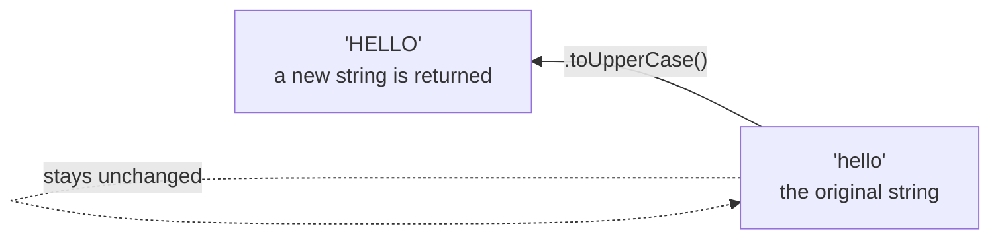

## מה זה?

מתודות מחרוזת (`toUpperCase`, `trim`, `split`, `includes` ועוד) הן פונקציות מובנות שפועלות על כל מחרוזת ומבצעות פעולות נפוצות — שינוי אותיות, ניקוי רווחים, פיצול לחלקים, חיפוש. הבעיה שנפתרת: בלי מתודות מובנות, אפילו פעולה פשוטה כמו "הפוך הכל לאותיות גדולות" הייתה דורשת מעבר ידני על כל תו במחרוזת.

## מילות מפתח שחשוב לזכור

• `toUpperCase()` / `toLowerCase()` — ממירה את כל התווים לאותיות גדולות/קטנות

• `trim()` — מסירה רווחים מיותרים מתחילת וסוף המחרוזת

• `split(separator)` — מפצלת מחרוזת למערך לפי תו הפרדה

• `includes(str)` — בודקת אם מחרוזת מכילה תת-מחרוזת; מחזירה `true`/`false`

• `slice(start, end)` — מחזירה חלק מהמחרוזת; לא משנה את המקור

• Template Literal — `` \`שלום ${name}\` `` — הטמעת משתנים בתוך מחרוזת עם backticks

• Immutability — מתודות מחרוזת **תמיד** מחזירות מחרוזת חדשה; לעולם לא משנות את המקור

```javascript
"Hello".toUpperCase();   // "HELLO"
"  trim me  ".trim();    // "trim me"
"a,b,c".split(",");      // ["a", "b", "c"]
```



## הסבר עיקרי

מחרוזות הן immutable — `"hello".toUpperCase()` לא משנה את המחרוזת המקורית; היא **מחזירה** מחרוזת חדשה. `const s = "hello"; s.toUpperCase();` בלי לשמור את התוצאה במשתנה — לא עושה כלום, כי המקור לא השתנה ולא שמרתם את החדש.

`split` כגשר למערכים — `"a,b,c".split(",")` הופכת מחרוזת מופרדת-פסיקים למערך `["a","b","c"]` — מדויק בשביל להשתמש אחר כך במתודות מערך (`map`/`filter`) על החלקים.

Template Literals לשילוב ערכים — `` \`שם: ${name}, גיל: ${age}\` `` משלבת טקסט ומשתנים בקריאות גבוהה, בלי שרשור מסורבל עם `+`. תמיד עם backticks (``` ` ```), לא מרכאות רגילות.

`includes` לעומת `indexOf` — `includes` מחזירה `true`/`false` פשוט לבדיקת "האם קיים"; `indexOf` מחזירה מיקום מספרי (או `-1`) כשצריך לדעת *איפה* בדיוק. לבדיקה פשוטה, `includes` קריאה יותר.

## יתרונות

מחליף עיבוד תווים ידני בשורת קוד אחת קריאה; Immutability מונעת שינוי בטעות של המקור; Template Literals הופכות בניית מחרוזות משולבות לפשוטה וברורה.

## חסרונות

שכחה ששיטות מחזירות ערך חדש (ולא משנות את המקור) גורמת לקוד "שלא עובד" בלי שגיאה גלויה; שרשור ארוך של מתודות (`.trim().toLowerCase().split(" ")`) עלול לפגוע בקריאות אם משתמשים בו יתר על המידה.

## נקודות חשובות

• מתודות מחרוזת תמיד מחזירות מחרוזת חדשה — לעולם לא משנות את המקור (immutable)

• `split` הופכת מחרוזת למערך; משמשת גשר למתודות מערך

• Template Literals (`` ` ```) מטמיעות משתנים בקריאות; מרכאות רגילות לא תומכות בכך

• `includes` מחזירה boolean; `indexOf` מחזירה מיקום מספרי או `-1`

## טעויות נפוצות

• קריאה למתודה בלי לשמור את התוצאה (`str.trim();` בלי `const clean = str.trim();`)

• ציפייה שמתודה תשנה את המחרוזת המקורית "במקום" (in-place) — היא לא

• שימוש במרכאות רגילות במקום backticks ואז `${name}` נשאר טקסט גולמי

• בלבול בין `slice` (לא זורק שגיאה על גבולות לא תקינים) להתנהגות מצופה אחרת

## סיכום

מתודות מחרוזת מבצעות פעולות נפוצות (שינוי אותיות, ניקוי, פיצול) בקריאה אחת, ותמיד מחזירות מחרוזת חדשה — המקור לא משתנה. `split` מגשרת למערכים; Template Literals (backticks) משלבות משתנים בתוך טקסט בקריאות גבוהה.

## דוקומנטציה רשמית

[MDN — String methods](https://developer.mozilla.org/en-US/docs/Web/JavaScript/Reference/Global_Objects/String)

[MDN — Template literals](https://developer.mozilla.org/en-US/docs/Web/JavaScript/Reference/Template_literals)

---

## תרגילים

### תרגיל 1 — ניקוי וקיצור

**המשימה:** בהינתן המחרוזת `"   Dana   "` (עם רווחים מיותרים בהתחלה ובסוף), נקו אותה עם `trim()` והפכו לאותיות גדולות עם `toUpperCase()`.

**בדיקה:** התוצאה הסופית היא `"DANA"`, בלי אף רווח.

### תרגיל 2 — פיצול

**המשימה:** בהינתן `"apple,banana,cherry"`, פצלו אותה למערך עם `split(",")`. הדפיסו את אורך המערך ואת האיבר הראשון בו.

**בדיקה:** אורך המערך הוא `3`, והאיבר הראשון הוא `"apple"`.

### תרגיל 3 — Template Literal

**המשימה:** בהינתן `const name = "Dana"` ו-`const age = 28`, בנו משפט יחיד עם template literal (לא שרשור עם `+`): `"שם: Dana, גיל: 28"`.

**בדיקה:** הפלט הוא בדיוק `"שם: Dana, גיל: 28"`.

---

## פרויקט מסכם

**המשימה:** כתבו פונקציית `normalizeUsername(input)` שמנקה קלט משתמש גולמי.

**דרישות:**
1. מסירה רווחים מיותרים מתחילת/סוף הקלט (`trim`)
2. הופכת את כל התווים לאותיות קטנות (`toLowerCase`)
3. מחליפה כל רווח שנשאר באמצע במקף (`-`)
4. הפונקציה מחזירה (`return`) את התוצאה — לא מדפיסה אותה

**בדיקה:** `normalizeUsername("  Dana Levi  ")` מחזירה בדיוק `"dana-levi"`.

---

## מה בפרק הבא

בפרק הבא נלמד על **Arrays** — מערך (Array) הוא רשימה מסודרת של ערכים תחת שם אחד — כל ערך ("איבר") נגיש לפי מיקום מספרי (אינדקס), שמתחיל מ-0. הבעיה שנפתרת: שמירת 100 ערכים במשתנים נפרדים (`item1`, `item2`, ... `item100`) בלתי אפשרי
