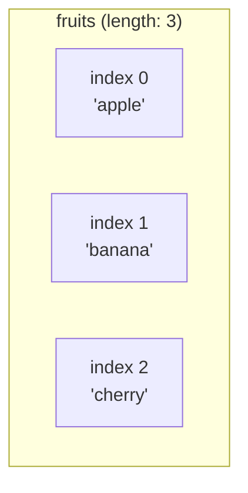

## מה זה?

מערך (Array) הוא רשימה מסודרת של ערכים תחת שם אחד — כל ערך ("איבר") נגיש לפי מיקום מספרי (אינדקס), שמתחיל מ-0. הבעיה שנפתרת: שמירת 100 ערכים במשתנים נפרדים (`item1`, `item2`, ... `item100`) בלתי אפשרית בפועל — אי אפשר לעבור עליהם בלולאה, ואי אפשר לדעת כמה יש בלי לספור ידנית.

## מילות מפתח שחשוב לזכור

• Array Literal — `[]`; הדרך הנפוצה ליצור מערך: `const nums = [1, 2, 3]`

• Index — מיקום איבר במערך; **מתחיל מ-0**, לא מ-1

• `length` — מספר האיברים במערך (property, לא מתודה — בלי סוגריים)

• `push(value)` — מוסיפה איבר לסוף המערך; משנה את המערך המקורי

• `pop()` — מסירה ומחזירה את האיבר האחרון; משנה את המערך המקורי

• Nested Array — מערך שערכיו הם בעצמם מערכים (`[[1,2],[3,4]]`)

```javascript
const fruits = ["apple", "banana"];
fruits.push("cherry");
fruits[0];      // "apple"
fruits.length;  // 3
```



## הסבר עיקרי

אינדקס מתחיל מ-0 — האיבר הראשון ב-`fruits` הוא `fruits[0]`, לא `fruits[1]`. האיבר האחרון הוא `fruits[fruits.length - 1]`, לא `fruits[fruits.length]` — כי אינדקס 3 לא קיים במערך באורך 3 (יש בו אינדקסים 0, 1, 2 בלבד).

מערך הוא mutable — בניגוד למחרוזות, מתודות כמו `push`/`pop` **משנות** את המערך המקורי במקום (in-place), ולא מחזירות עותק חדש. זה הבדל חשוב לזכור בהמשך הקורס כשמשווים למתודות אחרות שמחזירות מערך חדש.

גישה מחוץ לתחום לא זורקת שגיאה — `fruits[10]` על מערך עם 3 איברים מחזיר `undefined`, לא שגיאה. זו נקודה שמפתיעה מתחילים — חשוב לבדוק `length` לפני הנחה שאינדקס מסוים קיים.

לולאת `for` על מערך — `for (let i = 0; i < fruits.length; i++) { console.log(fruits[i]); }` עוברת על כל איברי המערך אחד-אחד, בעזרת ה-`length` כתנאי העצירה.

## יתרונות

מאפשר לשמור כמות לא-ידועה מראש של ערכים תחת שם אחד; אינדקס מספרי מאפשר גישה מהירה וישירה לכל איבר; `push`/`pop` מאפשרים בניית רשימה דינמית בזמן ריצה.

## חסרונות

אינדקס מתחיל מ-0 מבלבל מתחילים שרגילים לספירה מ-1; גישה לאינדקס לא קיים מחזירה `undefined` בשקט במקום שגיאה, מה שיכול להסתיר באג; שינוי מערך "במקום" (`push`) עלול ליצור תופעות לוואי לא-רצויות אם משתפים את אותו מערך בכמה מקומות בקוד.

## נקודות חשובות למבחן / ראיון עבודה

• אינדקס ראשון הוא 0; אינדקס אחרון הוא `length - 1`

• `length` הוא property (בלי סוגריים); `push`/`pop` הן מתודות (עם סוגריים)

• `push`/`pop` משנות את המערך המקורי (mutable) — לא מחזירות עותק

• גישה לאינדקס מחוץ לתחום מחזירה `undefined`, לא שגיאה

## טעויות נפוצות

• ניסיון לגשת לאיבר האחרון עם `arr[arr.length]` במקום `arr[arr.length - 1]`

• בלבול בין `length` (property, בלי סוגריים) לבין מתודה

• הנחה ש-`push`/`pop` מחזירות מערך חדש, בעוד שהן משנות את המקורי

• שכחה שאינדקס מתחיל מ-0, וספירה כאילו הוא מתחיל מ-1

## סיכום

מערך שומר רשימה מסודרת של ערכים, נגישים לפי אינדקס שמתחיל מ-0. `length` נותן את גודל המערך; `push`/`pop` מוסיפים/מסירים איברים ומשנים את המערך המקורי. גישה מחוץ לתחום מחזירה `undefined` בלי שגיאה — חשוב לבדוק `length` לפני הנחות.

## דוקומנטציה רשמית

[MDN — Array](https://developer.mozilla.org/en-US/docs/Web/JavaScript/Reference/Global_Objects/Array)

---

## תרגילים

### תרגיל 1 — בניית מערך

**המשימה:** צרו מערך `colors` עם 3 צבעים (מחרוזות). הוסיפו צבע רביעי עם `push`. הדפיסו את `colors.length` ואת האיבר האחרון במערך.

**בדיקה:** `length` המודפס הוא `4`, והאיבר האחרון המודפס הוא הצבע הרביעי שהוספתם.

### תרגיל 2 — לולאה על מערך

**המשימה:** בהינתן `const nums = [10, 20, 30, 40]`, כתבו לולאת `for` שמדפיסה כל איבר יחד עם האינדקס שלו, בפורמט `"<אינדקס>: <ערך>"`.

**פלט צפוי:**
```
0: 10
1: 20
2: 30
3: 40
```

### תרגיל 3 — גבולות המערך

**המשימה:** בהינתן `const arr = [1, 2, 3, 4, 5]` (אורך 5), נחשו **לפני** שאתם מריצים: מה יחזיר `arr[4]`? ומה יחזיר `arr[5]`? אחר כך הריצו `console.log` על שניהם ובדקו את עצמכם.

**בדיקה:** `arr[4]` הוא האיבר האחרון (`5`); `arr[5]` הוא `undefined`, כי אין אינדקס 5 במערך באורך 5.

---

## פרויקט מסכם

**המשימה:** בנו "רשימת קניות" שמנוהלת עם מערך.

**דרישות:**
1. מערך `shoppingList` שמתחיל ריק (`[]`)
2. הוספת 4 פריטים (מחרוזות) עם `push`, אחד אחרי השני
3. הסרת הפריט האחרון עם `pop`
4. לולאת `for` שמדפיסה את הרשימה הסופית, ממוספרת **מ-1** (לא מ-0) — כלומר `"1: <פריט>"`, `"2: <פריט>"` וכו'

**בדיקה:** הרשימה המודפסת מכילה **3** פריטים בסך הכל (4 שהוספתם פחות 1 שהוסר), ממוספרים 1 עד 3.

---

## מה בפרק הבא

בפרק הבא נלמד על **Objects** — Object הוא אוסף של זוגות key-value שמאחד נתונים קשורים תחת ישות אחת — כל מפתח (key) הוא מחרוזת, וכל ערך (value) יכול להיות מכל טיפוס. הבעיה שנפתרת: תיאור משתמש עם משתנים נפרדים (`userName`, `userAge`,
