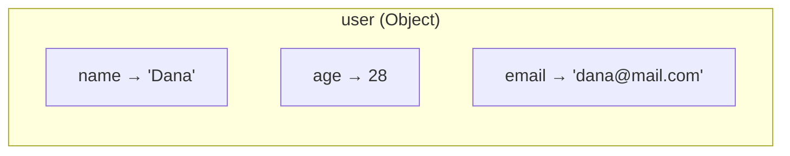

## מה זה?

Object הוא אוסף של זוגות key-value שמאחד נתונים קשורים תחת ישות אחת — כל מפתח (key) הוא מחרוזת, וכל ערך (value) יכול להיות מכל טיפוס. הבעיה שנפתרת: תיאור משתמש עם משתנים נפרדים (`userName`, `userAge`, `userEmail`) שביר — אי אפשר להעביר אותם כארגומנט אחד לפונקציה, ואין קשר פורמלי ביניהם.

## מילות מפתח שחשוב לזכור

• Object Literal — `{}`; הדרך הנפוצה ליצור object: `{ name: "Dana", age: 28 }`

• Property (תכונה) — זוג key-value בודד בתוך Object

• Dot Notation — גישה עם נקודה (`user.name`); כששם התכונה ידוע וקבוע בקוד

• Bracket Notation — גישה עם סוגריים מרובעות (`user["name"]`); הכרחית כשהשם מגיע ממשתנה

• Method (מתודה) — תכונה שערכה הוא פונקציה: `greet() { return "..."; }`

• `this` — בתוך מתודה, מצביע על ה-Object שדרכו נקראה המתודה

```javascript
const user = { name: "Dana", age: 28, email: "dana@mail.com" };
user.name;      // "Dana" — dot notation
user["email"];  // "dana@mail.com" — bracket notation
```



## הסבר עיקרי

dot מול bracket — הכלל הוא לא "מה נוח" אלא "מה אפשרי": dot notation לא יכולה לקבל משתנה כשם תכונה, רק שם קבוע שכתוב בקוד. כש-שם התכונה מגיע ממשתנה (`const key = "age"; user[key]`), חובה bracket — dot פשוט לא תומכת בכך.

```javascript
const key = "age";
user.key;   // undefined — dot לא תומכת במשתנה
user[key];  // 28   — bracket כן
```

מתודה ו-`this` — כשערך של תכונה הוא פונקציה, זו מתודה. `this` בתוכה מצביע על ה-Object שדרכו נקראה המתודה בפועל — כך אפשר לכתוב לוגיקה אחת (`greet() { return "Hi, I'm " + this.name; }`) שעובדת נכון על כל object שקורא לה, בלי לחזור על הקוד.

Object מקנן — ערך של תכונה יכול להיות בעצמו Object (`user.address = { city: "TLV" }`), נגיש בשרשור נקודות: `user.address.city`. זה מאפשר לייצג מבנה מדורג, במקום שדות שטוחים כמו `userAddressCity`.

## יתרונות

מאחד נתונים קשורים לישות אחת שניתן להעביר כארגומנט יחיד לפונקציה; קל להוסיף תכונה חדשה בלי לשנות קוד קיים; מתודות עם `this` מאפשרות לוגיקה גנרית שעובדת על כל object.

## חסרונות

bracket notation עם מפתח דינמי פחות קריא מ-dot notation למי שלא רגיל; גישה לתכונה מקוננת לא-קיימת (`user.address.city` כש-`address` הוא `undefined`) זורקת שגיאה.

## נקודות חשובות למבחן / ראיון עבודה

• dot notation דורשת שם קבוע; bracket notation תומכת גם במפתח דינמי (משתנה)

• `this` בתוך מתודה מצביע על ה-Object שקרא לה

• Object מקנן נגיש בשרשור נקודות: `user.address.city`

• Object Literal (`{}`) הוא הדרך הנפוצה ליצירת object חדש

## טעויות נפוצות

• ניסיון לגשת לתכונה עם dot notation כששם התכונה במשתנה (`user.key` במקום `user[key]`)

• שכחת `this` בתוך מתודה וניסיון לגשת לתכונה בשם קבוע במקום `this.property`

• גישה לתכונה מקוננת לא-קיימת בלי לבדוק קודם שהיא קיימת

• בלבול בין Object Literal בודד לבין מבנה שצריך להיות מערך של objects

## סיכום

Object מאחד נתונים קשורים תחת ישות אחת, בזוגות key-value. dot notation לשם קבוע, bracket notation לשם דינמי. מתודות עם `this` מאפשרות לוגיקה גנרית לכל object. Object מקנן מייצג מבנה מדורג, נגיש בשרשור נקודות.

## דוקומנטציה רשמית

[MDN — Working with objects](https://developer.mozilla.org/en-US/docs/Web/JavaScript/Guide/Working_with_objects)

---

## תרגילים

### תרגיל 1 — בניית object

**המשימה:** צרו object בשם `book` עם שלוש תכונות: `title` (מחרוזת), `author` (מחרוזת), `year` (מספר). הדפיסו כל תכונה בנפרד באמצעות dot notation (`book.title` וכו').

**בדיקה:** שלוש שורות פלט, אחת לכל תכונה, עם הערכים שהגדרתם.

### תרגיל 2 — bracket notation

**המשימה:** צרו משתנה `const prop = "author"`, וגשו לתכונה `author` של `book` (מהתרגיל הקודם) באמצעות `book[prop]` — **לא** `book.author` ישירות.

**בדיקה:** `book[prop]` מדפיס את אותו ערך כמו `book.author` היה מדפיס.

### תרגיל 3 — מתודה עם this

**המשימה:** הוסיפו ל-`book` מתודה בשם `describe`, שמחזירה (`return`) מחרוזת בפורמט `"<title> by <author> (<year>)"` — תוך שימוש ב-`this` לגישה לתכונות ה-object מבפנים.

**בדיקה:** `book.describe()` מחזירה מחרוזת שמכילה את שלוש התכונות בדיוק בפורמט הזה.

---

## פרויקט מסכם

**המשימה:** בנו object `product` לחנות אונליין.

**דרישות:**
1. תכונות: `name` (מחרוזת), `price` (מספר), `inStock` (boolean)
2. Object מקנן בשם `dimensions`, עם `width` ו-`height` (מספרים)
3. מתודה `getSummary()` שמחזירה מחרוזת עם השם והמחיר (למשל `"Chair — 150"`), תוך שימוש ב-`this`
4. הדפיסו בנפרד את `product.dimensions.width` (שרשור נקודות)

**בדיקה:** `product.getSummary()` מחזירה מחרוזת שמכילה גם את `name` וגם את `price`; ההדפסה הנפרדת של `dimensions.width` מציגה רק את המספר, לא את כל ה-object המקונן.

---

## מה בפרק הבא

בפרק הבא נלמד על **Array Methods** — מתודות מערך (`map`, `filter`, `reduce`, `find`) הן פונקציות מובנות שפועלות על כל מערך ומחליפות לולאות `for` ידניות בתחביר קריא יותר. הבעיה שנפתרת: לולאת `for` ארוכה דורשת מערך עזר ריק, `push` ידני בכל
