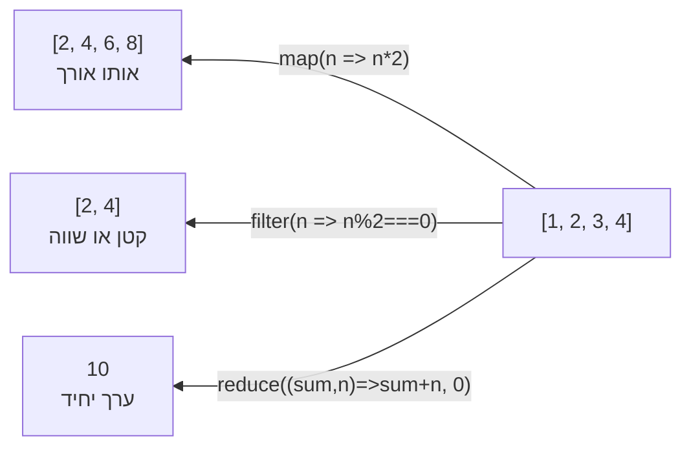

## מה זה?

מתודות מערך (`map`, `filter`, `reduce`, `find`) הן פונקציות מובנות שפועלות על כל מערך ומחליפות לולאות `for` ידניות בתחביר קריא יותר. הבעיה שנפתרת: לולאת `for` ארוכה דורשת מערך עזר ריק, `push` ידני בכל סיבוב, וניהול ידני של אינדקס — שכחת `push` אחד משאירה תוצאה שגויה בלי שום שגיאה.

## מילות מפתח שחשוב לזכור

• `map(callback)` — יוצרת מערך חדש **באותו גודל**, כל איבר הוא תוצאת ה-callback על האיבר המקביל

• `filter(callback)` — יוצרת מערך חדש (קטן או שווה) עם האיברים שעברו תנאי (callback מחזיר `true`)

• `reduce(callback, initial)` — מצמצמת מערך שלם לערך יחיד דרך accumulator

• `find(callback)` — מחזיר את **האיבר** הראשון שעומד בתנאי (לא מערך); `undefined` אם לא נמצא

• Callback — הפונקציה שמועברת כארגומנט למתודה ומופעלת על כל איבר

```javascript
const nums = [1, 2, 3, 4];
nums.map(n => n * 2);          // [2, 4, 6, 8]
nums.filter(n => n % 2 === 0); // [2, 4]
nums.reduce((sum, n) => sum + n, 0); // 10
```



## הסבר עיקרי

map מול filter — ההבדל המהותי: `map` **תמיד** מחזירה מערך באותו אורך כמו המקור (טרנספורמציה אחת לכל איבר); `filter` מחזירה מערך קטן או שווה למקור, ו-callback שלה **חייב** להחזיר `true`/`false`.

reduce כמצבר גנרי — `(acc, current) => nextAcc` מקבל ערך התחלתי (`0` לסכום) ומעדכן אותו בכל איטרציה. זו המתודה הגמישה ביותר מבין השלוש — אפשר לצמצם למספר, למערך, או ל-object חדש.

find מול filter — `find` עוצרת בהתאמה הראשונה ומחזירה איבר בודד; `filter` ממשיכה על כל המערך ומחזירה מערך (גם אם ריק). אם צריך רק "יש התאמה?" — `find` יעילה יותר.

Method Chaining — כיוון שכל מתודה (`filter`, `map`) מחזירה מערך חדש, אפשר לשרשר: `users.filter(u => u.age >= 18).map(u => u.name)` — הקוד מתאר **מה** רוצים, לא **איך** לממש בלולאות.

## יתרונות

קוד קצר וקריא שמבטא כוונה ("מה" ולא "איך"); פחות באגים אילמים מהצורה של שכחת `push` בלולאה ידנית; שרשור מתודות מבטא זרימת נתונים בשורה אחת.

## חסרונות

טעות נפוצה לבלבל בין המתודות (`map` כשצריך `filter`); שרשור ארוך מדי (יותר מ-3-4 מתודות) עלול לפגוע בקריאות; `reduce` הוא הכי גמיש אך גם הכי פחות אינטואיטיבי למתחילים.

## נקודות חשובות למבחן / ראיון עבודה

• `map` מחזירה מערך **באותו** גודל תמיד; אם התוצאה קטנה יותר — זו לא הייתה `map`

• `filter` — callback חייב להחזיר boolean; התוצאה קטנה או שווה למקור

• `find` מחזיר איבר בודד (או `undefined`); `filter` מחזיר תמיד מערך

• `reduce` דורשת ערך התחלתי מפורש כדי להימנע מהתנהגות לא-צפויה על מערך ריק

## טעויות נפוצות

• שימוש ב-`map` כשבאמת רוצים לסנן (`filter`) — מקבלים מערך באותו גודל עם ערכים לא רצויים

• שכחת ערך התחלתי ב-`reduce` — עלול לגרום להתנהגות שגויה על מערך ריק

• בלבול בין `find` (מחזיר איבר) ל-`filter` (מחזיר מערך) כשרוצים "רק את הראשון שמתאים"

• שרשור מתודות ארוך מדי בלי שמות ביניים — פוגע בקריאות ובדיבוג

## סיכום

`map` ממירה כל איבר ומחזירה מערך באותו גודל. `filter` שומרת רק איברים שעברו תנאי. `reduce` מצמצמת מערך לערך יחיד דרך accumulator. `find` מחזיר איבר בודד. שרשור (`filter().map()`) מבטא כוונה קריאה בלי לולאות ידניות.

## דוקומנטציה רשמית

[MDN — Array.prototype.map()](https://developer.mozilla.org/en-US/docs/Web/JavaScript/Reference/Global_Objects/Array/map)

[MDN — Array.prototype.reduce()](https://developer.mozilla.org/en-US/docs/Web/JavaScript/Reference/Global_Objects/Array/reduce)

---

## תרגילים

### תרגיל 1 — map

**המשימה:** בהינתן `const prices = [100, 200, 300]`, השתמשו ב-`map` ליצירת מערך חדש שבו כל מחיר קטן ב-10% (הנחה).

**בדיקה:** המערך החדש הוא `[90, 180, 270]`, ו-`prices` המקורי לא השתנה.

### תרגיל 2 — filter

**המשימה:** בהינתן `const ages = [15, 22, 17, 30, 12]`, השתמשו ב-`filter` ליצירת מערך חדש עם רק הגילאים `>= 18`.

**בדיקה:** המערך החדש הוא `[22, 30]`.

### תרגיל 3 — reduce

**המשימה:** בהינתן `const scores = [80, 95, 70, 60]`, השתמשו ב-`reduce` לחשב את **הממוצע** של כל הציונים (סכום חלקי כמות).

**בדיקה:** התוצאה היא `76.25`.

---

## פרויקט מסכם

**המשימה:** בנו מעבד "עגלת קניות" עם מתודות מערך בלבד (בלי אף לולאת `for`).

**דרישות:**
1. מערך `cart` של 3-4 objects, כל אחד עם `name`, `price`, `qty` — כללו לפחות פריט אחד עם `qty: 0`
2. `map` ליצירת מערך חדש עם `total` לכל פריט (`price * qty`)
3. `filter` ליצירת מערך שמכיל רק פריטים עם `qty > 0`
4. `reduce` לחישוב הסכום הכולל (`total`) של כל הפריטים שנשארו אחרי הסינון

**בדיקה:** הפריט עם `qty: 0` לא משפיע על הסכום הסופי, וה-`reduce` מחזיר מספר יחיד שהוא סכום כל ה-`total`-ים של הפריטים שכן נמכרו.

---

## מה בפרק הבא

בפרק הבא נלמד על **Object Methods** — מתודות Object הן פונקציות סטטיות מובנות (`Object.keys`, `Object.values`, `Object.entries`, `Object.assign`) שפועלות על אובייקטים — לאיטרציה, בדיקה, ומיזוג. הבעיה שנפתרת: אובייקט אינו מערך, ולכן מתודות
