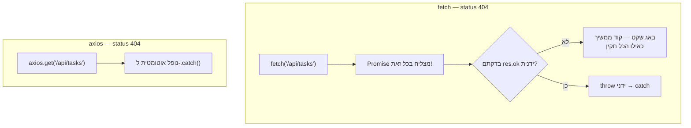

## מה זה?

לאורך כל הקורס השתמשנו ב-`fetch` — ה-API המובנה בדפדפן לשליחת בקשות HTTP. הוא עובד מצוין, אבל דורש כמה שורות "טקס" חוזרות בכל קריאה: `res.ok`, `res.json()`, טיפול שגיאות ידני. **Axios** היא ספרייה חיצונית פופולרית שעוטפת את אותו רעיון בסיסי (בקשת HTTP, Promise) עם API נוח יותר — פחות קוד חוזר, יותר תכונות מובנות.

## מילות מפתח שחשוב לזכור

• `fetch` — API מובנה בדפדפן; לא דורש התקנה, אבל "מינימלי" — הרבה דברים דורשים טיפול ידני

• `axios` — ספרייה חיצונית (`npm install axios`) שעוטפת בקשות HTTP בממשק נוח יותר

• Response Data אוטומטי — ב-axios, `response.data` כבר מכיל את הנתונים המפורסרים; אין צורך ב-`.json()` נפרד כמו ב-`fetch`

• Automatic Error Throwing — axios זורק שגיאה אוטומטית על status לא-מוצלח (4xx/5xx); `fetch` **לא** עושה זאת (זוכרים מיחידת Fetch API?)

• Interceptors — פונקציות שרצות אוטומטית על **כל** בקשה/תגובה (למשל, הוספת טוקן Auth לכל בקשה יוצאת) — תכונה שאין ב-`fetch` המובנה

```javascript
// fetch — דורש טיפול ידני בכל שלב
fetch("/api/tasks")
  .then(res => {
    if (!res.ok) throw new Error("שגיאת שרת");
    return res.json();
  })
  .then(data => console.log(data));

// axios — אותו דבר, פחות טקס
axios.get("/api/tasks")
  .then(response => console.log(response.data))
  .catch(error => console.error(error));
```



## הסבר עיקרי

fetch לא זורק שגיאה על 404/500 — זה בדיוק ה"מלכודת" הכי ידועה של `fetch` שכבר פגשנו ביחידת Fetch API: קריאה שמחזירה status 404 עדיין "מצליחה" מבחינת ה-Promise — צריך לבדוק `res.ok` **ידנית** ולזרוק שגיאה בעצמכם. `axios` עושה את זה **אוטומטית** — כל status שאינו 2xx נופל ישירות ל-`.catch()`, בלי בדיקה ידנית.

response.data מול res.json() — ב-`fetch`, `res.json()` הוא בעצמו קריאה אסינכרונית נוספת שמחזירה Promise (זוכרים את השרשור הכפול משיעור Promises?). ב-axios, `response.data` **כבר** מפורסר ומוכן — פחות שלב אחד בשרשרת.

Interceptors כ"middleware" בצד הלקוח — בדיוק כמו ש-Middleware ב-Express (מיחידת השרתים) רץ על **כל** בקשה נכנסת, Interceptor ב-axios רץ על **כל** בקשה יוצאת (או תגובה נכנסת) — למשל, הוספת `Authorization: Bearer <token>` אוטומטית לכל בקשה, בלי לחזור על זה בכל `fetch` בנפרד. אין ל-`fetch` המובנה מנגנון מקביל.

## יתרונות

axios: פחות קוד חוזר, זריקת שגיאה אוטומטית, Interceptors לתכונות חוצות-בקשות; fetch: מובנה בדפדפן, אין תלות חיצונית, גודל bundle קטן יותר.

## חסרונות

axios: תלות (dependency) נוספת שצריך להתקין ולתחזק; fetch: הרבה "טקס" חוזר בכל קריאה, וזריקת שגיאה ידנית שקל לשכוח.

## נקודות חשובות למבחן / ראיון עבודה

• `fetch` מובנה בדפדפן; `axios` ספרייה חיצונית שדורשת התקנה

• `fetch` לא זורק שגיאה על status לא-מוצלח (4xx/5xx); `axios` כן, אוטומטית

• `response.data` (axios) מוכן מיד; `res.json()` (fetch) דורש `await`/`.then` נוסף

• Interceptors (axios) מאפשרים לוגיקה גורפת על כל בקשה/תגובה — אין מקבילה ב-`fetch`

## טעויות נפוצות

• לשכוח לבדוק `res.ok` ב-`fetch` ולהניח שגיאת שרת "תיתפס" אוטומטית כמו ב-axios

• לנסות `response.json()` על תוצאת axios — כבר מפורסר תחת `.data`, אין `.json()` בכלל

• להוסיף axios לפרויקט קטן שבו `fetch` הפשוט מספיק לגמרי — תלות מיותרת

## סיכום

`fetch` הוא ה-API המובנה, פשוט אך דורש טיפול ידני (`res.ok`, `.json()`); `axios` היא ספרייה חיצונית עם פחות קוד חוזר — זריקת שגיאה אוטומטית על status לא-מוצלח, `response.data` מוכן מיד, ו-Interceptors לתכונות חוצות-בקשות (כמו הוספת טוקן Auth אוטומטית). הבחירה תלויה בגודל הפרויקט והצורך בתכונות הנוספות.

## דוקומנטציה רשמית

[Axios — GitHub](https://github.com/axios/axios)

---

## תרגילים

### תרגיל 1 — אותה בקשה, שתי דרכים

**המשימה:** כתבו את אותה קריאת `GET /tasks` פעם עם `fetch` ופעם עם `axios`, והשוו את אורך הקוד.

**בדיקה:** שתי הגרסאות מחזירות את אותם הנתונים בהצלחה; גרסת ה-axios קצרה יותר (אין `.json()` נפרד).

### תרגיל 2 — טיפול שגיאות אוטומטי מול ידני

**המשימה:** שלחו בקשה ל-endpoint שמחזיר 404, פעם עם `fetch` (בלי בדיקת `res.ok`) ופעם עם `axios`.

**בדיקה:** גרסת ה-`fetch` "מצליחה" בשקט (לא נכנסת ל-`.catch`); גרסת ה-axios נכנסת אוטומטית ל-`.catch` עם השגיאה.

### תרגיל 3 — Interceptor להוספת טוקן

**המשימה:** הגדירו axios interceptor שמוסיף `Authorization` header לכל בקשה יוצאת.

**בדיקה:** כל בקשה שנשלחת (בדקו ב-Network tab) כוללת את ה-header, גם בלי להוסיף אותו ידנית בכל קריאה בנפרד.

---

## פרויקט מסכם

**המשימה:** המירו את `useFetch`/`useTasks` (מיחידת React) לשימוש ב-axios במקום fetch.

**דרישות:**
1. התקינו axios והחליפו את כל קריאות ה-`fetch` בקריאות axios מקבילות
2. הגדירו axios instance עם `baseURL` (כתובת השרת) כדי לא לחזור עליה בכל קריאה
3. הוסיפו interceptor שמדפיס לקונסול כל בקשה יוצאת (לצורכי debugging)
4. וודאו שטיפול השגיאות עדיין עובד נכון (loading/error/success, מיחידת React)

**בדיקה:** כל פונקציונליות ה-CRUD (מיחידת React Backend Integration) ממשיכה לעבוד זהה; ה-interceptor מדפיס שורה לכל בקשה שנשלחת.

---

## מה בפרק הבא

בפרק הבא נלמד על **Auth Flow (React)** — ביחידת Auth & JWT (שרתים) בנינו את צד **השרת**: `POST /login` שמחזיר טוקן. אבל מה קורה בצד **הלקוח**? איפה שומרים את הטוקן? איך מוודאים שדף "פרופיל" לא נגיש למי שלא מחובר? **Auth Flow** הוא הזרימה המל
