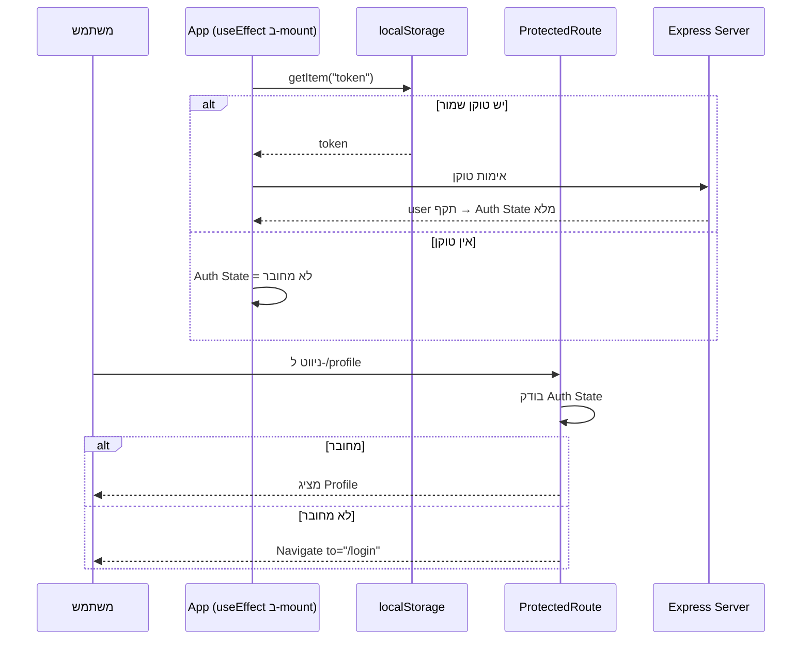

## מה זה?

ביחידת Auth & JWT (שרתים) בנינו את צד **השרת**: `POST /login` שמחזיר טוקן. אבל מה קורה בצד **הלקוח**? איפה שומרים את הטוקן? איך מוודאים שדף "פרופיל" לא נגיש למי שלא מחובר? **Auth Flow** הוא הזרימה המלאה בצד React: טופס התחברות → קבלת טוקן → שמירתו → הגנה על routes → צירוף הטוקן לכל בקשה עתידית.

## מילות מפתח שחשוב לזכור

• Auth State — האם המשתמש מחובר, ומי הוא; לרוב מוחזק ב-Context (מיחידת Context API) כדי שיהיה נגיש בכל האפליקציה

• Token Storage — איפה שומרים את ה-JWT בצד הלקוח; `localStorage` (מיחידת ה-DOM) הוא הנפוץ ביותר, למרות שיקולי אבטחה נוספים בפרויקטים אמיתיים

• Protected Route — קומפוננטת עטיפה (מיחידת Routing) שבודקת Auth State לפני שמאפשרת גישה ל-route מסוים; אם לא מחובר, מפנה (`useNavigate`) לעמוד ההתחברות

• Persisted Login — התחברות ש"שורדת" רענון עמוד: בעליית האפליקציה, קוראים טוקן שמור מ-`localStorage` ומאמתים אותו מול השרת

```jsx
function ProtectedRoute({ children }) {
  const { user } = useContext(AuthContext);
  if (!user) return <Navigate to="/login" />;
  return children;
}

// שימוש:
<Route path="/profile" element={
  <ProtectedRoute><Profile /></ProtectedRoute>
} />
```



## הסבר עיקרי

Auth State ב-Context, כי הרבה קומפוננטות צריכות אותו — `Header` צריך להציג "שלום, דנה" או "התחבר"; `ProtectedRoute` צריך לדעת אם לחסום גישה; `Profile` צריך את פרטי המשתמש עצמו. זה בדיוק המקרה ש-Context API (שיעור קודם) נועד אליו — שיתוף רחב, לא prop drilling דרך כל העץ.

Protected Route כ"שומר סף" בצד הלקוח — `ProtectedRoute` עוטפת `<Route>` ובודקת Auth State **לפני** שמרנדרת את התוכן המוגן — אם אין משתמש מחובר, `<Navigate to="/login">` (ניווט תכנותי, מיחידת Routing) מפנה מיד לעמוד התחברות. **חשוב**: זו הגנה לחוויית משתמש בלבד — ההגנה **האמיתית** חייבת להיות גם בשרת (בדיוק כמו Client-side Validation מיחידת HTML Forms) — משתמש זדוני יכול לעקוף בדיקת React לגמרי ולפנות ישירות ל-API.

Persisted Login פותר את בעיית "התנתקתי כי רעננתי" — בלי מנגנון נוסף, רענון עמוד "מאפס" את כל ה-state של React — כולל Auth State! `useEffect` (מיחידת React) עם `[]` שרץ בעליית האפליקציה קורא את הטוקן השמור מ-`localStorage`, ומאמת/משחזר את מצב ההתחברות — כך שהמשתמש **לא** צריך להתחבר מחדש בכל רענון.

## יתרונות

Auth State ב-Context זמין לכל האפליקציה בלי prop drilling; Protected Routes נותנים חוויית משתמש ברורה (הפניה אוטומטית, לא מסך שבור); Persisted Login שומר על חוויית משתמש חלקה בין רענונים.

## חסרונות

Protected Route בצד הלקוח היא **רק** הגנת UX — לא תחליף לבדיקה בשרת; `localStorage` חשוף להתקפות מסוימות (XSS, אם יש פרצה במקום אחר באפליקציה) — פרויקטים רגישים במיוחד שוקלים אלטרנטיבות.

## נקודות חשובות למבחן / ראיון עבודה

• Auth State (משתמש מחובר?) נשמר ב-Context לרוב, כדי שיהיה נגיש בכל העץ

• Protected Route בודק Auth State לפני רינדור, ומפנה ל-login אם אין משתמש — הגנת UX, לא אבטחה אמיתית

• ההגנה האמיתית **חייבת** להיות גם בשרת — Client-side Auth Check הוא נוחות, לא ביטחון

• Persisted Login קורא טוקן שמור בעליית האפליקציה (`useEffect`), כדי לשרוד רענון עמוד

## טעויות נפוצות

• לסמוך רק על Protected Route בצד הלקוח, בלי לבדוק Authorization גם בשרת — כל בקשת API ישירה עוקפת את זה

• לשכוח Persisted Login — משתמש "מתנתק" בכל רענון עמוד, גם שהטוקן עדיין תקף

• לשמור מידע רגיש (כמו סיסמה) ב-`localStorage` — רק הטוקן צריך להישמר, לעולם לא סיסמה גולמית

## סיכום

Auth Flow בצד React: Auth State (משתמש מחובר?) ב-Context, Token Storage ב-`localStorage`, Protected Route שחוסמת routes בלי משתמש מחובר (ומפנה ל-login), ו-Persisted Login שקוראת טוקן שמור בעליית האפליקציה. חשוב לזכור: כל זה הוא הגנת UX בצד הלקוח — ההגנה האמיתית חייבת להתקיים גם בשרת (Auth & JWT, מיחידת השרתים).

## דוקומנטציה רשמית

[React Router — Navigate](https://reactrouter.com/en/main/components/navigate)

---

## תרגילים

### תרגיל 1 — Auth Context בסיסי

**המשימה:** צרו `AuthContext` עם `user` ו-`login`/`logout` פונקציות, ועטפו את `App` ב-`Provider`.

**בדיקה:** קריאה ל-`login` עם פרטי משתמש מעדכנת את `user` בכל האפליקציה; `logout()` מאפס אותו חזרה ל-`null`.

### תרגיל 2 — Protected Route

**המשימה:** בנו `ProtectedRoute` שמפנה ל-`/login` אם `user` הוא `null`.

**בדיקה:** ניסיון גישה ל-route מוגן בלי להתחבר מפנה אוטומטית לעמוד ההתחברות; אחרי התחברות, הגישה מתאפשרת.

### תרגיל 3 — Persisted Login

**המשימה:** שמרו טוקן ב-`localStorage` בהתחברות מוצלחת, וקראו אותו ב-`useEffect` בעליית `App` כדי לשחזר את ה-Auth State.

**בדיקה:** רענון מלא של העמוד (F5) אחרי התחברות עדיין מציג מצב "מחובר", לא מחזיר למסך התחברות.

---

## פרויקט מסכם

**המשימה:** בנו זרימת Auth מלאה לאפליקציית ה-Task, מחוברת לשרת האמיתי (Auth & JWT, מיחידת השרתים).

**דרישות:**
1. טופס התחברות ש-`POST`-ים ל-`/login` (עם fetch/axios) ושומר את הטוקן שחוזר
2. `AuthContext` שמחזיק את מצב המשתמש, נטען מחדש ב-`useEffect` בעליית האפליקציה
3. `ProtectedRoute` סביב עמוד רשימת המשימות — לא נגיש בלי התחברות
4. כפתור "התנתק" שמנקה את הטוקן ומחזיר Auth State ל-`null`

**בדיקה:** ניסיון גישה לרשימת משימות בלי התחברות מפנה ל-login; אחרי התחברות מוצלחת, הגישה מתאפשרת ונשארת גם אחרי רענון עמוד; התנתקות חוסמת גישה שוב.

---

## מה בפרק הבא

בפרק הבא נלמד על **React Deployment** — לאורך כל יחידת ה-React, `npm run dev` (Vite) הריץ שרת פיתוח שמקמפל JSX "תוך כדי תנועה" — נוח לפיתוח, אבל **לא** מתאים לייצור: איטי, וחושף כלי פיתוח למשתמשים. **Deployment** (פריסה) הוא התהליך של להפוך
