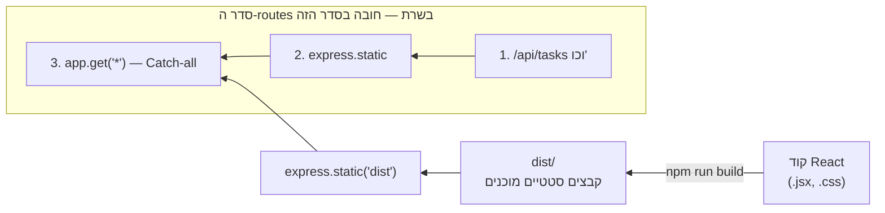

## מה זה?

לאורך כל יחידת ה-React, `npm run dev` (Vite) הריץ שרת פיתוח שמקמפל JSX "תוך כדי תנועה" — נוח לפיתוח, אבל **לא** מתאים לייצור: איטי, וחושף כלי פיתוח למשתמשים. **Deployment** (פריסה) הוא התהליך של להפוך את קוד ה-React ל**קבצים סטטיים אמיתיים** (`npm run build`), ולתת ל**שרת Express** (מיחידת השרתים) — אותו שרת שכבר בניתם — להגיש אותם למשתמשים אמיתיים.

## מילות מפתח שחשוב לזכור

• `npm run build` — פקודת Vite שמקמפלת את כל קוד ה-React (JSX, imports, הכל) לקבצי `.html`/`.js`/`.css` **סטטיים**, מאוחסנים בתיקיית `dist/`

• Static Files (קבצים סטטיים) — קבצים "מוכנים" שהשרת רק שולח כמו שהם, בלי לעבד אותם — בדיוק כמו `.css`/`.jpg` רגילים

• `express.static(path)` — Middleware מובנה ב-Express שמגיש קבצים סטטיים מתיקייה נתונה (מיחידת השרתים — מוכר?)

• Catch-all Route — route שתופס **כל** בקשה שלא תאמה route אחר, ומחזיר תמיד את `index.html` — הכרחי כדי ש-React Router (מיחידת Routing) ימשיך לעבוד אחרי רענון

```javascript
import express from "express";
import path from "node:path";

const app = express();

app.use(express.static(path.join(process.cwd(), "dist"))); // קבצי ה-build

app.get("/api/tasks", (req, res) => { /* ... */ }); // API routes כרגיל

app.get("*", (req, res) => {
  res.sendFile(path.join(process.cwd(), "dist", "index.html")); // Catch-all ל-React Router
});
```



## הסבר עיקרי

build הופך JSX לקבצים סטטיים רגילים — `npm run build` מריץ את Vite פעם אחת, ובמקום שרת פיתוח שמקמפל תוך-כדי-תנועה, מייצר **קבצים מוגמרים**: JavaScript מקומפל וממוזער, CSS, HTML — בדיוק כמו קבצי ה-HTML/CSS הסטטיים שראינו בתחילת הקורס. `express.static("dist")` פשוט מגיש אותם, בדיוק כמו כל תיקיית קבצים סטטיים אחרת.

Catch-all Route פותר בעיה עדינה עם Routing — דמיינו משתמש שמרענן את הדפדפן בעמוד `/tasks/5` (route של React Router). בלי Catch-all, השרת **מחפש** קובץ פיזי בשם `/tasks/5` — ולא מוצא כזה (כי זה route וירטואלי שקיים רק בתוך React)! `app.get("*", ...)` תופס **כל** בקשה שלא תאמה route/קובץ אחר, ומחזיר תמיד את `index.html` — ואז React Router (שרץ בתוך אותו `index.html`) "מזהה" את ה-URL הנוכחי ומרנדר את הקומפוננטה הנכונה בעצמו.

API routes וקבצים סטטיים חיים יחד באותו שרת — שימו לב שהדוגמה מציגה **גם** `/api/tasks` (כמו שכל היחידה בנתה) **וגם** הגשת קבצי React — זה בדיוק אותו שרת Express, מגיש שני סוגי תוכן: API דינמי (מיחידת REST API) וקבצי frontend סטטיים. סדר ה-routes חשוב: ה-Catch-all חייב להיות **אחרון**, אחרת הוא "יתפוס" גם בקשות API.

## יתרונות

פריסה פשוטה — שרת Express אחד מגיש גם API וגם frontend, בלי צורך בשני שרתים נפרדים; קבצי build ממוזערים ומהירים בהרבה מ-`npm run dev`; Catch-all Route שומר על תמיכה מלאה ב-React Router גם ברענון.

## חסרונות

צריך לזכור להריץ `npm run build` מחדש בכל שינוי קוד frontend — לא מתעדכן אוטומטית כמו `npm run dev`; שרת אחד שמשרת גם API וגם frontend פחות ניתן להרחבה (scale) בנפרד מאשר הפרדה מלאה בפרודקשן גדול.

## נקודות חשובות למבחן / ראיון עבודה

• `npm run build` מייצר קבצים סטטיים מוגמרים בתיקיית `dist/`, שונה לגמרי מ-`npm run dev`

• `express.static(path)` מגיש קבצים סטטיים — אותה טכניקה עבור frontend build כמו לכל תיקיית קבצים

• Catch-all Route (`app.get("*", ...)`) חובה כדי ש-React Router ימשיך לעבוד אחרי רענון עמוד

• סדר ה-routes קריטי: API routes לפני ה-Catch-all, אחרת הוא "בולע" גם אותם

## טעויות נפוצות

• לשכוח להריץ `npm run build` מחדש אחרי שינוי קוד — השרת ממשיך להגיש גרסה ישנה

• לשים את ה-Catch-all Route **לפני** routes של API — כל בקשת API "נתפסת" בטעות ומחזירה `index.html`

• לנסות "לפרוס" (deploy) את שרת הפיתוח של Vite (`npm run dev`) לייצור, במקום `npm run build`

## סיכום

Deployment הופך קוד React ל-קבצים סטטיים (`npm run build` → תיקיית `dist/`), ש-Express מגיש עם `express.static`, בדיוק כמו כל תוכן סטטי אחר. Catch-all Route (`app.get("*", ...)`) מבטיח שרענון עמוד בכל route של React Router עדיין מחזיר את `index.html` הנכון. סדר ה-routes חשוב — API routes תמיד לפני ה-Catch-all.

## דוקומנטציה רשמית

[Vite — Building for Production](https://vite.dev/guide/build)

---

## תרגילים

### תרגיל 1 — build ראשון

**המשימה:** הריצו `npm run build` על פרויקט React קיים, ובדקו את תוכן תיקיית `dist/`.

**בדיקה:** התיקייה מכילה `index.html`, קבצי `.js`/`.css` — לא קוד JSX גולמי.

### תרגיל 2 — הגשה עם express.static

**המשימה:** הוסיפו לשרת Express קיים `app.use(express.static("dist"))`, והריצו את השרת.

**בדיקה:** פתיחת כתובת השרת מציגה את אפליקציית ה-React, לא רק תשובת API.

### תרגיל 3 — Catch-all Route

**המשימה:** הוסיפו `app.get("*", ...)` שמחזיר `index.html`, ובדקו רענון עמוד ב-route פנימי של React Router.

**בדיקה:** רענון (F5) ב-route פנימי (כמו `/tasks/5`) מציג את האפליקציה כרגיל, לא שגיאת 404.

---

## פרויקט מסכם

**המשימה:** פרסו (build+serve) את אפליקציית ה-Task המלאה משרת Express יחיד.

**דרישות:**
1. `npm run build` על פרויקט ה-React
2. `express.static` שמגיש את `dist/` מהשרת
3. כל routes ה-API (`/api/tasks` וכו') ממשיכים לעבוד, **לפני** ה-Catch-all
4. Catch-all Route בסוף כל הגדרות ה-routes

**בדיקה:** פתיחת השרת מציגה את אפליקציית ה-React המלאה; API עדיין עובד; רענון בכל route פנימי של React Router לא מחזיר 404.

---

## מה בפרק הבא

בפרק הבא נלמד על **WebSockets** — כל התקשורת שלמדנו עד עכשיו (HTTP, `fetch`, axios) היא **חד-כיוונית לפי בקשה**: הלקוח שולח בקשה, השרת עונה, והחיבור נסגר — אם רוצים לדעת על שינוי חדש (כמו הודעת צ'אט מגולש אחר), חייבים **לשאול שוב** (P
