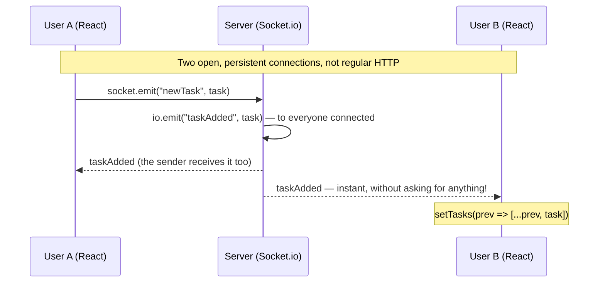

## מה זה?

כל התקשורת שלמדנו עד עכשיו (HTTP, `fetch`, axios) היא **חד-כיוונית לפי בקשה**: הלקוח שולח בקשה, השרת עונה, והחיבור נסגר — אם רוצים לדעת על שינוי חדש (כמו הודעת צ'אט מגולש אחר), חייבים **לשאול שוב** (Polling). **WebSockets** פותרים את זה: חיבור **אחד, פתוח וממושך**, שדרכו גם הלקוח וגם השרת יכולים לשלוח הודעות **בכל רגע**, בלי בקשה חדשה בכל פעם.

## מילות מפתח שחשוב לזכור

• WebSocket — פרוטוקול תקשורת שמקיים חיבור **פתוח וממושך** בין לקוח לשרת, דו-כיווני

• Polling (מיחידת JS Fetch API, כזכור) — הדרך "הישנה": הלקוח שואל שוב ושוב ("יש חדש?") בכל כמה שניות — בזבזני ולא מיידי

• `socket.emit(event, data)` — שולח הודעה מסומנת-שם דרך ה-WebSocket

• `socket.on(event, callback)` — מאזין להודעות מהצד השני, בדיוק כמו `addEventListener` (מיחידת DOM Events) — רק על חיבור רשת, לא על אלמנט

• Socket.io — ספרייה פופולרית שמפשטת עבודה עם WebSockets (fallbacks, reconnection, rooms)

```javascript
// Server (Express + Socket.io)
io.on("connection", (socket) => {
  socket.on("newTask", (task) => {
    io.emit("taskAdded", task); // sends to all connected clients
  });
});

// Client (React)
useEffect(() => {
  socket.on("taskAdded", (task) => {
    setTasks(prev => [...prev, task]); // real-time state update
  });
  return () => socket.off("taskAdded"); // Cleanup (from the useEffect unit!)
}, []);
```



## הסבר עיקרי

emit/on כמו Events, אך על רשת — `socket.emit("newTask", task)` ו-`socket.on("taskAdded", callback)` הם בדיוק אותו רעיון כמו `addEventListener` (מיחידת DOM Events): "שלח הודעה מסומנת-שם", "האזן להודעות מסומנות-שם" — רק שכאן זה קורה **דרך רשת**, בין לקוח לשרת (או בין כמה לקוחות, דרך השרת), לא בתוך עמוד HTML אחד.

השרת "דוחף" מידע, לא רק עונה — זה ההבדל המהותי מ-HTTP: כשמשתמש א' מוסיף משימה, השרת יכול לשלוח `io.emit("taskAdded", task)` ל**כל** הלקוחות המחוברים **מיד** — כולל משתמש ב' שלא "ביקש" כלום באותו רגע. ב-HTTP רגיל, משתמש ב' היה צריך "לשאול" שוב ושוב (Polling) כדי לגלות שיש עדכון — WebSockets הופכים את זה למיידי ואמיתי.

Cleanup ב-useEffect קריטי גם כאן — בדיוק כמו `setInterval`/event listener (מיחידת useEffect), רישום ל-`socket.on` **חייב** cleanup (`socket.off`) כשהקומפוננטה יורדת — אחרת, אם הקומפוננטה נטענת שוב, נרשמים **שני** listeners לאותה הודעה, וכל עדכון מטופל פעמיים.

## יתרונות

עדכונים בזמן אמת אמיתי, בלי Polling בזבזני; דו-כיווני — גם הלקוח וגם השרת יוזמים הודעות; מתאים במיוחד לצ'אט, התראות חיות, שיתוף-פעולה בזמן אמת (כמו כמה משתמשים שרואים את אותה רשימה מתעדכנת).

## חסרונות

מורכב יותר מ-HTTP רגיל — חיבור ממושך דורש ניהול (ניתוקים, reconnection); לא כל תשתית/hosting תומכת ב-WebSockets בקלות כמו ב-HTTP רגיל; לא מתאים לכל תרחיש — רוב הבקשות הרגילות (CRUD סטנדרטי) עדיין הכי טבעיות ב-HTTP/REST.

## נקודות חשובות

• WebSocket הוא חיבור פתוח וממושך, דו-כיווני — בניגוד ל-HTTP (בקשה-תגובה, נסגר)

• Polling הוא הדרך "הישנה" לדמות עדכונים בזמן אמת — שואלים שוב ושוב; WebSockets מייתרים את זה

• `emit`/`on` הם send/listen להודעות דרך הסוקט, מקבילים ל-Events (DOM) אך על רשת

• Cleanup (`socket.off`) חובה ב-`useEffect`, בדיוק כמו כל listener אחר

## טעויות נפוצות

• להשתמש ב-WebSockets לכל תקשורת, כולל CRUD רגיל שהיה פשוט יותר עם REST API רגיל

• לשכוח `socket.off` (Cleanup) — הודעות מטופלות כמה פעמים אחרי טעינות חוזרות של קומפוננטה

• לבלבל בין Polling (שאילה חוזרת ב-HTTP) ל-WebSockets (חיבור פתוח אמיתי) — שני פתרונות שונים לגמרי לאותה בעיה

## סיכום

WebSockets נותנים חיבור פתוח וממושך, דו-כיווני, בין לקוח לשרת — פותר את הצורך ב-Polling כדי לקבל עדכונים בזמן אמת. `emit`/`on` שולחים ומאזינים להודעות, בדיוק כמו Events (DOM) אך על רשת. Cleanup (`socket.off`) חובה ב-`useEffect`, כמו כל listener/טיימר אחר. מתאים במיוחד לצ'אט, התראות חיות, ושיתוף-פעולה בזמן אמת.

## דוקומנטציה רשמית

[Socket.io — Official Docs](https://socket.io/docs/v4/)

---

## תרגילים

### תרגיל 1 — חיבור בסיסי

**המשימה:** הקימו שרת Socket.io בסיסי ולקוח React שמתחבר אליו, והדפיסו לקונסול כשהחיבור מצליח.

**בדיקה:** פתיחת הלקוח מדפיסה הודעת "מחובר" בקונסול, גם בשרת וגם בלקוח.

### תרגיל 2 — emit/on בסיסי

**המשימה:** לקוח שולח `socket.emit("ping", "שלום")`, שרת מאזין ל-`"ping"` ומגיב עם `socket.emit("pong", "שלום חזרה")`.

**בדיקה:** הלקוח מקבל את הודעת ה-`"pong"` ומדפיס אותה, מיד אחרי שליחת ה-`"ping"`.

### תרגיל 3 — עדכון בזמן אמת בין שני לקוחות

**המשימה:** פתחו את האפליקציה בשני טאבים. לקוח א' שולח הודעה; ודאו שלקוח ב' מקבל אותה **בלי לרענן**.

**בדיקה:** הודעה שנשלחת בטאב אחד מופיעה מיד בטאב השני, בזמן אמת.

---

## פרויקט מסכם

**המשימה:** הוסיפו עדכון "משימה נוספה" בזמן אמת לאפליקציית ה-Task, בין כמה לקוחות מחוברים.

**דרישות:**
1. שרת Socket.io (על גבי שרת Express הקיים) שמאזין ל-`"newTask"` ומשדר `"taskAdded"` לכולם
2. לקוח React שמאזין ל-`"taskAdded"` (עם `useEffect`+cleanup) ומעדכן את ה-state המקומי
3. הוספת משימה בטאב אחד מופיעה **מיד** בטאב אחר פתוח, בלי רענון
4. Cleanup נכון (`socket.off`) כשקומפוננטת הרשימה יורדת

**בדיקה:** שני טאבים פתוחים של האפליקציה; הוספת משימה באחד מופיעה מיידית בשני; פתיחה וסגירה חוזרת של קומפוננטת הרשימה לא גורמת לעדכונים כפולים (הוכחת cleanup תקין).

---

## מה בפרק הבא

בפרק הבא — **פרויקט מסכם ליחידת React + Server**: משדרגים את אפליקציית ה-Task Manager עם Axios+Interceptors, זרימת התחברות עם Protected Routes, הכנה לפריסה, ועדכונים בזמן אמת עם WebSockets — כל היחידה יחד.
