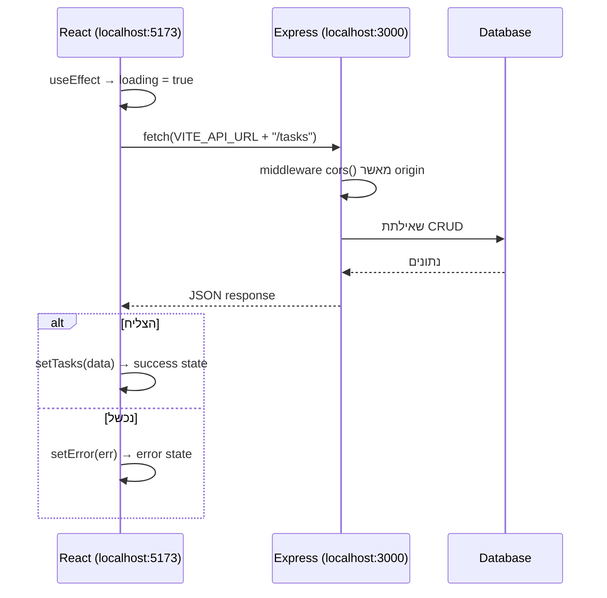

## מה זה?

זהו השיעור המסכם של יחידת ה-React, וכמעט של הקורס כולו: מחברים אפליקציית React מלאה (קומפוננטות, state, hooks, routing) לשרת **אמיתי** — בדיוק אותו שרת Express+DB שבניתם ביחידות השרתים ובסיסי הנתונים. עד עכשיו, `fetch` בתוך `useEffect` פנה ל-endpoint לדוגמה; עכשיו זה קורה מול שרת אמיתי, עם CRUD מלא, מהצד השני של הקורס כולו.

## מילות מפתח שחשוב לזכור

• Frontend / Backend — React (Frontend) רץ בדפדפן ומציג UI; Express (Backend, מיחידת השרתים) רץ בשרת ומנהל נתונים — שני "צדדים" נפרדים שמתקשרים דרך HTTP

• CORS (Cross-Origin Resource Sharing) — מנגנון אבטחה בדפדפן שחוסם בקשות `fetch` מדומיין אחד (React, לרוב `localhost:5173`) לדומיין אחר (Express, `localhost:3000`) אלא אם השרת מאשר זאת במפורש

• Environment Variable (מיחידת dotenv) — כתובת ה-API לרוב מוגדרת כמשתנה סביבה, לא "קשיחה" בקוד, כדי שקל להחליף בין פיתוח לייצור

• Loading / Error / Success States — שלושת המצבים שכל קריאת `fetch` אמיתית עוברת: טוען → הצליח (מציג נתונים) או נכשל (מציג שגיאה)

```jsx
function TaskList() {
  const { tasks, loading, error } = useFetch(
    `${import.meta.env.VITE_API_URL}/tasks`
  );

  if (loading) return <p>טוען...</p>;
  if (error) return <p>שגיאה: {error.message}</p>;

  return <ul>{tasks.map(t => <li key={t.id}>{t.title}</li>)}</ul>;
}
```



## הסבר עיקרי

CORS כשומר-סף בין frontend ל-backend — כש-React (רץ על פורט של Vite, לרוב 5173) שולח `fetch` ל-Express (רץ על פורט אחר, כמו 3000) — אלה **שני origins שונים** מבחינת הדפדפן, גם אם שניהם על אותו מחשב! בברירת מחדל, הדפדפן **חוסם** את הבקשה (מטעמי אבטחה) — השרת חייב במפורש "לאשר" בקשות מה-origin של ה-frontend (בעזרת middleware ייעודי ב-Express, כמו חבילת `cors`) — בדיוק כמו middleware אחר שראינו ביחידת השרתים.

שלושת מצבי fetch, בכל קריאה אמיתית — הדוגמה משתמשת ב-`useFetch` (מיחידת Custom Hooks!) עם שלושה מצבים: `loading` (עד שהתשובה מגיעה), ואז או `error` (הבקשה נכשלה — שרת לא זמין, שגיאת רשת) או תוצאה מוצלחת (`tasks` מלא). Conditional Rendering (מיחידת React Lists) מציג את ה-UI המתאים לכל מצב — משתמש אמיתי **תמיד** רואה מצב הגיוני, לא מסך ריק תוך כדי טעינה או קריסה שקטה בשגיאה.

Environment Variables מפרידים סביבות — `import.meta.env.VITE_API_URL` (המקבילה ב-Vite ל-`process.env` מיחידת dotenv) מאפשרת ש-**אותו קוד** יפנה לכתובת שרת שונה בפיתוח (`localhost:3000`) ובייצור (כתובת אמיתית בענן) — בלי לשנות קוד, רק את משתנה הסביבה.

## יתרונות

מחבר את כל הקורס למעגל שלם: HTML/CSS (מבנה ועיצוב) + React (UI אינטראקטיבי) + Express (שרת) + DB (נתונים אמיתיים); `useFetch` (Custom Hook) עם 3 מצבים נותן חוויית משתמש מקצועית, לא רק "מקרה השמח"; Environment Variables מאפשרים מעבר חלק בין פיתוח לייצור.

## חסרונות

CORS יכול להיות מקור תסכול נפוץ למתחילים (שגיאה בקונסול שלא תמיד ברורה מיד); סנכרון בין שינויי Schema בשרת (DB) לטיפוסי הנתונים ב-Frontend דורש תשומת לב ידנית (בלי TypeScript מלא על שני הצדדים, שראינו רק כמבוא).

## נקודות חשובות למבחן / ראיון עבודה

• Frontend (React) ו-Backend (Express) הם שני "צדדים" נפרדים שמתקשרים דרך HTTP/`fetch`

• CORS חוסם בברירת מחדל בקשות בין origins שונים — השרת חייב לאשר זאת במפורש

• כל קריאת `fetch` אמיתית צריכה לטפל בשלושה מצבים: loading, error, success

• Environment Variables מפרידים כתובת שרת פיתוח מכתובת ייצור, בלי לשנות קוד

## טעויות נפוצות

• לשכוח להגדיר CORS בשרת Express — בקשות מה-frontend נחסמות בשקט עם שגיאה מבלבלת בקונסול

• לטפל רק ב"מקרה השמח" (הצלחה), בלי Conditional Rendering ל-loading/error — משתמש רואה מסך ריק/תקוע בטעות רשת

• "לקבע" (hardcode) כתובת שרת בקוד במקום Environment Variable — שובר כשעוברים מפיתוח לייצור

## סיכום

זהו החיבור השלם: React (frontend, קומפוננטות+state+hooks+routing) מדבר עם Express+DB (backend, מהיחידות הקודמות) דרך `fetch`. CORS הוא תנאי הכרחי לתקשורת בין השניים; כל קריאת רשת אמיתית מטופלת בשלושה מצבים (loading/error/success); Environment Variables מפרידים סביבות פיתוח וייצור. זה סוגר את המעגל של כל מה שנלמד בקורס — מבנה, עיצוב, לוגיקה, שרת, מסד נתונים, וממשק משתמש אינטראקטיבי — לכדי אפליקציית full-stack שלמה ואמיתית.

## דוקומנטציה רשמית

[MDN — Cross-Origin Resource Sharing (CORS)](https://developer.mozilla.org/en-US/docs/Web/HTTP/Guides/CORS)

---

## תרגילים

### תרגיל 1 — הפעלת CORS בשרת

**המשימה:** הוסיפו את חבילת `cors` לשרת ה-Express (מיחידת השרתים), והפעילו אותה כ-middleware.

**בדיקה:** בקשת `fetch` מ-React (על פורט שונה) לשרת מצליחה, בלי שגיאת CORS בקונסול.

### תרגיל 2 — שלושת מצבי הבקשה

**המשימה:** בקומפוננטת React שמושכת נתונים מהשרת, הציגו UI שונה עבור `loading`, `error`, ותוצאה מוצלחת.

**בדיקה:** כיבוי השרת זמנית מציג את מצב ה-`error`; הפעלתו מחדש מציגה את הנתונים בהצלחה.

### תרגיל 3 — Environment Variable לכתובת שרת

**המשימה:** הגדירו `VITE_API_URL` בקובץ `.env` של פרויקט ה-React, והשתמשו בו במקום כתובת "קשיחה" בקוד.

**בדיקה:** שינוי הערך ב-`.env` (והפעלה מחדש של שרת הפיתוח) משנה לאן ה-`fetch` פונה, בלי לגעת בקוד הרכיב עצמו.

---

## פרויקט מסכם

**המשימה:** חברו את אפליקציית ה-Task המלאה (React, מהשיעורים הקודמים) לשרת Express+DB אמיתי (מהיחידות הקודמות בקורס).

**דרישות:**
1. שרת Express עם CORS מופעל, ו-endpoints מלאים ל-CRUD משימות (מיחידת REST API)
2. `useTasks` (Custom Hook, מהשיעור הקודם) מבצע את כל קריאות ה-`fetch` בפועל לשרת האמיתי, לא נתונים מדומים
3. טיפול מלא בשלושת המצבים (loading/error/success) בכל מקום שיש קריאת רשת
4. Environment Variable לכתובת השרת, לא כתובת קשיחה

**בדיקה:** הוספה/מחיקה/סימון משימה ב-React משפיעים בפועל על הנתונים בשרת (ואם יש DB אמיתי — נשמרים שם); רענון מלא של העמוד עדיין מציג את אותם הנתונים, כי הם מגיעים מהשרת בכל טעינה, לא מ-localStorage.
