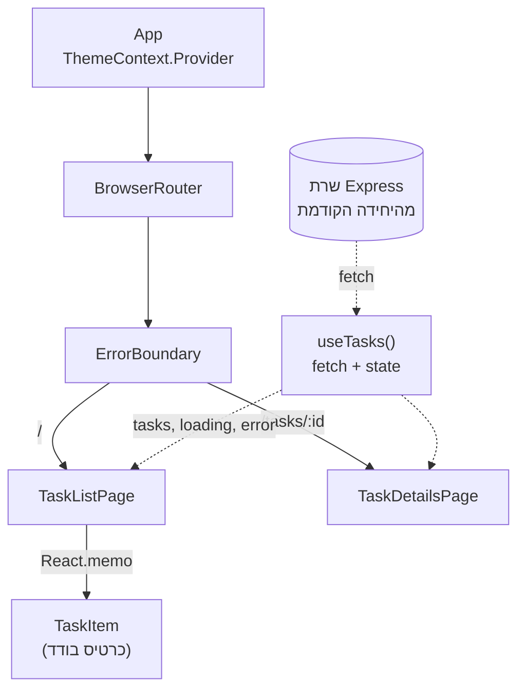

## מה זה?

זהו הפרויקט המסכם של יחידת React — הגדול והמקיף ביותר בקורס עד כה: אפליקציית **Task Manager** מלאה, מרובת-עמודים, שמשלבת את **כל שלושה-עשר** השיעורים ביחידה — Components, State, Lists & Conditional Rendering, useRef, useEffect, Context API, Custom Hooks, Error Boundaries, State Management, Performance, Routing, ו-Backend Integration — לכדי אפליקציה אחת שרצה מול שרת ה-Express האמיתי מהפרויקט המסכם של יחידת Server.

## מילות מפתח שחשוב לזכור

• עץ קומפוננטות — `App` בראש, עם Routes שמחליפים בין עמודים, וקומפוננטות קטנות יותר (`TaskList`, `TaskItem`, `TaskForm`) בכל עמוד

• Custom Hook (`useTasks`) — מרכז את כל לוגיקת ה-`fetch`+state עבור משימות, כדי שקומפוננטות UI לא יצטרכו לדעת עליה

• Context — משתף מידע רחב (למשל: משתמש מחובר, או ערכת נושא) בלי להעביר Props דרך כל שכבה

• Error Boundary — עוטף אזור באפליקציה כדי שקריסת רינדור לא תפיל את כל האתר

```jsx
// useTasks.js — Custom Hook שמרכז את כל לוגיקת המשימות
function useTasks() {
  const [tasks, setTasks] = useState([]);
  const [loading, setLoading] = useState(true);
  const [error, setError] = useState(null);

  useEffect(() => {
    fetch(`${import.meta.env.VITE_API_URL}/tasks`)
      .then((res) => res.json())
      .then(setTasks)
      .catch(setError)
      .finally(() => setLoading(false));
  }, []);

  return { tasks, loading, error, setTasks };
}
```

```jsx
// App.jsx — הרכבת כל היחידה: Router + Context + Error Boundary
function App() {
  return (
    <ThemeContext.Provider value="dark">
      <BrowserRouter>
        <ErrorBoundary>
          <Routes>
            <Route path="/" element={<TaskListPage />} />
            <Route path="/tasks/:id" element={<TaskDetailsPage />} />
          </Routes>
        </ErrorBoundary>
      </BrowserRouter>
    </ThemeContext.Provider>
  );
}
```



## הסבר עיקרי

Custom Hook מפריד "מה מוצג" מ"איך משיגים את הנתונים" — `TaskListPage` קוראת ל-`useTasks()` ומקבלת `{ tasks, loading, error }` — היא לא יודעת כלום על `fetch`, כתובת ה-API, או טיפול בשגיאות רשת. אם מחר צריך לשנות איך המשימות נטענות (למשל: להוסיף caching), משנים רק את `useTasks`, ואף קומפוננטת UI לא זזה.

Routing הופך את זה ל"אפליקציה" אמיתית, לא מסך אחד — `TaskListPage` מציגה את כל המשימות; לחיצה על משימה מנווטת (בלי רענון!) ל-`/tasks/:id`, ש-`useParams()` קורא ממנו את ה-`id` הרלוונטי ומציג פרטים מלאים. זה בדיוק ה-SPA (Single Page Application) שיחידת Routing לימדה.

Error Boundary + Context הם רשת ביטחון ותשתית-רחבה, לא "עוד קומפוננטה" — Error Boundary עוטף את כל אזור ה-Routes, כך שאם קומפוננטה בודדת (למשל כרטיס משימה עם נתון פגום) קורסת ברינדור, שאר האפליקציה (התפריט, שאר הרשימה) ממשיכה לעבוד. Context (כאן: ערכת נושא) זמין לכל קומפוננטה בעץ בלי Prop Drilling — בדיוק כמו שיחידת Context API לימדה.

## יתרונות

חיבור אמיתי לשרת אמיתי (לא נתונים מדומים) מוכיח שכל השכבות — React, Router, שרת Express, DB — עובדות יחד; Custom Hook + State Management נכון הופכים את הקוד לניתן-לתחזוקה גם כשהאפליקציה גדלה; Error Boundary נותן חוסן אמיתי מול שגיאות רינדור בלתי-צפויות.

## חסרונות

אפליקציה מרובת-עמודים עם Context+Hooks+Routing דורשת יותר קבצים ותכנון מראש מ"קומפוננטה בודדת עם useState"; דיבוג בעיות שמערבות כמה שכבות (Hook+Context+Router ביחד) יכול לקחת יותר זמן מבעיה מבודדת בקומפוננטה אחת.

## נקודות חשובות למבחן / ראיון עבודה

• Custom Hook מפריד לוגיקת state/fetch מקומפוננטות UI — עקרון מרכזי לאפליקציות React אמיתיות

• Routing הופך אפליקציית עמוד-יחיד לכמה "מסכים" בלי רענון דפדפן

• Error Boundary מגביל את רדיוס הנזק של קריסת רינדור לתת-עץ ספציפי, לא כל האפליקציה

• Context משתף state רחב (כמו ערכת נושא/משתמש) בלי Prop Drilling דרך כל שכבה

## טעויות נפוצות

• לכתוב לוגיקת `fetch` ישירות בתוך קומפוננטת UI, במקום לחלץ ל-Custom Hook — קשה לשימוש חוזר ולבדיקה

• לשכוח Error Boundary סביב אזורים שמציגים נתונים חיצוניים — קריסה בודדת מפילה את כל האתר

• להשתמש ב-Context לכל state, גם state מקומי לקומפוננטה אחת — Prop Drilling מיותר בכיוון ההפוך

• לא לטפל בשלושת מצבי הבקשה (loading/error/success) — משתמש רואה מסך ריק/תקוע במקום מצב הגיוני

## סיכום

הפרויקט המסכם בונה אפליקציית Task Manager שלמה: Custom Hook מרכז את כל לוגיקת התקשורת עם השרת, Routing הופך אותה למספר "עמודים" אמיתיים, Context משתף מידע רחב בלי Prop Drilling, ו-Error Boundary נותן חוסן מול קריסות. זה בדיוק המעגל השלם שהקורס בנה אליו — מ-JavaScript גולמי, דרך שרת Express אמיתי, ועד ממשק React מלא שמדבר איתו.

## דוקומנטציה רשמית

[React — Reusing Logic with Custom Hooks](https://react.dev/learn/reusing-logic-with-custom-hooks)

[React Router — Official Docs](https://reactrouter.com/)

---

## תרגילים

### תרגיל 1 — Custom Hook לחילוץ לוגיקה

**המשימה:** קחו קומפוננטה עם `fetch`+`useState`+`useEffect` בגוף שלה, וחלצו את הלוגיקה ל-Custom Hook נפרד.

**בדיקה:** הקומפוננטה מתנהגת זהה לפני ואחרי — רק הקוד עצמו עבר למקום אחר, נגיש לשימוש חוזר.

### תרגיל 2 — Error Boundary סביב כרטיס בודד

**המשימה:** גרמו לכרטיס משימה בודד לקרוס בכוונה (למשל גישה לשדה `undefined`), ועטפו אותו ב-Error Boundary.

**בדיקה:** רק הכרטיס הספציפי מציג הודעת שגיאה — שאר הכרטיסים והאפליקציה ממשיכים לעבוד כרגיל.

---

## פרויקט מסכם

**המשימה:** בנו אפליקציית Task Manager מלאה עם React, המחוברת לשרת ה-Express האמיתי מהפרויקט המסכם של יחידת Server.

**דרישות:**
1. `useTasks` — Custom Hook שמושך משימות מהשרת האמיתי, עם טיפול מלא ב-loading/error/success
2. שני עמודים לפחות עם React Router: רשימת משימות (`/`) ופרטי משימה בודדת (`/tasks/:id`)
3. Context אחד לפחות (למשל ערכת נושא בהיר/כהה) שזמין לכל האפליקציה
4. Error Boundary שעוטף את אזור התוכן הראשי
5. `React.memo` על קומפוננטת כרטיס משימה, כדי למנוע רינדור מיותר כש-state אחר משתנה
6. חיבור אמיתי לשרת — לא נתונים מדומים — עם `VITE_API_URL` מ-Environment Variable

**בדיקה:** רשימת המשימות נטענת מהשרת האמיתי ומוצגת נכון; לחיצה על משימה מנווטת ל-`/tasks/:id` בלי רענון עמוד, ומציגה פרטים מלאים; כיבוי השרת זמנית מציג מצב `error` ברור, לא מסך ריק; הוספת/מחיקת משימה משפיעה בפועל על השרת, ורענון מלא של העמוד עדיין מציג את השינוי.

## מה בפרק הבא

בפרק הבא נתחיל יחידה חדשה — **React + Server**. עד עכשיו חיברנו את React לשרת עם `fetch` בסיסי בלבד. ביחידה הבאה נלמד כלים מתקדמים יותר לתקשורת עם השרת — Axios, זרימת התחברות (Auth), פריסה (Deployment) לאינטרנט, ו-WebSockets לתקשורת בזמן אמת.
