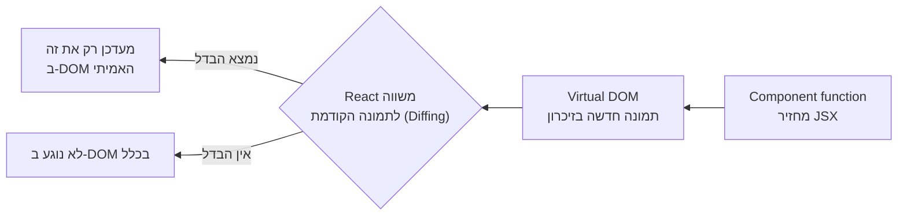

## מה זה?

ביחידת ה-DOM, בפרויקט ה-Todo App, בנינו את הדפוס: State (מערך משימות) → `render()` שבונה מחדש את כל ה-DOM מה-state. זה עבד, אבל `innerHTML = ""` ובניית הכל מחדש בכל שינוי, בפרויקט **גדול** עם הרבה רכיבים, הופך לאיטי ומסורבל. **React** היא ספרייה של Facebook שפותרת בדיוק את זה: כותבים קומפוננטות שמתארות "איך ה-UI אמור להיראות לפי ה-state הנוכחי", ו-React דואגת **בעצמה** לעדכן רק את מה שבאמת השתנה ב-DOM האמיתי — לא הכל מחדש.

## מילות מפתח שחשוב לזכור

• Component (קומפוננטה) — פונקציית JavaScript שמחזירה תיאור של UI; יחידת הבנייה הבסיסית ב-React

• JSX — תחביר שמערבב HTML-כמו-קוד בתוך JavaScript; **לא** מחרוזת HTML (כמו `innerHTML`) — הוא מתקמפל לקריאות פונקציה

• Virtual DOM — עותק "קל" בזיכרון של ה-DOM האמיתי; React משווה אותו לגרסה הקודמת ומעדכן ב-DOM האמיתי **רק** את מה שהשתנה

• `ReactDOM.createRoot(...).render(...)` — הפקודה שמחברת קומפוננטת React ל-DOM אמיתי בעמוד

• Vite / Create React App — כלי build שמריצים כדי להתחיל פרויקט React חדש, כולל שרת פיתוח וקומפילציית JSX

```jsx
function Greeting() {
  return <h1>שלום, React!</h1>;
}

ReactDOM.createRoot(document.getElementById("root")).render(<Greeting />);
```



## הסבר עיקרי

JSX מתקמפל לקריאות פונקציה, לא HTML אמיתי — `<h1>שלום, React!</h1>` בתוך קוד JavaScript **נראה** כמו HTML, אבל הוא בעצם תחביר שמתקמפל (בעזרת Vite/Babel) לקריאת פונקציה רגילה. זה שונה לגמרי מ-`innerHTML` (מיחידת ה-DOM) — JSX **לא** מפרסר מחרוזת HTML בזמן ריצה, אלא נבנה כקוד JavaScript רגיל בזמן קומפילציה — בטוח מ-XSS בברירת מחדל.

Virtual DOM כפתרון לבעיית "בנייה מחדש של הכל" — בפרויקט ה-Todo App (DOM), `render()` מחק **את כל** הרשימה ובנה אותה מחדש, גם אם רק פריט אחד השתנה — יקר ביצועית בפרויקט גדול. React שומרת "תמונה" (Virtual DOM) של איך ה-UI אמור להיראות, משווה אותה לתמונה הקודמת (Diffing), ומעדכנת ב-DOM **האמיתי** רק את השינויים המדויקים — הרבה יותר יעיל.

Component כפונקציה שמחזירה UI — קומפוננטה היא פשוט פונקציה JavaScript (עם אות ראשונה גדולה, בהסכמה) שמחזירה JSX. React קוראת לפונקציה הזו **מחדש** בכל פעם שצריך "לרנדר" אותה מחדש (למשל, אחרי שינוי state, בשיעור הבא) — ומשווה את התוצאה החדשה לישנה בעזרת Virtual DOM.

## יתרונות

Virtual DOM נותן ביצועים טובים גם באפליקציות גדולות עם הרבה רכיבים; JSX משלב תיאור UI ולוגיקה באותו מקום, קריא יותר מהפרדה מלאה; קומפוננטות ניתנות לשימוש חוזר ומורכבות אחת מתוך השנייה.

## חסרונות

דורש שלב build (Vite/webpack) — לא ניתן להריץ JSX ישירות בדפדפן בלי קומפילציה; עקומת למידה נוספת (JSX, קומפוננטות, hooks בהמשך); "הקסם" של Virtual DOM יכול להקשות על הבנה מלאה של מה קורה "מתחת למכסה המנוע" בהתחלה.

## נקודות חשובות למבחן / ראיון עבודה

• Component הוא פונקציה שמחזירה JSX; React קוראת לה מחדש כדי לרנדר

• JSX מתקמפל לקריאות פונקציה, לא מפרסר HTML כמחרוזת — בטוח מ-XSS בברירת מחדל

• Virtual DOM מאפשר ל-React לעדכן רק את מה שהשתנה בפועל ב-DOM האמיתי, לא הכל מחדש

• פרויקט React אמיתי דורש כלי build (כמו Vite) לקומפילציית JSX ולשרת פיתוח

## טעויות נפוצות

• לחשוב ש-JSX הוא HTML רגיל שרץ ישירות — הוא תחביר שדורש קומפילציה

• לנסות להריץ קובץ `.jsx` ישירות בדפדפן בלי שלב build

• לבלבל בין Virtual DOM (עותק בזיכרון) ל-DOM האמיתי (מה שבאמת מוצג על המסך)

## סיכום

React היא ספרייה שמיישמת בקנה מידה גדול את דפוס ה-State→Render שכבר הכרנו מהיחידת ה-DOM: קומפוננטות (פונקציות שמחזירות JSX) מתארות איך ה-UI אמור להיראות, ו-Virtual DOM מאפשר ל-React לעדכן רק את מה שהשתנה בפועל, לא לבנות הכל מחדש. JSX מתקמפל לקוד JavaScript אמיתי, לא HTML כמחרוזת — בטוח ויעיל.

## דוקומנטציה רשמית

[React — Official Docs](https://react.dev/learn)

---

## תרגילים

### תרגיל 1 — הקמת פרויקט React

**המשימה:** צרו פרויקט React חדש עם Vite (`npm create vite@latest`), והריצו את שרת הפיתוח.

**בדיקה:** פתיחת הכתובת שהודפסה בטרמינל בדפדפן מציגה את עמוד ה-React ברירת המחדל.

### תרגיל 2 — קומפוננטה ראשונה

**המשימה:** כתבו קומפוננטת `Greeting` שמחזירה `<h1>` עם שם שלכם, והציגו אותה בעמוד.

**בדיקה:** השם שלכם מוצג על המסך בתוך כותרת.

### תרגיל 3 — JSX עם ביטויים

**המשימה:** בתוך JSX, הציגו תוצאה של חישוב JavaScript (למשל `{2 + 2}`) בתוך תגית.

**בדיקה:** המסך מציג את התוצאה המחושבת (`4`), לא את הטקסט המילולי.

---

## פרויקט מסכם

**המשימה:** הקימו פרויקט React חדש עם קומפוננטת "כרטיס ביקור" אישית.

**דרישות:**
1. פרויקט Vite חדש שרץ בהצלחה
2. קומפוננטה `BusinessCard` שמחזירה שם, תפקיד, ואימייל בתוך אלמנטים סמנטיים (מיחידת HTML)
3. שימוש בביטוי JavaScript אחד לפחות בתוך ה-JSX (למשל שנה נוכחית מחושבת)

**בדיקה:** הקומפוננטה מוצגת נכון בדפדפן; שינוי הקוד גורם לעדכון מיידי בדפדפן (Hot Reload של Vite).

---

## מה בפרק הבא

בפרק הבא נלמד על **React Components** — בשיעור הקודם ראינו קומפוננטה בודדת. אבל אפליקציה אמיתית מורכבת מהרבה חלקים: כותרת, כרטיס משתמש, כפתור — כל אחד עם התנהגות ומראה משלו. **Components** הם היחידה שמאפשרת לפרק UI מורכב לחלקים קטנים, עצמאי
