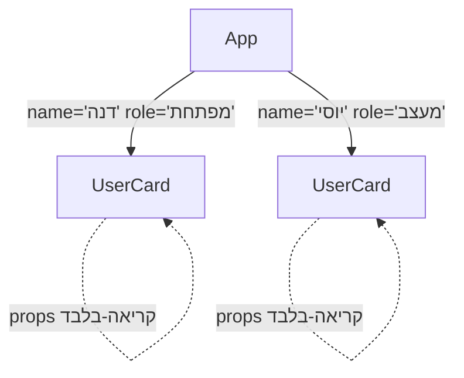

## מה זה?

בשיעור הקודם ראינו קומפוננטה בודדת. אבל אפליקציה אמיתית מורכבת מהרבה חלקים: כותרת, כרטיס משתמש, כפתור — כל אחד עם התנהגות ומראה משלו. **Components** הם היחידה שמאפשרת לפרק UI מורכב לחלקים קטנים, עצמאיים, וניתנים לשימוש חוזר — ו-**Props** הן הדרך להעביר מידע **מקומפוננטת-הורה לקומפוננטת-ילד**, בדיוק כמו פרמטרים לפונקציה.

## מילות מפתח שחשוב לזכור

• Props (properties) — אובייקט של נתונים שקומפוננטת-הורה מעבירה לקומפוננטת-ילד; **קריאה-בלבד** מנקודת מבט הילד

• Composition (הרכבה) — בניית UI מורכב מהרכבת קומפוננטות קטנות זו בתוך זו, כמו לבני LEGO

• `children` prop — prop מיוחד שמכיל את כל מה שהועבר **בין** תגיות הפתיחה/סגירה של הקומפוננטה

• Reusability (שימוש חוזר) — אותה קומפוננטה, עם props שונים, יכולה להופיע כמה פעמים עם תוכן שונה

```jsx
function UserCard({ name, role }) {
  return (
    <div className="card">
      <h2>{name}</h2>
      <p>{role}</p>
    </div>
  );
}

function App() {
  return (
    <>
      <UserCard name="דנה" role="מפתחת" />
      <UserCard name="יוסי" role="מעצב" />
    </>
  );
}
```



## הסבר עיקרי

Props זורמים בכיוון אחד — מהורה לילד — `<UserCard name="דנה" role="מפתחת" />` מעביר את `name` ו-`role` **פנימה** לקומפוננטה `UserCard`, בדיוק כמו קריאה לפונקציה עם ארגומנטים. הקומפוננטה `UserCard` **לא יכולה** לשנות את ה-props שקיבלה — הם קריאה-בלבד, ומגיעים תמיד מלמעלה למטה בעץ הקומפוננטות. זה מייצר תזרים נתונים חזוי וקל למעקב.

Composition כדרך לבנות UI מורכב — במקום קומפוננטה ענקית אחת עם כל הלוגיקה, מפרקים ל-`UserCard`, `Header`, `Button` נפרדות — כל אחת עם אחריות אחת ברורה (בדיוק כמו MVC/DDD מיחידת השרתים!) — ומרכיבים אותן יחד בקומפוננטת `App` הראשית. זו בדיוק אותה חשיבה כמו פירוק Semantic HTML לתגיות עם תפקיד ברור.

className לא class — שימו לב שבתוך JSX כותבים `className` ולא `class` — כי `class` היא מילה שמורה ב-JavaScript (מגדירה מחלקה). זו נקודה שמפתחים חדשים ל-React שוכחים כל הזמן.

## יתרונות

פירוק UI לקומפוננטות קטנות הופך את הקוד לקריא ולניתן-לתחזוקה; שימוש חוזר באותה קומפוננטה עם props שונים חוסך שכפול קוד; תזרים props חד-כיווני (הורה→ילד) הופך את זרימת הנתונים לחזויה.

## חסרונות

העברת props דרך כמה שכבות קומפוננטות ("prop drilling") יכולה להיות מסורבלת (נלמד פתרון ב-Context API); פירוק-יתר לקומפוננטות קטנות מדי יכול להוסיף מורכבות ניהולית שלא לצורך.

## נקודות חשובות למבחן / ראיון עבודה

• Props זורמים תמיד מהורה לילד, וקריאים-בלבד מנקודת מבט הילד

• Composition מפרקת UI מורכב לקומפוננטות קטנות עם אחריות ברורה

• `children` הוא prop מיוחד שמכיל את מה שהועבר בין תגיות הפתיחה/סגירה

• ב-JSX כותבים `className`, לא `class` (מילה שמורה ב-JavaScript)

## טעויות נפוצות

• לנסות לשנות props בתוך קומפוננטת-הילד — הם קריאה-בלבד, זה נגד עקרון React

• שימוש ב-`class` במקום `className` בתוך JSX

• לבנות קומפוננטה ענקית אחת עם כל הלוגיקה, במקום לפרק לקומפוננטות קטנות עם אחריות ברורה

## סיכום

Components מפרקים UI מורכב לחלקים קטנים, עצמאיים וניתנים לשימוש חוזר. Props מעבירים נתונים מהורה לילד (קריאה-בלבד, חד-כיווני). `children` הוא prop מיוחד לתוכן שמועבר בין תגיות הפתיחה/סגירה. Composition — הרכבת קומפוננטות זו בתוך זו — היא הדרך המרכזית לבנות אפליקציות React.

## דוקומנטציה רשמית

[React — Passing Props to a Component](https://react.dev/learn/passing-props-to-a-component)

---

## תרגילים

### תרגיל 1 — קומפוננטה עם props

**המשימה:** כתבו קומפוננטת `Button({ label })` שמציגה כפתור עם הטקסט מה-prop, והשתמשו בה פעמיים עם label שונה.

**בדיקה:** שני הכפתורים מוצגים עם טקסטים שונים, מאותה קומפוננטה.

### תרגיל 2 — children prop

**המשימה:** כתבו קומפוננטת `Card({ children })` שעוטפת כל מה שמעבירים לה בתוך `<div className="card">`.

**בדיקה:** תוכן שמועבר בין תגיות הפתיחה/סגירה של `Card` מוצג בתוך עיצוב הכרטיס.

### תרגיל 3 — Composition

**המשימה:** בנו קומפוננטת `App` שמרכיבה יחד `Header`, `UserCard` (כמה פעמים עם props שונים), ו-`Footer`.

**בדיקה:** כל שלוש הקומפוננטות מוצגות יחד בעמוד, בסדר הנכון.

---

## פרויקט מסכם

**המשימה:** פרקו את "עמוד האודות" (מיחידות HTML/CSS) לקומפוננטות React.

**דרישות:**
1. קומפוננטת `Header` עם `nav` (מיחידת Semantic HTML)
2. קומפוננטת `SkillCard({ title, description })` המשמשת כמה פעמים עם props שונים
3. קומפוננטת `Footer`
4. קומפוננטת `App` שמרכיבה את כולן יחד

**בדיקה:** העמוד מוצג זהה (או קרוב) לגרסת ה-HTML/CSS המקורית; כל `SkillCard` מציג תוכן שונה מאותה קומפוננטה.

---

## מה בפרק הבא

בפרק הבא נלמד על **React State** — Props (שיעור קודם) הם קבועים מנקודת מבט הקומפוננטה שמקבלת אותם. אבל מה עם נתונים שמשתנים **בתוך** קומפוננטה עצמה — כמו מונה קליקים, או תוכן שדה טקסט? ביחידת ה-DOM, שינוי כזה דרש קריאה ידנית ל-`render(
