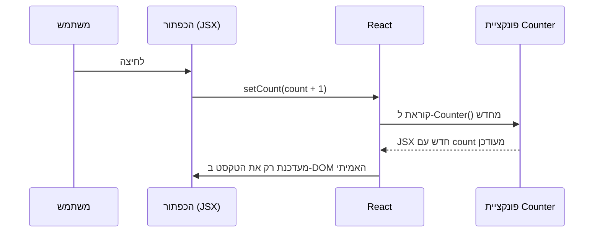

## מה זה?

Props (שיעור קודם) הם קבועים מנקודת מבט הקומפוננטה שמקבלת אותם. אבל מה עם נתונים שמשתנים **בתוך** קומפוננטה עצמה — כמו מונה קליקים, או תוכן שדה טקסט? ביחידת ה-DOM, שינוי כזה דרש קריאה ידנית ל-`render()`. ב-React, `useState` נותן לקומפוננטה "לזכור" ערך בין רינדורים, **ואוטומטית** לגרום לרינדור מחדש כשהוא משתנה — בלי לקרוא לשום דבר ידנית.

## מילות מפתח שחשוב לזכור

• `useState(initialValue)` — Hook שמחזיר זוג: `[state, setState]` — הערך הנוכחי, ופונקציה לעדכן אותו

• State (מצב) — נתון ש"שייך" לקומפוננטה ספציפית, ונשמר בין רינדורים שונים שלה

• `setState(newValue)` — קריאה לה **גורמת** ל-React לרנדר את הקומפוננטה מחדש עם הערך החדש

• Immutability (אי-שינוי) — לעולם לא משנים state ישירות — תמיד קוראים ל-`setState` עם ערך **חדש**

• Re-render (רינדור מחדש) — React קוראת שוב לפונקציית הקומפוננטה כדי לחשב את ה-UI המעודכן

```jsx
function Counter() {
  const [count, setCount] = useState(0);

  return (
    <button onClick={() => setCount(count + 1)}>
      נלחצתי {count} פעמים
    </button>
  );
}
```



## הדגמה חיה

<div class="demo-live" style="direction:rtl;border:1px solid #d1d5db;border-radius:10px;padding:1.25rem;margin:1.25rem 0;background:#fafafa;color:#111827;">
<p style="font-weight:600;margin:0 0 0.9rem;color:#6b7280;font-size:0.85rem;">🔴 הדגמה חיה — זו לא רכיב React אמיתי (שדורש קומפילציית JSX), אלא המחשה של אותו רעיון: "state" ששומר ערך בין "רינדורים", ולחיצה מפעילה עדכון</p>
<button id="demo-counter-btn" onclick="const n=parseInt(this.dataset.count||'0')+1; this.dataset.count=n; this.textContent='נלחצתי ' + n + ' פעמים';" data-count="0" style="background:#2563eb;color:#fff;border:none;border-radius:6px;padding:0.6rem 1.2rem;font-weight:700;cursor:pointer;">נלחצתי 0 פעמים</button>
</div>

## הסבר עיקרי

setState לא רק משנה ערך — היא מפעילה רינדור מחדש — זה בדיוק ההבדל מ-JavaScript רגיל: קריאה ל-`setCount(count + 1)` לא רק "שומרת" ערך חדש — היא **מודיעה** ל-React "משהו השתנה, תרנדר את הקומפוננטה הזו מחדש עם הערך העדכני". React קוראת שוב לפונקציית `Counter`, מחשבת JSX חדש, ומעדכנת ב-DOM האמיתי (דרך Virtual DOM) רק את מה שבאמת השתנה — הכפתור עם המספר החדש.

State לא נעלם בין רינדורים, בניגוד למשתנה רגיל — משתנה `let` רגיל בתוך פונקציה "מתאפס" בכל קריאה חדשה לפונקציה. `useState` שונה: React "זוכרת" את הערך **עבור הקומפוננטה הספציפית הזו**, גם אחרי שהפונקציה רצה מחדש. זה בדיוק מה שמאפשר למונה "לזכור" כמה פעמים לחצו, גם כשהקומפוננטה מתרנדרת שוב ושוב.

לעולם לא לשנות state ישירות — כתיבה ישירה של ערך חדש למשתנה (בלי לקרוא ל-`setCount`) **לא** עובדת — React לא "יודעת" שמשהו השתנה, ולא תרנדר מחדש. תמיד קוראים לפונקציית ה-setter עם הערך החדש — זה מה שמפעיל את כל המנגנון.

## יתרונות

עדכון UI אוטומטי ומדויק בתגובה לשינוי נתונים, בלי קריאה ידנית ל-`render()`; state מקומי לקומפוננטה, בלי "לזהם" משתנים גלובליים; העדכון מתבצע רק דרך `setState`, כך שאפשר תמיד לדעת **מתי בדיוק** UI עשוי להשתנות.

## חסרונות

עדכוני state הם **אסינכרוניים** — `setCount` לא בהכרח מעדכן את `count` מיד באותה שורת קוד; state מקומי בקומפוננטה אחת לא נגיש לקומפוננטות אחרות בלי מנגנון נוסף (Props, או Context API בשיעור מאוחר יותר).

## נקודות חשובות למבחן / ראיון עבודה

• `useState(initial)` מחזיר `[value, setValue]` — ערך נוכחי ופונקציית עדכון

• קריאה ל-`setState` גורמת ל-React לרנדר את הקומפוננטה מחדש

• לעולם לא משנים state ישירות — תמיד דרך פונקציית ה-setter

• state נשמר בין רינדורים של אותה קומפוננטה, בניגוד למשתנה `let` רגיל

## טעויות נפוצות

• שינוי state ישירות במקום קריאה ל-setter — לא גורם לרינדור מחדש בכלל

• לצפות שהערך יתעדכן **מיד** אחרי `setState`, באותה שורת קוד — עדכוני state הם אסינכרוניים

• לשכוח שכל `setState` מפעיל רינדור מחדש — קריאות מיותרות רבות פוגעות בביצועים

## סיכום

`useState` נותן לקומפוננטה state — נתון שנשמר בין רינדורים, וקריאה ל-`setState` שלו גורמת ל-React לרנדר את הקומפוננטה מחדש אוטומטית. לעולם לא משנים state ישירות — תמיד דרך פונקציית ה-setter. זה מחליף את הצורך בקריאה ידנית ל-`render()` שראינו ביחידת ה-DOM.

## דוקומנטציה רשמית

[React — State: A Component's Memory](https://react.dev/learn/state-a-components-memory)

---

## תרגילים

### תרגיל 1 — מונה בסיסי

**המשימה:** בנו קומפוננטת `Counter` עם `useState(0)` וכפתור שמעלה את הערך ב-1 בכל קליק.

**בדיקה:** כל קליק מעלה את המספר המוצג בדיוק ב-1.

### תרגיל 2 — state מטיפוס מחרוזת

**המשימה:** בנו שדה קלט מחובר ל-state, שמציג את הערך בזמן אמת באלמנט אחר.

**בדיקה:** הקלדה בשדה מעדכנת את התצוגה מיד, בכל תו.

### תרגיל 3 — כמה state נפרדים

**המשימה:** בקומפוננטה אחת, נהלו שני `useState` נפרדים (למשל `count` ו-`isVisible`), ווודאו ששינוי אחד לא משפיע על השני.

**בדיקה:** עדכון `count` לא גורם ל-`isVisible` להשתנות, ולהפך — שני ה-state עצמאיים לגמרי.

---

## פרויקט מסכם

**המשימה:** בנו קומפוננטת "עגלת קניות מיני" עם state.

**דרישות:**
1. `useState` למספר פריטים בעגלה (מתחיל מ-0)
2. כפתור "הוסף לעגלה" שמעלה את המספר ב-1
3. כפתור "רוקן עגלה" שמאפס את המספר ל-0
4. תצוגה שמראה "X פריטים בעגלה" ומתעדכנת בזמן אמת

**בדיקה:** כל קליק על "הוסף" מעלה את המספר המוצג ב-1; "רוקן" תמיד מחזיר בדיוק ל-0, לא משנה מה היה הערך לפני כן.

---

## מה בפרק הבא

בפרק הבא נלמד על **Lists & Conditional Rendering** — ביחידת ה-DOM, כדי להציג רשימת משימות בנינו לולאה עם `createElement`+`appendChild` לכל פריט. ב-React, זה הרבה יותר פשוט: `.map()` (מיחידת Array Methods!) הופך כל איבר במערך ל-JSX, ו-React דואגת להציג א
