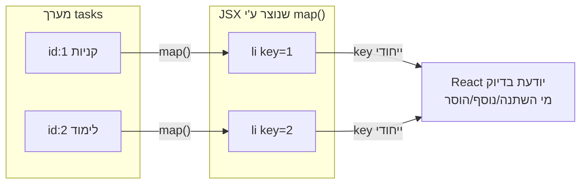

## מה זה?

ביחידת ה-DOM, כדי להציג רשימת משימות בנינו לולאה עם `createElement`+`appendChild` לכל פריט. ב-React, זה הרבה יותר פשוט: `.map()` (מיחידת Array Methods!) הופך כל איבר במערך ל-JSX, ו-React דואגת להציג את כולם. **Conditional Rendering** נותן דרך דומה להציג או להסתיר חלקי UI לפי תנאי, בלי לגעת ב-DOM ישירות.

## מילות מפתח שחשוב לזכור

• `.map()` (מוכר מיחידת JS) — הופך כל איבר במערך ל-JSX, ומחזיר מערך של קומפוננטות להצגה

• `key` prop — מזהה ייחודי שחייבים לתת לכל איבר ברשימה ממופה; עוזר ל-React "לזהות" אילו איברים השתנו/נוספו/הוסרו

• Conditional Rendering — הצגה מותנית: `{condition && <Component />}` או ביטוי טרנרי `{condition ? <A /> : <B />}`

• Short-circuit (מוכר מיחידת JS) — `&&` בתוך JSX: אם התנאי `false`, שום דבר לא מוצג; אם `true`, מוצג הצד הימני

```jsx
function TaskList({ tasks }) {
  return (
    <ul>
      {tasks.map(task => (
        <li key={task.id}>
          {task.title} {task.done && "✓"}
        </li>
      ))}
    </ul>
  );
}
```



## הסבר עיקרי

key עוזר ל-React "לזהות" איברים לאורך זמן — כשמערך משתנה (פריט נוסף/הוסר), React צריכה לדעת **איזה** `<li>` הוא איזה, כדי לעדכן רק את מה שבאמת השתנה (זוכרים Virtual DOM Diffing?) — בלי `key` ייחודי ויציב, React עלולה "לבלבל" בין איברים ולעדכן/למחוק את הפריטים הלא-נכונים. **חובה** `key` ייחודי — לרוב `id` אמיתי מהנתונים, **לא** האינדקס במערך (שמשתנה כשמוסיפים/מוחקים מהאמצע).

&& כקיצור להצגה מותנית — `{task.done && "✓"}` מנצל Short-circuit Evaluation (מיחידת JS): אם `task.done` הוא `false`, הביטוי כולו מוערך ל-`false` — ו-React **לא מציגה כלום** עבור `false` (או `null`/`undefined`). אם `task.done` הוא `true`, הביטוי מוערך לצד הימני ("✓") — שמוצג.

.map() בדיוק כמו ביחידת JS, רק בתוך JSX — `tasks.map(task => (...))` הוא **אותו** `.map()` בדיוק מיחידת Array Methods — מחזיר מערך חדש, בלי לשנות את המקורי. ההבדל היחיד: כאן, מה שמוחזר הוא JSX, ו-React יודעת להציג מערך של אלמנטים כרשימה.

## יתרונות

`.map()` הופך מערך לרשימת UI בשורה אחת, בלי DOM ידני; `key` נכון נותן ביצועים טובים גם ברשימות גדולות שמשתנות; Conditional Rendering עם `&&`/טרנרי קריא וקצר.

## חסרונות

שימוש ב-index כ-`key` (במקום `id` אמיתי) עלול לגרום לבאגים עדינים כשהרשימה משתנה מהאמצע; ביטויי תנאי מקוננים מדי (`&&`/טרנרי בתוך טרנרי) פוגעים בקריאות.

## נקודות חשובות למבחן / ראיון עבודה

• כל איבר ברשימה ממופה חייב `key` ייחודי ויציב — עדיף `id` אמיתי, לא index

• `.map()` בתוך JSX הוא אותו `.map()` של מערכים רגיל — מחזיר מערך של JSX

• `{condition && <X/>}` מציג `<X/>` רק אם `condition` הוא `true`; `false`/`null` לא מוצגים כלל

• ביטוי טרנרי (`condition ? A : B`) מתאים כשיש **שתי** אפשרויות תצוגה, לא רק אחת-או-כלום

## טעויות נפוצות

• שימוש ב-index המערך כ-`key` — שובר בעדינות כשמוסיפים/מוחקים פריטים מהאמצע

• שכחת `key` לגמרי — React מזהירה באזהרת קונסול, והתנהגות עדכון עלולה להיות שגויה

• להשתמש ב-`&&` עם ערך שעלול להיות `0` — מציג "0" בפועל על המסך, לא כלום

## סיכום

`.map()` הופך מערך נתונים לרשימת קומפוננטות, בדיוק כמו ביחידת JS — כל איבר חייב `key` ייחודי ויציב (לא index) כדי ש-React תעדכן נכון ויעיל. Conditional Rendering עם `&&`/טרנרי מציג/מסתיר UI לפי תנאי, בלי לגעת ב-DOM ישירות.

## דוקומנטציה רשמית

[React — Rendering Lists](https://react.dev/learn/rendering-lists)

---

## תרגילים

### תרגיל 1 — map בסיסי

**המשימה:** על מערך שמות, הציגו רשימת `<li>` עם `.map()`, כל אחד עם `key` ייחודי.

**בדיקה:** כל שם מהמערך מוצג כפריט רשימה נפרד; אין אזהרת `key` בקונסול.

### תרגיל 2 — Conditional Rendering

**המשימה:** על state בוליאני (`isLoggedIn`), הציגו "ברוך הבא" אם `true`, ו-"אנא התחבר" אם `false`, עם ביטוי טרנרי.

**בדיקה:** שינוי ה-state (עם כפתור) מחליף בין שתי ההודעות בזמן אמת.

### תרגיל 3 — key עם id אמיתי

**המשימה:** על מערך אובייקטים עם `id`, השתמשו ב-`task.id` כ-`key` (לא באינדקס), ובדקו שהוספת פריט לאמצע המערך לא "מבלבלת" את הרשימה.

**בדיקה:** הוספת פריט לאמצע המערך מציגה אותו במקום הנכון, בלי לגרום לפריטים אחרים "להתחלף" בטעות.

---

## פרויקט מסכם

**המשימה:** בנו קומפוננטת `TaskList` שמציגה משימות עם סימון "בוצע"/"לא בוצע".

**דרישות:**
1. State כמערך משימות (`{ id, title, done }`)
2. `.map()` להצגת הרשימה, עם `key={task.id}`
3. Conditional Rendering: משימות שבוצעו מוצגות עם קו-חוצה (className מותנה) או סימן ✓
4. הודעה "אין משימות" כשהמערך ריק (Conditional Rendering נוסף)

**בדיקה:** הרשימה מוצגת נכון עם כל הפריטים; ריקון המערך מציג את הודעת "אין משימות" במקום רשימה ריקה.

---

## מה בפרק הבא

בפרק הבא נלמד על **useRef** — ב-`useState` (שיעור קודם), כל שינוי ערך גורם לרינדור מחדש — זה בדיוק מה שרוצים ברוב המקרים. אבל מה אם רוצים "לזכור" ערך בין רינדורים **בלי** לגרום לרינדור מחדש (כמו טיימר ID), או לגשת **ישירות** לאלמנ
