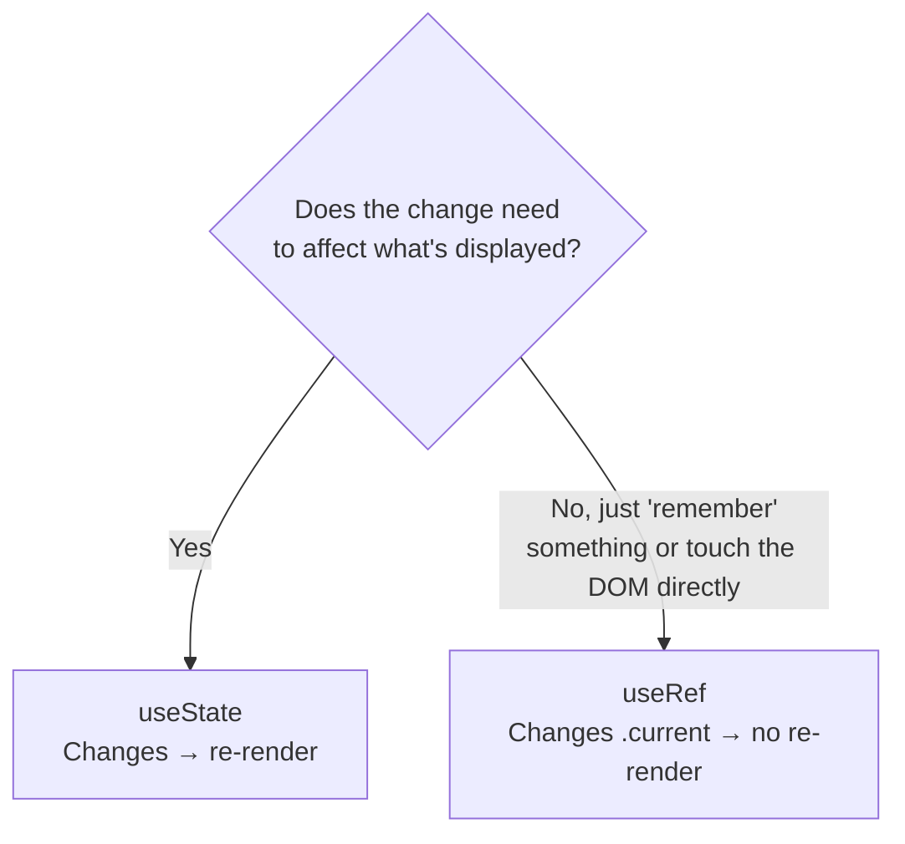

## מה זה?

ב-`useState` (שיעור קודם), כל שינוי ערך גורם לרינדור מחדש — זה בדיוק מה שרוצים ברוב המקרים. אבל מה אם רוצים "לזכור" ערך בין רינדורים **בלי** לגרום לרינדור מחדש (כמו טיימר ID), או לגשת **ישירות** לאלמנט DOM (למשל, למקד שדה קלט אוטומטית)? `useState` לא מתאים לזה — `useRef` כן.

## מילות מפתח שחשוב לזכור

• `useRef(initialValue)` — Hook שמחזיר אובייקט עם מאפיין יחיד: `.current`

• `.current` — הערך עצמו; שינוי שלו **לא** גורם לרינדור מחדש (בניגוד ל-`setState`)

• DOM ref — שימוש נפוץ ב-`useRef`: מחוברים אותו לתגית JSX (`ref={myRef}`), ו-`myRef.current` הופך לאלמנט ה-DOM האמיתי

• Mutable (בר-שינוי) — `ref.current` אפשר לשנות ישירות, בניגוד ל-state שדורש `setState`

```jsx
function SearchBox() {
  const inputRef = useRef(null);

  function focusInput() {
    inputRef.current.focus(); // Direct access to the DOM element
  }

  return (
    <>
      <input ref={inputRef} type="text" />
      <button onClick={focusInput}>Focus field</button>
    </>
  );
}
```



## הדגמה חיה

<div class="demo-live" style="direction:rtl;border:1px solid #d1d5db;border-radius:10px;padding:1.25rem;margin:1.25rem 0;background:#fafafa;color:#111827;">
<p style="font-weight:600;margin:0 0 0.9rem;color:#6b7280;font-size:0.85rem;">🔴 הדגמה חיה — בדיוק כמו ref.current.focus() ב-React: גישה ישירה לאלמנט DOM, בלי רינדור מחדש</p>
<input id="demo-ref-input" type="text" placeholder="שדה טקסט..." style="width:60%;box-sizing:border-box;padding:0.5rem;border:1px solid #d1d5db;border-radius:6px;margin-left:0.5rem;">
<button onclick="document.getElementById('demo-ref-input').focus();" style="background:#2563eb;color:#fff;border:none;border-radius:6px;padding:0.5rem 1rem;font-weight:700;cursor:pointer;">מקד שדה (focus)</button>
</div>

## הסבר עיקרי

useRef לא גורם לרינדור מחדש — ההבדל המהותי מ-`useState`: קריאה ל-`setCount` **גורמת** לרינדור מחדש; שינוי `ref.current` **לא** גורם לכלום. זה שימושי בדיוק כשרוצים "לזכור" משהו (כמו ID של `setInterval`) בלי שזה משפיע על ה-UI בכלל.

DOM ref כגישה ישירה, כשבאמת צריך — React בדרך כלל **לא** רוצה שתיגעו ב-DOM ישירות (זוכרים — זה כל הרעיון של Virtual DOM!) — אבל יש מקרים חוקיים: מיקוד שדה (`.focus()`), מדידת גודל אלמנט, אינטגרציה עם ספריות חיצוניות שדורשות אלמנט DOM אמיתי. `ref={inputRef}` על תגית JSX מחבר את `inputRef.current` לאלמנט ה-DOM **בפועל** אחרי שהוא מצויר — בדיוק אותו סוג אובייקט שהיה חוזר מ-`querySelector` ביחידת ה-DOM.

מתי useState ומתי useRef — כלל אצבע: אם השינוי **צריך** להשפיע על מה שמוצג על המסך — `useState`. אם השינוי הוא "מידע פנימי" שהקומפוננטה צריכה לזכור, אבל לא משפיע ישירות על ה-JSX המוחזר — `useRef`.

## יתרונות

מאפשר "לזכור" ערכים בין רינדורים בלי overhead של רינדור מחדש מיותר; נותן גישה ישירה לאלמנטי DOM כשבאמת צריך (מיקוד, מדידה); API פשוט מאוד — רק `.current`.

## חסרונות

שימוש-יתר ב-`ref` לגישה ישירה ל-DOM "עוקף" את הגישה המוצהרת (declarative) של React — צריך רק כשבאמת אין ברירה; קל לבלבל בין מתי להשתמש ב-`useState` למתי ב-`useRef`.

## נקודות חשובות

• `useRef` מחזיר אובייקט עם `.current` — שינוי שלו לא גורם לרינדור מחדש

• `ref={myRef}` על תגית JSX נותן גישה לאלמנט ה-DOM האמיתי דרך `myRef.current`

• `useState` לערכים שצריכים להשפיע על ה-UI; `useRef` ל"זיכרון פנימי" שלא

• DOM refs שימושיים למיקוד, מדידה, ואינטגרציה עם ספריות חיצוניות

## טעויות נפוצות

• להשתמש ב-`useRef` במקום `useState` לערך שכן אמור להשפיע על ה-UI — ה-UI פשוט לא יתעדכן

• לגשת ל-`ref.current` לפני שהקומפוננטה בכלל התרנדרה — יכול להיות `null`

• שימוש-יתר ב-refs לגישה ישירה ל-DOM, במקום לתת ל-React "לנהל" את ה-UI כרגיל

## סיכום

`useRef` נותן ערך שנשמר בין רינדורים (`.current`) בלי לגרום לרינדור מחדש כשהוא משתנה — שונה מהותית מ-`useState`. שימוש נפוץ: DOM refs, שמחברים `ref={myRef}` על תגית JSX לגישה ישירה לאלמנט ה-DOM האמיתי (למיקוד, מדידה). `useState` לערכים שמשפיעים על ה-UI; `useRef` לזיכרון פנימי שלא.

## דוקומנטציה רשמית

[React — Referencing Values with Refs](https://react.dev/learn/referencing-values-with-refs)

---

## תרגילים

### תרגיל 1 — DOM ref בסיסי

**המשימה:** בנו שדה קלט עם כפתור "מקד" ש-`ref.current.focus()` אותו.

**בדיקה:** קליק על הכפתור ממקד את שדה הקלט, הסמן מהבהב בתוכו.

### תרגיל 2 — ref שלא גורם לרינדור

**המשימה:** בנו `useRef(0)` שסופר קליקים בלי `setState`, והדפיסו את הערך לקונסול בכל קליק (בלי להציג אותו ב-UI).

**בדיקה:** הערך עולה בכל קליק (רואים בקונסול), אבל ה-UI לא "מתרענן" בכלל — אין רינדור מחדש.

### תרגיל 3 — useState מול useRef

**המשימה:** בנו שני מונים זהים — אחד עם `useState`, אחד עם `useRef`. השוו את ההתנהגות ב-UI.

**בדיקה:** המונה עם `useState` מציג את המספר המתעדכן על המסך; המונה עם `useRef` **לא** מציג עדכון על המסך, למרות שהערך משתנה בפועל (בדקו בקונסול).

---

## פרויקט מסכם

**המשימה:** בנו טופס חיפוש עם מיקוד אוטומטי וספירת שליחות "שקטה".

**דרישות:**
1. שדה חיפוש שמתמקד אוטומטית כשהעמוד נטען
2. `useRef` שסופר כמה פעמים הטופס נשלח, בלי להציג את המספר ב-UI (רק בקונסול)
3. `useState` נפרד שמציג ב-UI את **תוצאת החיפוש האחרונה**

**בדיקה:** השדה ממוקד מיד בטעינת העמוד; כל שליחה מעלה את המונה השקט (בקונסול) בלי לגרום לרינדור נוסף מעבר לעדכון תוצאת החיפוש עצמה.

---

## מה בפרק הבא

בפרק הבא נלמד על **useEffect** — עד עכשיו כל הקוד בקומפוננטה רץ **בזמן הרינדור עצמו** — מחשב ומחזיר JSX. אבל מה עם פעולות שצריכות לקרות **בתגובה** לרינדור, ולא **בתוך** תהליך החישוב שלו — כמו קריאת `fetch` לטעינת נתונים כשהקומפוננטה 
