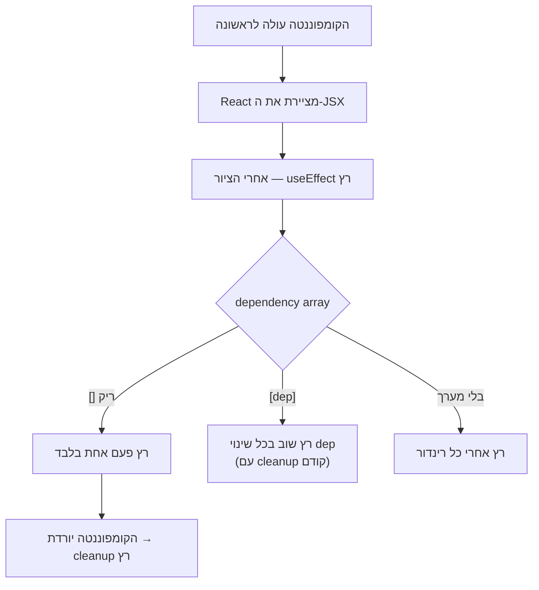

## מה זה?

עד עכשיו כל הקוד בקומפוננטה רץ **בזמן הרינדור עצמו** — מחשב ומחזיר JSX. אבל מה עם פעולות שצריכות לקרות **בתגובה** לרינדור, ולא **בתוך** תהליך החישוב שלו — כמו קריאת `fetch` לטעינת נתונים כשהקומפוננטה עולה לראשונה? **useEffect** נותן בדיוק את זה: קוד שרץ **אחרי** שה-UI כבר צויר, בתגובה לרינדור — "תופעות לוואי" (Side Effects) שלא שייכות לחישוב ה-JSX עצמו.

## מילות מפתח שחשוב לזכור

• `useEffect(callback, dependencies)` — מריץ `callback` **אחרי** שהקומפוננטה מצוירת; `dependencies` קובע **מתי**

• Dependency Array (מערך תלויות) — מערך ה-`[...]` שקובע מתי ה-effect ירוץ מחדש; `[]` ריק = פעם אחת בלבד (כשהקומפוננטה "עולה")

• Side Effect (תופעת לוואי) — פעולה שלא קשורה ישירות לחישוב UI: `fetch`, טיימרים, מנויים ל-event listeners חיצוניים

• Cleanup Function (פונקציית ניקוי) — פונקציה ש-`useEffect` יכול **להחזיר**; רצה לפני שה-effect רץ מחדש, או כשהקומפוננטה "יורדת" — מונעת דליפות זיכרון

```jsx
function TaskList() {
  const [tasks, setTasks] = useState([]);

  useEffect(() => {
    fetch("/api/tasks")
      .then(res => res.json())
      .then(data => setTasks(data));
  }, []); // מערך ריק — רץ פעם אחת, כשהקומפוננטה עולה

  return <ul>{tasks.map(t => <li key={t.id}>{t.title}</li>)}</ul>;
}
```



## הסבר עיקרי

Dependency Array קובע מתי ה-effect רץ — זו הנקודה הכי קריטית להבין: `[]` (מערך ריק) אומר "רק פעם אחת, כשהקומפוננטה עולה לראשונה" — בדיוק כמו `fetch` בדוגמה, שרוצים לטעון פעם אחת. מערך עם משתנים (`[userId]`) אומר "רץ מחדש בכל פעם ש-`userId` משתנה". **בלי** מערך תלויות כלל, ה-effect ירוץ **אחרי כל רינדור** — כמעט תמיד לא מה שרוצים.

fetch בתוך useEffect, לא ישירות ברינדור — קריאה ל-`fetch` **ישירות** בגוף הקומפוננטה (לא בתוך `useEffect`) הייתה רצה **בכל רינדור בודד**, כולל רינדורים שקורים מסיבות אחרות לגמרי — לולאה אינסופית פוטנציאלית! `useEffect` עם `[]` מבטיח שהטעינה קורית **פעם אחת בלבד**, אחרי שהקומפוננטה כבר מצוירת.

Cleanup Function מונע דליפות — אם `useEffect` "נרשם" למשהו (כמו `setInterval` או event listener חיצוני), **חייבים** להחזיר פונקציית ניקוי שמבטלת את הרישום (`clearInterval`, `removeEventListener`) — אחרת, כשהקומפוננטה "יורדת" מהמסך, הטיימר/listener ממשיך לרוץ ברקע, גורם ל"דליפת זיכרון" ולבאגים קשים לאיתור.

## יתרונות

מפריד תופעות לוואי (fetch, טיימרים) מחישוב ה-UI עצמו, בצורה מוצהרת וברורה; Dependency Array נותן שליטה מדויקת על מתי קוד רץ מחדש; Cleanup Function מונעת דליפות זיכרון בצורה מובנית.

## חסרונות

Dependency Array שגוי (חסר תלות, או תלות מיותרת) הוא מקור נפוץ מאוד לבאגים — ריצה בתדירות לא-נכונה; לוגיקת effects מורכבת יכולה להיות קשה למעקב, במיוחד עם כמה effects בקומפוננטה אחת.

## נקודות חשובות למבחן / ראיון עבודה

• `useEffect(fn, [])` רץ פעם אחת, כשהקומפוננטה עולה — מתאים ל-fetch ראשוני

• `useEffect(fn, [dep])` רץ מחדש בכל פעם ש-`dep` משתנה

• `useEffect(fn)` בלי מערך תלויות כלל רץ אחרי **כל** רינדור — כמעט תמיד לא רצוי

• פונקציית ניקוי (מה ש-effect מחזיר) חובה כשנרשמים לטיימר/listener — מונעת דליפות

## טעויות נפוצות

• קריאה ל-`fetch` ישירות בגוף הקומפוננטה, לא בתוך `useEffect` — עלול לגרום ללולאת רינדורים אינסופית

• שכחת מערך תלויות — ה-effect רץ אחרי כל רינדור בטעות, כולל רינדורים לא-קשורים

• שכחת פונקציית ניקוי על טיימר/listener — דליפת זיכרון שממשיכה לרוץ אחרי שהקומפוננטה כבר לא במסך

## סיכום

`useEffect` מריץ קוד ("תופעות לוואי" — fetch, טיימרים) **אחרי** שהקומפוננטה מצוירת, לא בתוך חישוב ה-JSX עצמו. Dependency Array קובע **מתי**: `[]` = פעם אחת, `[dep]` = בכל שינוי של `dep`, בלי מערך = אחרי כל רינדור. פונקציית ניקוי (מוחזרת מה-effect) מונעת דליפות זיכרון מטיימרים/listeners.

## דוקומנטציה רשמית

[React — Synchronizing with Effects](https://react.dev/learn/synchronizing-with-effects)

---

## תרגילים

### תרגיל 1 — effect עם מערך ריק

**המשימה:** הוסיפו `useEffect` עם `console.log` ומערך תלויות ריק לקומפוננטה, ובדקו כמה פעמים ההודעה מודפסת גם אחרי רינדורים נוספים (כמו לחיצות כפתור עם state אחר).

**בדיקה:** ההודעה מודפסת **פעם אחת בלבד**, לא בכל רינדור נוסף.

### תרגיל 2 — fetch בתוך useEffect

**המשימה:** טענו נתונים מ-endpoint אמיתי (מיחידת השרתים) בתוך `useEffect` עם `[]`, והציגו אותם עם `.map()`.

**בדיקה:** הנתונים מוצגים פעם אחת אחרי טעינת הקומפוננטה, בלי קריאות `fetch` חוזרות מיותרות.

### תרגיל 3 — Cleanup Function

**המשימה:** בנו `useEffect` עם `setInterval` שמעדכן state כל שנייה, עם פונקציית ניקוי שקוראת ל-`clearInterval`.

**בדיקה:** הסרת הקומפוננטה מהעמוד (למשל דרך Conditional Rendering) עוצרת את הטיימר — בדקו שהוא לא ממשיך לרוץ ברקע (בקונסול).

---

## פרויקט מסכם

**המשימה:** בנו קומפוננטת `TaskList` שטוענת משימות מהשרת (מיחידת השרתים/DB) בעליית הקומפוננטה.

**דרישות:**
1. `useState([])` למשימות, `useState(true)` למצב טעינה
2. `useEffect` עם `[]` שמריץ `fetch` לשרת, ומעדכן את שני ה-state (משימות + סיום טעינה)
3. Conditional Rendering: "טוען..." בזמן שהטעינה עדיין רצה, רשימה אמיתית אחרי שהנתונים הגיעו
4. טיפול בשגיאת רשת (`.catch`) עם הודעה מתאימה

**בדיקה:** העמוד מציג "טוען..." לרגע קצר ואז את הרשימה האמיתית; ניתוק השרת (או URL שגוי בכוונה) מציג הודעת שגיאה, לא "טוען..." לנצח.

---

## מה בפרק הבא

בפרק הבא נלמד על **Context API** — בשיעור Components ראינו ש-props זורמים מהורה לילד. אבל מה קורה כשקומפוננטה **עמוקה** בעץ (נכד-נכד-נכד) צריכה נתון שקיים רק בקומפוננטה **גבוהה** מאוד (כמו `App`) — למשל, מצב dark mode? להעביר את זה כ-p
