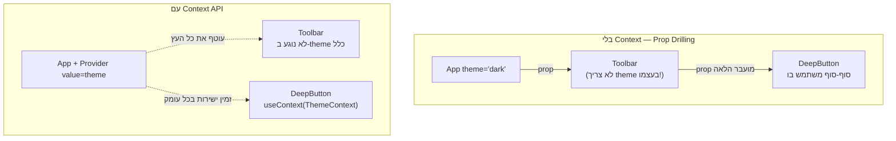

## מה זה?

בשיעור Components ראינו ש-props זורמים מהורה לילד. אבל מה קורה כשקומפוננטה **עמוקה** בעץ (נכד-נכד-נכד) צריכה נתון שקיים רק בקומפוננטה **גבוהה** מאוד (כמו `App`) — למשל, מצב dark mode? להעביר את זה כ-props דרך **כל** שכבת-ביניים (שאולי אפילו לא צריכה את הנתון בעצמה) נקרא "Prop Drilling" — מסורבל ושביר. **Context API** פותר את זה: מגדירים ערך **פעם אחת**, וכל קומפוננטה בעץ, לא משנה כמה עמוק, יכולה "למשוך" אותו ישירות.

## מילות מפתח שחשוב לזכור

• Prop Drilling (קידוח props) — העברת prop דרך כמה שכבות ביניים שלא באמת צריכות אותו, רק כדי שיגיע לקומפוננטה העמוקה

• `createContext(defaultValue)` — יוצר "ערוץ" משותף שקומפוננטות יכולות "להירשם" אליו

• `<Context.Provider value={...}>` — קומפוננטה שעוטפת חלק מהעץ, ונותנת לו את הערך המשותף

• `useContext(Context)` — Hook שקורא לערך הנוכחי מה-Context הקרוב ביותר "מעלה" בעץ

```jsx
const ThemeContext = createContext("light");

function App() {
  const [theme, setTheme] = useState("dark");
  return (
    <ThemeContext.Provider value={theme}>
      <Toolbar /> {/* לא צריך להעביר theme כ-prop! */}
    </ThemeContext.Provider>
  );
}

function DeepButton() {
  const theme = useContext(ThemeContext); // "מושך" ישירות, גם דרך כמה שכבות
  return <button className={theme}>לחצו</button>;
}
```



## הסבר עיקרי

Provider קובע את הערך לכל מה שבתוכו — `<ThemeContext.Provider value={theme}>` "עוטף" חלק מהעץ (יכול להיות כל האפליקציה, כמו בדוגמה), ואומר: "כל קומפוננטה בתוכי, בכל עומק, יכולה לקרוא לערך `theme` הזה ישירות". `Toolbar` באמצע לא צריך "לדעת" בכלל על `theme` ולא צריך להעביר אותו הלאה — `DeepButton` (הרבה שכבות מתחת) פשוט קורא ל-`useContext(ThemeContext)` ומקבל אותו ישירות.

מתי Context ומתי props רגילים — Context שימושי לנתונים ש**הרבה** קומפוננטות במקומות שונים בעץ צריכות (theme, משתמש מחובר, שפה) — לא לכל prop. עבור נתונים שרק קומפוננטת-ילד ישירה צריכה, props רגילים עדיין הדרך הפשוטה והברורה יותר — Context הוא כלי למקרה ספציפי (שיתוף רחב), לא תחליף גורף ל-props.

עדכון Context גורם לרינדור מחדש לכל הצרכנים — כשה-`value` שמועבר ל-`Provider` משתנה (למשל `theme` משתנה דרך `setTheme`), **כל** קומפוננטה שקוראת ל-`useContext(ThemeContext)` מתרנדרת מחדש אוטומטית — בדיוק כמו `setState` רגיל, רק שהעדכון "מתפרס" על כל צרכני ה-Context, לא רק קומפוננטה אחת.

## יתרונות

פותר Prop Drilling לגמרי — קומפוננטות עמוקות "מושכות" ישירות בלי שכבות-ביניים מיותרות; מרכז state משותף (theme, user) במקום אחד ברור; `useContext` פשוט לשימוש כמו כל Hook אחר.

## חסרונות

שימוש-יתר ב-Context לכל דבר הופך את זרימת הנתונים לפחות ברורה (קשה "לעקוב" מאיפה ערך הגיע); עדכון Context מרנדר מחדש **את כל** הצרכנים, גם אם רק חלק מהם באמת "צריכים" את השינוי הספציפי — פוטנציאל לבעיות ביצועים (נלמד עוד בשיעור Performance).

## נקודות חשובות למבחן / ראיון עבודה

• Prop Drilling הוא הבעיה: העברת props דרך שכבות ביניים שלא צריכות אותם

• `createContext` יוצר ערוץ; `Provider` נותן ערך לכל העץ שבתוכו; `useContext` קורא אותו מכל עומק

• Context מתאים לנתונים ש**הרבה** קומפוננטות צריכות (theme, user) — לא תחליף לכל prop

• עדכון ה-`value` ב-Provider מרנדר מחדש את כל הקומפוננטות שקוראות ל-`useContext` שלו

## טעויות נפוצות

• שימוש ב-Context לכל prop, גם כשמדובר בקשר הורה-ילד ישיר — props רגילים פשוטים וברורים יותר שם

• לשכוח לעטוף את חלק העץ הרלוונטי ב-`Provider` — `useContext` יחזיר את ערך ברירת המחדל, לא את הערך שציפו לו

• להניח ש-Context "חוסך" רינדורים — למעשה הוא מרנדר מחדש את **כל** הצרכנים בכל שינוי

## סיכום

Context API פותר Prop Drilling: `createContext` יוצר ערוץ, `Provider` נותן לו ערך לכל תת-העץ, `useContext` "מושך" אותו מכל עומק בלי להעביר props דרך שכבות-ביניים. מתאים לנתונים משותפים רחבים (theme, משתמש מחובר) — לא תחליף גורף לכל prop רגיל.

## דוקומנטציה רשמית

[React — Passing Data Deeply with Context](https://react.dev/learn/passing-data-deeply-with-context)

---

## תרגילים

### תרגיל 1 — Context בסיסי

**המשימה:** צרו `ThemeContext` עם `createContext`, עטפו את `App` ב-`Provider` עם ערך `"dark"`, וקראו אותו מקומפוננטה מקוננת עם `useContext`.

**בדיקה:** הקומפוננטה המקוננת מציגה/משתמשת בערך `"dark"`, בלי שהוא הועבר אליה כ-prop.

### תרגיל 2 — Prop Drilling מול Context

**המשימה:** בנו שרשרת של 3 קומפוננטות מקוננות (`A > B > C`) שבהן `C` צריכה נתון מ-`A`. פתרו את זה קודם עם Prop Drilling (העברה דרך `B`), ואז עם Context.

**בדיקה:** שתי הגרסאות מציגות את אותו נתון ב-`C`; בגרסת ה-Context, `B` לא מזכירה את הנתון בכלל בקוד שלה.

### תרגיל 3 — עדכון Context

**המשימה:** הוסיפו כפתור ב-`App` שמחליף (`setTheme`) בין "light" ל-"dark", ווודאו שקומפוננטה עמוקה שקוראת ל-`useContext` מתעדכנת אוטומטית.

**בדיקה:** קליק על הכפתור משנה את התצוגה בקומפוננטה העמוקה מיד, בלי לגעת בה ישירות.

---

## פרויקט מסכם

**המשימה:** הוסיפו מצב "משתמש מחובר" (User Context) שזמין לכל האפליקציה.

**דרישות:**
1. `UserContext` עם `Provider` שעוטף את כל `App`, עם state למשתמש (שם, האם מחובר)
2. קומפוננטת `Header` (עמוקה בעץ) שמציגה את שם המשתמש דרך `useContext`, בלי props
3. קומפוננטת `Footer` (עמוקה גם היא, במקום אחר בעץ) שמציגה "מחובר"/"לא מחובר" דרך אותו Context
4. כפתור "התנתק" ש-Provider-level state מתעדכן, ומשפיע על שתי הקומפוננטות בו-זמנית

**בדיקה:** קליק על "התנתק" מעדכן גם את `Header` וגם את `Footer` בו-זמנית, בלי שהן מחוברות ישירות זו לזו.

---

## מה בפרק הבא

בפרק הבא נלמד על **Custom Hooks** — דמיינו שכמה קומפוננטות שונות צריכות **בדיוק** את אותה לוגיקת `fetch`+`useState`+`useEffect` (מהשיעור על useEffect) — טעינת נתונים, מצב טעינה, טיפול שגיאות. להעתיק-הדביק את זה בכל קומפוננטה זה בדיוק סו
