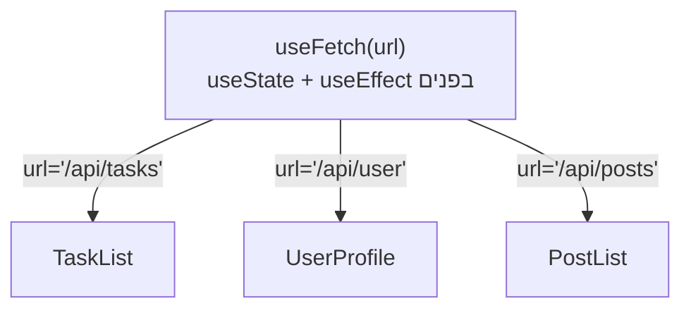

## מה זה?

דמיינו שכמה קומפוננטות שונות צריכות **בדיוק** את אותה לוגיקת `fetch`+`useState`+`useEffect` (מהשיעור על useEffect) — טעינת נתונים, מצב טעינה, טיפול שגיאות. להעתיק-הדביק את זה בכל קומפוננטה זה בדיוק סוג הכפילות ש-Functions (מיחידת JS) אמורות למנוע. **Custom Hook** הוא פונקציה שמתחילה ב-`use`, ומרכזת לוגיקת state/effects חוזרת לשימוש חוזר בכמה קומפוננטות — בלי כפילות קוד.

## מילות מפתח שחשוב לזכור

• Custom Hook — פונקציה שמתחילה ב-`use` (בהסכמה), שיכולה להשתמש ב-Hooks אחרים (`useState`, `useEffect`) בפנים

• Extraction (חילוץ) — הוצאת לוגיקה חוזרת מכמה קומפוננטות לפונקציה משותפת אחת

• Hook Rules — Hooks (כולל custom) חייבים להיקרא רק **ברמה העליונה** של קומפוננטה/hook אחר, לא בתוך תנאים/לולאות

• Composability (הרכבתיות) — custom hook יכול להשתמש בכמה hooks אחרים בפנים, ולהחזיר בדיוק את מה שהקומפוננטה צריכה

```jsx
function useFetch(url) {
  const [data, setData] = useState(null);
  const [loading, setLoading] = useState(true);

  useEffect(() => {
    fetch(url)
      .then(res => res.json())
      .then(result => {
        setData(result);
        setLoading(false);
      });
  }, [url]);

  return { data, loading };
}

function TaskList() {
  const { data: tasks, loading } = useFetch("/api/tasks");
  if (loading) return <p>טוען...</p>;
  return <ul>{tasks.map(t => <li key={t.id}>{t.title}</li>)}</ul>;
}
```



## הסבר עיקרי

custom hook הוא "רק" פונקציה, עם כלל שם אחד — `useFetch` נראה מיוחד, אבל היא בעצם פונקציה JavaScript רגילה שקוראת ל-`useState`/`useEffect` בפנים ומחזירה ערך. השם **חייב** להתחיל ב-`use` — זו הסכמה שמאפשרת ל-React (ולכלי הבדיקה שלו) לזהות שזו קורא-Hooks ולאכוף עליה את חוקי ה-Hooks.

חילוץ לוגיקה, לא רק קוד — שימו לב ש-`useFetch` **לא** יודעת כלום על "משימות" ספציפית — היא מקבלת `url` כפרמטר ומחזירה `{ data, loading }` גנרי. כל קומפוננטה (`TaskList`, `UserProfile`, כל דבר) יכולה להשתמש ב-`useFetch` עם URL שונה, ולקבל בדיוק את אותה לוגיקת טעינה, מצב-טעינה, וניהול state — בלי להעתיק את קוד ה-`useEffect`.

Hook Rules חלים גם על custom hooks — בדיוק כמו ש-`useState`/`useEffect` **חייבים** להיקרא ברמה העליונה של קומפוננטה (לא בתוך `if`), אותו כלל חל על custom hooks — כי הם רק "עוטפים" hooks רגילים בפנים. הפרת הכלל הזה שוברת את המנגנון הפנימי ש-React משתמשת בו כדי "לזכור" איזה state שייך לאיזו קריאה.

## יתרונות

מונע כפילות קוד בין קומפוננטות שצריכות אותה לוגיקת state; קומפוננטות נשארות קצרות וממוקדות ב-UI, לא בלוגיקת ניהול state מורכבת; קל לבדוק (test) custom hook בבידוד, מיחידת ה-Testing.

## חסרונות

חילוץ-יתר ל-custom hooks לכל דבר קטן יכול להוסיף אינדירקציה שלא לצורך; דורש הבנה טובה של Hooks בסיסיים (useState/useEffect) לפני שאפשר לחלץ אותם נכון.

## נקודות חשובות למבחן / ראיון עבודה

• Custom hook הוא פונקציה שמתחילה ב-`use`, ומשתמשת ב-Hooks אחרים בפנים

• מטרתו: חילוץ לוגיקת state/effects חוזרת מכמה קומפוננטות לפונקציה אחת משותפת

• חוקי Hooks (רק ברמה עליונה, לא בתנאי/לולאה) חלים גם על custom hooks

• custom hook יכול להחזיר כל דבר — אובייקט, מערך, ערך בודד — לפי מה שהקומפוננטה צריכה

## טעויות נפוצות

• לתת ל-custom hook שם שלא מתחיל ב-`use` — שובר את הזיהוי של React ושל כלי הלינטינג

• קריאה ל-custom hook (או כל hook) בתוך `if`/לולאה — מפר את חוקי ה-Hooks

• לחלץ custom hook לפני שהלוגיקה באמת חוזרת על עצמה בכמה מקומות — אינדירקציה מיותרת

## סיכום

Custom Hooks הן פונקציות (בשם שמתחיל ב-`use`) שמחלצות לוגיקת state/effects חוזרת מכמה קומפוננטות לפונקציה אחת לשימוש חוזר — כמו `useFetch` שמרכזת `fetch`+`useState`+`useEffect`. הן כפופות לאותם חוקי Hooks כמו `useState`/`useEffect` הרגילים, כי הן רק "עוטפות" אותם בפנים.

## דוקומנטציה רשמית

[React — Reusing Logic with Custom Hooks](https://react.dev/learn/reusing-logic-with-custom-hooks)

---

## תרגילים

### תרגיל 1 — custom hook בסיסי

**המשימה:** כתבו `useCounter(initial)` שמחזיר `{ count, increment, decrement }`, והשתמשו בו בקומפוננטה.

**בדיקה:** קריאה ל-`increment`/`decrement` משנה את `count` המוצג, בדיוק כמו `useState` רגיל שהיה בקומפוננטה עצמה.

### תרגיל 2 — useFetch לשימוש חוזר

**המשימה:** כתבו `useFetch(url)` (כמו בדוגמה), והשתמשו בו בשתי קומפוננטות שונות עם URL-ים שונים.

**בדיקה:** שתי הקומפוננטות טוענות נתונים שונים בהצלחה, מאותו custom hook בדיוק.

### תרגיל 3 — שילוב כמה hooks בתוך custom hook

**המשימה:** כתבו `useLocalStorageState(key, initial)` שמשלב `useState` עם קריאה/כתיבה ל-`localStorage` (מיחידת ה-DOM) בפנים.

**בדיקה:** state שנוצר עם ה-hook הזה נשמר גם אחרי רענון עמוד — הוכחה שהוא באמת קורא/כותב ל-`localStorage`.

---

## פרויקט מסכם

**המשימה:** חלצו custom hook `useTasks` שמרכז את כל לוגיקת ניהול משימות (fetch, הוספה, מחיקה, סימון).

**דרישות:**
1. `useTasks()` מחזיר `{ tasks, loading, addTask, deleteTask, toggleTask }`
2. בפנים, ה-hook מנהל `useState` למשימות ו-`useEffect` לטעינה ראשונית מהשרת
3. קומפוננטת `TaskList` משתמשת ב-`useTasks` ומציגה רק UI — בלי שום לוגיקת state ישירות בתוכה
4. הוכחת שימוש חוזר: קומפוננטת `TaskCount` נפרדת שגם היא משתמשת ב-`useTasks()` רק כדי להציג "X משימות"

**בדיקה:** שתי הקומפוננטות (`TaskList`, `TaskCount`) מציגות נתונים עקביים מאותו hook; קוד ה-UI בכל קומפוננטה נקי מלוגיקת `fetch`/state ישירה.

---

## מה בפרק הבא

בפרק הבא נלמד על **Error Boundaries** — עד עכשיו הנחנו שקומפוננטות תמיד מצליחות לרנדר. אבל מה קורה אם קומפוננטה זורקת שגיאה בזמן רינדור (למשל, ניסיון לגשת לשדה של אובייקט שהוא `undefined`)? בברירת מחדל, React "מסירה" את **כל** עץ הקומפוננטו
