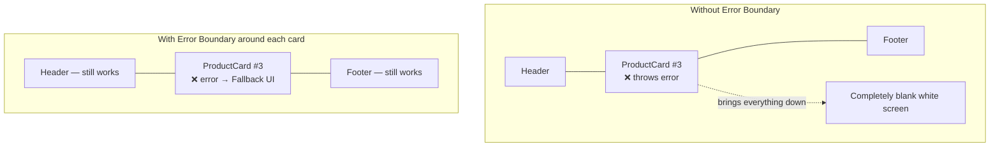

## מה זה?

עד עכשיו הנחנו שקומפוננטות תמיד מצליחות לרנדר. אבל מה קורה אם קומפוננטה זורקת שגיאה בזמן רינדור (למשל, ניסיון לגשת לשדה של אובייקט שהוא `undefined`)? בברירת מחדל, React "מסירה" את **כל** עץ הקומפוננטות מהמסך — מסך לבן ריק למשתמש, גם אם רק חלק קטן נכשל. **Error Boundary** היא קומפוננטה מיוחדת שתופסת שגיאות רינדור **בתת-עץ** שלה, ומציגה UI חלופי במקום — בלי להפיל את כל האפליקציה.

## מילות מפתח שחשוב לזכור

• Error Boundary — קומפוננטה (class component, מקרה חריג שעדיין דורש class ולא function) שתופסת שגיאות רינדור בילדים שלה

• `componentDidCatch` / `getDerivedStateFromError` — מתודות מיוחדות ב-class component שמפעילות את מנגנון תפיסת השגיאה

• Fallback UI — התוכן החלופי שמוצג במקום תת-העץ שנכשל (למשל "אופס, משהו השתבש")

• Blast Radius (רדיוס נזק) — כמה מהאפליקציה "נופל" יחד עם שגיאה אחת; Error Boundary מצמצם אותו לתת-עץ ספציפי

```jsx
class ErrorBoundary extends React.Component {
  state = { hasError: false };

  static getDerivedStateFromError() {
    return { hasError: true };
  }

  render() {
    if (this.state.hasError) {
      return <p>Oops, something went wrong in this section.</p>;
    }
    return this.props.children;
  }
}

// Usage:
<ErrorBoundary>
  <RiskyComponent />
</ErrorBoundary>
```



## הסבר עיקרי

Error Boundary מגביל את רדיוס הנזק — בלי Error Boundary, שגיאה בקומפוננטה עמוקה כלשהי (למשל בכרטיס מוצר בודד ברשימה) "מפילה" את **כל** האפליקציה — התפריט, ה-header, הכל נעלם למסך לבן. עם `<ErrorBoundary><ProductCard /></ErrorBoundary>` סביב **כל** כרטיס, שגיאה בכרטיס אחד מציגה fallback רק שם — שאר האפליקציה (ושאר הכרטיסים) ממשיכים לעבוד כרגיל.

מדוע class component כאן, לא function — זהו אחד המקומות היחידים ב-React מודרני שעדיין **דורשים** class component — Hooks (כמו `useState`) עדיין לא נותנים דרך רשמית לתפוס שגיאות רינדור בקומפוננטות-ילד. `getDerivedStateFromError` היא מתודת מחלקה מיוחדת ש-React קוראת לה אוטומטית כשילד זורק שגיאה בזמן רינדור.

Error Boundary לא תופס הכל — חשוב לדעת: Error Boundary תופס שגיאות רינדור **בתת-העץ שלו**, אבל **לא** תופס שגיאות בתוך event handlers (כמו `onClick`) או בתוך `useEffect` — לאלה יש מנגנוני טיפול נפרדים (`try`/`catch` רגיל, מוכר מיחידת JS).

## יתרונות

מונע קריסה מלאה של האפליקציה בגלל שגיאה בקומפוננטה בודדת; Fallback UI נותן חוויית משתמש טובה יותר מ"מסך לבן"; אפשר למקם כמה Error Boundaries במקומות שונים, כל אחד עם "רדיוס" משלו.

## חסרונות

עדיין דורש class component — לא ניתן לכתוב עם Hooks בלבד (נכון לכתיבת שיעור זה); לא תופס שגיאות ב-event handlers או `useEffect` — צריך `try`/`catch` נפרד שם.

## נקודות חשובות

• Error Boundary תופס שגיאות רינדור בתת-עץ הילדים שלו, ומציג Fallback UI במקום קריסה מלאה

• דורש class component (`getDerivedStateFromError`) — עדיין לא אפשרי עם Hooks בלבד

• לא תופס שגיאות ב-event handlers או `useEffect` — שם צריך `try`/`catch` רגיל

• מיקום Error Boundaries ממקד את "רדיוס הנזק" של שגיאה לחלק ספציפי, לא לכל האפליקציה

## טעויות נפוצות

• לצפות ש-Error Boundary יתפוס שגיאה בתוך `onClick` — הוא תופס רק שגיאות רינדור

• למקם Error Boundary יחיד סביב **כל** האפליקציה בלבד — שגיאה בכל מקום מפילה הכל, כמו בלעדיו

• לשכוח שה-Fallback UI צריך גם הוא להיות פשוט מספיק שלא ייכשל בעצמו

## סיכום

Error Boundary תופס שגיאות רינדור בתת-עץ קומפוננטות שלו, ומציג Fallback UI במקום להפיל את כל האפליקציה למסך לבן. עדיין דורש class component (`getDerivedStateFromError`) — אחד המקומות הבודדים שHooks לא מכסים. מיקום נכון של כמה Error Boundaries מצמצם את "רדיוס הנזק" של שגיאות לחלקים ספציפיים באפליקציה.

## דוקומנטציה רשמית

[React — Catching Rendering Errors with an Error Boundary](https://react.dev/reference/react/Component#catching-rendering-errors-with-an-error-boundary)

---

## תרגילים

### תרגיל 1 — קומפוננטה שנכשלת

**המשימה:** כתבו קומפוננטה ש-**בכוונה** זורקת שגיאה בזמן רינדור (למשל גישה לשדה של אובייקט `undefined`), והריצו אותה בלי Error Boundary.

**בדיקה:** כל האפליקציה נעלמת למסך לבן/שגיאה — עדות לבעיה שError Boundary פותר.

### תרגיל 2 — Error Boundary בסיסי

**המשימה:** עטפו את הקומפוננטה מהתרגיל הקודם ב-`ErrorBoundary` (כמו בדוגמה), ובדקו את התוצאה.

**בדיקה:** רק ההודעה "אופס, משהו השתבש" מוצגת במקום הקומפוננטה שנכשלה — שאר העמוד (אם יש) ממשיך לעבוד כרגיל.

### תרגיל 3 — כמה Error Boundaries נפרדים

**המשימה:** הציגו רשימה של 3 כרטיסים, כל אחד עטוף ב-`ErrorBoundary` נפרד, כשרק אחד מהם נכשל בכוונה.

**בדיקה:** רק הכרטיס שנכשל מציג Fallback UI; שני הכרטיסים האחרים ממשיכים להיות מוצגים כרגיל.

---

## פרויקט מסכם

**המשימה:** הוסיפו Error Boundary לקומפוננטת `TaskList` (מהשיעורים הקודמים), עם Fallback UI ידידותי.

**דרישות:**
1. `ErrorBoundary` (class component) שעוטף את `TaskList`
2. Fallback UI שמציג הודעה ברורה וכפתור "נסה שוב" (שיכול לרענן את העמוד, לפחות בגרסה בסיסית)
3. בדיקה מכוונת: שינוי זמני בקוד `TaskList` שגורם לשגיאת רינדור מלאכותית, כדי לוודא ש-Fallback מוצג נכון

**בדיקה:** כשהקוד "שבור" בכוונה, מוצג ה-Fallback ולא מסך לבן; אחרי החזרת הקוד לתקין, `TaskList` חוזרת לעבוד רגיל.

---

## מה בפרק הבא

בפרק הבא נלמד על **State Management** — עד עכשיו כל דוגמה השתמשה ב-state מקומי (`useState`) או Context לשיתוף רחב. אבל באפליקציה **גדולה**, עם עשרות קומפוננטות ומקורות state שונים (משתמש מחובר, עגלת קניות, הגדרות, נתוני שרת) — איך מחליטים *
