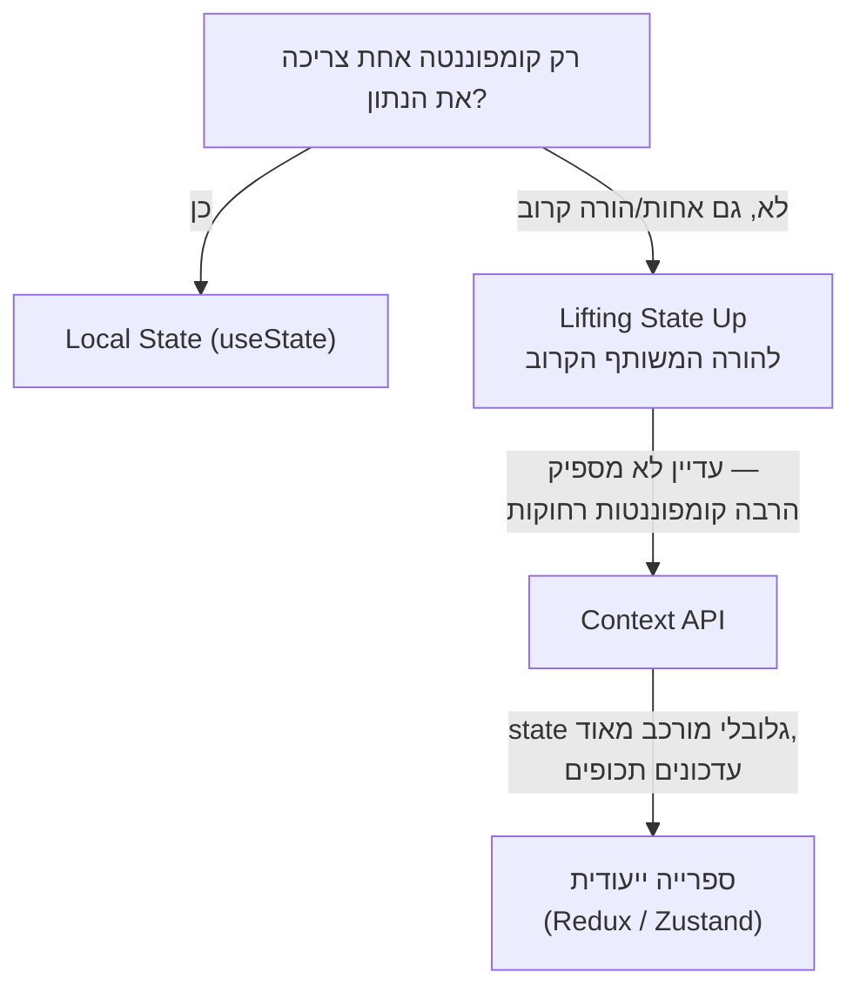

## מה זה?

עד עכשיו כל דוגמה השתמשה ב-state מקומי (`useState`) או Context לשיתוף רחב. אבל באפליקציה **גדולה**, עם עשרות קומפוננטות ומקורות state שונים (משתמש מחובר, עגלת קניות, הגדרות, נתוני שרת) — איך מחליטים **איפה** כל state צריך לגור? **State Management** הוא התחום שעוסק בדיוק בזה: עקרונות לארגון state בקנה מידה, ומתי כלים "כבדים" יותר (כמו Redux/Zustand) הופכים שווים את המורכבות הנוספת שלהם.

## מילות מפתח שחשוב לזכור

• Local State (state מקומי) — `useState` בקומפוננטה בודדת, לא נגיש לאף אחד אחר — ברירת המחדל הראשונה תמיד

• Lifting State Up (הרמת state) — העברת state מקומפוננטת-ילד להורה המשותף הקרוב ביותר, כששתי קומפוננטות-אחיות צריכות לשתף אותו

• Global State (state גלובלי) — state שרלוונטי לחלקים רחבים באפליקציה (Context API, או ספריות ייעודיות)

• State Management Library — ספרייה חיצונית (כמו Redux, Zustand) שנותנת כלים מובנים לניהול state גלובלי מורכב, מעבר למה ש-Context לבד נותן בקלות

```jsx
// Lifting State Up: שתי קומפוננטות-אחיות צריכות לשתף state
function App() {
  const [selectedId, setSelectedId] = useState(null); // ה-state "עלה" ל-App

  return (
    <>
      <TaskList onSelect={setSelectedId} />
      <TaskDetails taskId={selectedId} />
    </>
  );
}
```



## הסבר עיקרי

תמיד להתחיל ב-Local State — ברירת המחדל, כמעט תמיד, היא `useState` בתוך הקומפוננטה שבאמת צריכה את הנתון — לא Context, לא ספרייה חיצונית. רק כשמתגלה **צורך אמיתי** בשיתוף (עוד קומפוננטה צריכה את אותו נתון), עוברים לפתרון "רחב" יותר.

Lifting State Up כפתרון לביניים — כששתי קומפוננטות-**אחיות** (לא הורה-ילד) צריכות לשתף state (כמו `TaskList` ו-`TaskDetails` בדוגמה — לחיצה על משימה ברשימה צריכה להשפיע על מה שמוצג בפרטים), הפתרון הראשון הוא **להעלות** את ה-state להורה המשותף הקרוב ביותר (`App`), ולהעביר אותו למטה כ-props לשתי הקומפוננטות. זה עדיין state מקומי (של `App`) — לא Context, לא ספרייה — רק במיקום גבוה יותר בעץ.

מתי כן ספרייה ייעודית — Context (משיעור קודם) נהדר לשיתוף רחב יחסית פשוט (theme, user). אבל כשיש **הרבה** state גלובלי, עדכונים תכופים, ולוגיקה מורכבת סביבו (כמו עגלת קניות עם חוקי הנחות מסובכים), ספריות ייעודיות (Redux, Zustand ואחרות) נותנות כלים מובנים לניהול מסודר יותר — עם debugging tools, middleware, ומבנה ברור יותר מ-Context גולמי. הבחירה תלויה בגודל ומורכבות הפרויקט — לא כל פרויקט צריך את זה.

## יתרונות

היררכיה ברורה (Local → Lifted → Context → Library) נותנת עקרון החלטה, לא ניחוש; Lifting State Up פותר את רוב מקרי השיתוף בלי כלים נוספים בכלל; ספריות ייעודיות (כשבאמת צריך) נותנות כלי debugging וניהול מתקדמים.

## חסרונות

קפיצה ישירה לפתרון "כבד" (ספרייה חיצונית) לפני שבאמת צריך מוסיפה מורכבות מיותרת; Lifting State Up-יתר (הכל ב-`App`) יוצר קומפוננטת-שורש עמוסה מדי, "prop drilling" הפוך.

## נקודות חשובות למבחן / ראיון עבודה

• סדר עדיפות: Local State תמיד ראשון; Lifting State Up כששתי אחיות צריכות לשתף; Context לשיתוף רחב; ספרייה ייעודית רק כשבאמת נחוץ

• Lifting State Up = העברת state לקומפוננטת-ההורה המשותף הקרוב ביותר

• ספריות State Management (Redux/Zustand) שוות את המורכבות שלהן רק באפליקציות גדולות עם state גלובלי מסובך

• אין "פתרון אחד נכון" — הבחירה תלויה בהיקף השיתוף הנדרש

## טעויות נפוצות

• להשתמש ב-Context (או ספרייה) לכל state, גם state מקומי לגמרי שאף קומפוננטה אחרת לא צריכה

• "להרים" state גבוה מדי בעץ "ליתר ביטחון", גם כשרק שתי קומפוננטות ספציפיות צריכות לשתף אותו

• להוסיף ספריית State Management לפרויקט קטן שבו Context (או אפילו Local State) היה מספיק לגמרי

## סיכום

State Management עוסק בהחלטה **איפה** state צריך לגור: Local State (`useState` בקומפוננטה) הוא ברירת המחדל; Lifting State Up מעביר אותו להורה משותף כששתי אחיות צריכות לשתף; Context מתאים לשיתוף רחב יחסית פשוט; ספריות ייעודיות (Redux, Zustand) נכנסות לתמונה רק באפליקציות גדולות עם state גלובלי מורכב.

## דוקומנטציה רשמית

[React — Sharing State Between Components](https://react.dev/learn/sharing-state-between-components)

---

## תרגילים

### תרגיל 1 — זיהוי היכן ה-state שייך

**המשימה:** לכל תרחיש, קבעו את סוג ה-state המתאים (Local/Lifted/Context): (א) טקסט בשדה חיפוש בקומפוננטה בודדת; (ב) בחירת פריט ברשימה שמשפיעה על תצוגה בקומפוננטה אחות; (ג) מצב dark mode לכל האפליקציה.

**בדיקה:** תשובות: (א) Local, (ב) Lifted, (ג) Context.

### תרגיל 2 — Lifting State Up בפועל

**המשימה:** קחו שתי קומפוננטות-אחיות עצמאיות (כל אחת עם `useState` משלה), ואחדו אותן לשתף state יחיד שהורה מנהל.

**בדיקה:** לפני האיחוד, שינוי באחת לא משפיע על השנייה; אחריו, שינוי דרך אחת משפיע מיד על השנייה.

### תרגיל 3 — Local מול Context

**המשימה:** קחו state ש**רק** קומפוננטה אחת צריכה, והראו (בכתיבה) למה שימוש ב-Context כאן היה מיותר.

**בדיקה:** ההסבר מזכיר שאין אף קומפוננטה אחרת שצריכה את הנתון, כך שאין תועלת משיתוף רחב.

---

## פרויקט מסכם

**המשימה:** ארגנו מחדש את אפליקציית ה-Task (מהשיעורים הקודמים) עם State Management נכון.

**דרישות:**
1. `TaskList` ו-`TaskDetails` (קומפוננטות-אחיות) משתפות `selectedTaskId` דרך Lifting State Up ל-`App`
2. מצב "משתמש מחובר" (מיחידת Context API) נשאר ב-Context, כי הרבה קומפוננטות שונות צריכות אותו
3. state של שדה טופס (למשל חיפוש) נשאר Local — רק הקומפוננטה שלו צריכה אותו
4. תיעוד קצר (בהערת קוד) שמסביר למה כל state נמצא איפה שהוא נמצא

**בדיקה:** בחירת משימה ב-`TaskList` משפיעה מיד על `TaskDetails`; הקוד לא מכיל Context מיותר לנתונים מקומיים.

---

## מה בפרק הבא

בפרק הבא נלמד על **React Performance** — ראינו ש-`setState` (ו-Context, שיעור קודם) גורמים לרינדור מחדש. אבל מה אם רינדור מחדש קורה **הרבה יותר** ממה שבאמת צריך — למשל, קומפוננטת-ילד מתרנדרת מחדש כי ה-**הורה** התרנדר, למרות שה-props של הילד 
