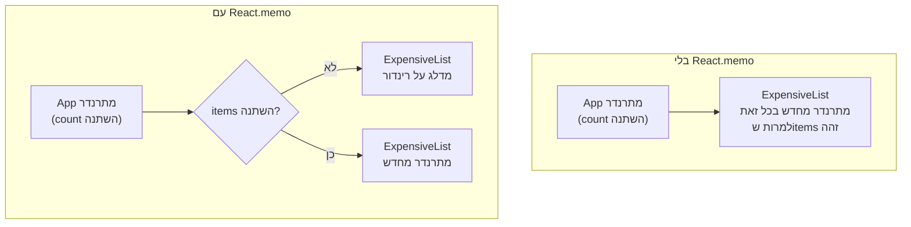

## מה זה?

ראינו ש-`setState` (ו-Context, שיעור קודם) גורמים לרינדור מחדש. אבל מה אם רינדור מחדש קורה **הרבה יותר** ממה שבאמת צריך — למשל, קומפוננטת-ילד מתרנדרת מחדש כי ה-**הורה** התרנדר, למרות שה-props של הילד לא השתנו בכלל? באפליקציה קטנה זה לא מורגש, אבל בגדולה זה יכול לפגוע בביצועים באמת. `React.memo`, `useMemo`, ו-`useCallback` הם כלים למניעת עבודה מיותרת.

## מילות מפתח שחשוב לזכור

• Unnecessary Re-render (רינדור מיותר) — קומפוננטה מתרנדרת מחדש למרות שה-UI שלה לא היה משתנה בכלל

• `React.memo(Component)` — עוטף קומפוננטה כך שהיא מתרנדרת מחדש **רק** אם ה-props שלה השתנו בפועל

• `useMemo(calculation, dependencies)` — "זוכר" תוצאה של חישוב יקר, ומחשב אותה מחדש **רק** כשהתלויות משתנות

• `useCallback(function, dependencies)` — "זוכר" reference לפונקציה, כדי שלא תיווצר מחדש בכל רינדור (חשוב כש-`React.memo` בודק שוויון props)

• Referential Equality (שוויון reference) — אובייקטים/פונקציות חדשות בכל רינדור נחשבות "שונות" גם אם התוכן זהה — זה בדיוק מה ש-`useMemo`/`useCallback` פותרים

```jsx
const ExpensiveList = React.memo(function ExpensiveList({ items }) {
  return <ul>{items.map(i => <li key={i}>{i}</li>)}</ul>;
});

function App() {
  const [count, setCount] = useState(0);
  const items = useMemo(() => computeExpensiveList(), []); // מחושב פעם אחת בלבד

  return (
    <>
      <button onClick={() => setCount(count + 1)}>{count}</button>
      <ExpensiveList items={items} /> {/* לא מתרנדר מחדש כש-count משתנה */}
    </>
  );
}
```



## הסבר עיקרי

React.memo בודק אם props באמת השתנו — בברירת מחדל, כשקומפוננטת-הורה (`App`) מתרנדרת מחדש (כי `count` השתנה), **כל** קומפוננטות-הילד שלה מתרנדרות מחדש גם כן — גם אם ה-props שהן קיבלו זהים לגמרי. `React.memo` עוטף קומפוננטה ואומר: "השווה את ה-props החדשים לישנים — אם זהים, דלג על רינדור מחדש". בדוגמה, `ExpensiveList` **לא** מתרנדרת מחדש כש-`count` משתנה, כי `items` (ה-prop שלה) לא השתנה.

useMemo למניעת חישוב חוזר יקר — `computeExpensiveList()` בדוגמה, בלי `useMemo`, היה רץ **מחדש בכל רינדור** של `App` — כולל כל לחיצה על הכפתור, גם שהתוצאה תמיד זהה! `useMemo(fn, [])` "זוכר" את התוצאה ומחשב מחדש **רק** כשהתלויות (`[]` = אף פעם, אחרי החישוב הראשון) משתנות.

useCallback פותר בעיית Referential Equality של פונקציות — בכל רינדור של `App`, פונקציה שמוגדרת ישירות בגוף הקומפוננטה (בלי `useCallback`) היא **אובייקט חדש לגמרי** בזיכרון — גם אם הקוד שלה זהה מילה-במילה. אם מעבירים פונקציה כזו כ-prop לקומפוננטה עטופה ב-`React.memo`, ה-`memo` "יחשוב" שה-prop השתנה (כי זה reference חדש), ויתרנדר מחדש בכל זאת — `useCallback` פותר את זה בדיוק כמו `useMemo`, אך עבור פונקציות.

## יתרונות

מונע רינדורים וחישובים מיותרים בקומפוננטות/פעולות יקרות; `React.memo` פשוט לעטוף סביב קומפוננטה קיימת; נותן שליטה מדויקת מתי בדיוק לעבוד מחדש ומתי לא.

## חסרונות

אופטימיזציית-יתר (עטיפת **כל** קומפוננטה ב-`memo`/`useMemo`) מוסיפה מורכבות ו-overhead משלה, בלי תועלת אמיתית אם אין באמת בעיית ביצועים; קל לשכוח תלות ב-`useMemo`/`useCallback` ולקבל תוצאה "תקועה" מיושנת.

## נקודות חשובות למבחן / ראיון עבודה

• `React.memo` מדלג על רינדור מחדש של קומפוננטה אם ה-props שלה לא השתנו בפועל

• `useMemo` זוכר **תוצאת חישוב**; `useCallback` זוכר **reference לפונקציה** — שניהם נמנעים מ"עבודה כפולה" מיותרת

• Referential Equality: אובייקטים/פונקציות חדשים בכל רינדור נחשבים "שונים", גם עם תוכן זהה

• אופטימיזציה כדאית רק כשיש בעיית ביצועים אמיתית ומדודה — לא כברירת מחדל בכל מקום

## טעויות נפוצות

• עטיפת כל קומפוננטה ב-`React.memo` "ליתר ביטחון", בלי למדוד אם יש בעיה בכלל

• שכחת תלות נכונה ב-`useMemo`/`useCallback` — תוצאה "מיושנת" שלא מתעדכנת כשצריך

• להעביר פונקציה/אובייקט חדש כ-prop לקומפוננטת `memo` בלי `useCallback`/`useMemo` — מבטל את היתרון של ה-`memo` לגמרי

## סיכום

`React.memo` מדלג על רינדור מחדש של קומפוננטה כש-props לא השתנו בפועל. `useMemo` זוכר תוצאת חישוב יקר; `useCallback` זוכר reference לפונקציה — שניהם פותרים את בעיית ה-Referential Equality (אובייקט/פונקציה "חדשים" בכל רינדור, גם עם תוכן זהה). כלים אלה שווים שימוש רק כשיש בעיית ביצועים אמיתית, לא כברירת מחדל בכל קומפוננטה.

## דוקומנטציה רשמית

[React — memo](https://react.dev/reference/react/memo)

---

## תרגילים

### תרגיל 1 — React.memo בפועל

**המשימה:** עטפו קומפוננטת-ילד ב-`React.memo`, והוכיחו (עם `console.log` בגוף הקומפוננטה) שהיא לא מתרנדרת מחדש כשמשתנה state לא-קשור בהורה.

**בדיקה:** ה-`console.log` לא מודפס בכל לחיצה על כפתור לא-קשור, רק כשה-props של הילד באמת משתנים.

### תרגיל 2 — useMemo לחישוב יקר

**המשימה:** כתבו פונקציית חישוב "יקרה" (למשל לולאה גדולה מלאכותית), עטפו אותה ב-`useMemo` עם תלות ריקה, והוכיחו שהיא רצה רק פעם אחת.

**בדיקה:** `console.log` בתוך פונקציית החישוב מודפס פעם אחת בלבד, לא בכל רינדור נוסף.

### תרגיל 3 — useCallback עם React.memo

**המשימה:** העבירו פונקציה כ-prop לקומפוננטת `memo`, פעם בלי `useCallback` (וראו שה-memo "לא עוזר") ופעם עם `useCallback`.

**בדיקה:** בלי `useCallback`, הקומפוננטה העטופה ב-`memo` עדיין מתרנדרת מחדש בכל פעם; עם `useCallback`, היא מפסיקה.

---

## פרויקט מסכם

**המשימה:** מדדו ואופטימיזו קומפוננטת `TaskList` (מהשיעורים הקודמים) שמכילה רשימה ארוכה.

**דרישות:**
1. הוסיפו `console.log` בקומפוננטת `TaskItem` בודדת כדי לספור רינדורים
2. זהו רינדור מיותר (למשל, כל הרשימה מתרנדרת מחדש כשמשנים משהו לא-קשור, כמו שדה חיפוש נפרד)
3. תקנו עם `React.memo` על `TaskItem`, ו-`useCallback` על כל handler שמועבר אליו כ-prop
4. תעדו (לפני/אחרי) כמה רינדורים קרו בכל תרחיש

**בדיקה:** לפני התיקון, שינוי שדה החיפוש גורם לכל פריטי הרשימה להתרנדר מחדש (רואים בקונסול); אחרי התיקון, רק הרינדור הראשוני מתרחש — שינוי החיפוש לא מרנדר מחדש את פריטי הרשימה.

---

## מה בפרק הבא

בפרק הבא נלמד על **React Routing** — כל מה שבנינו עד עכשיו היה **עמוד אחד** (Single Page). אבל אפליקציה אמיתית צריכה כמה "מסכים": רשימת משימות, פרטי משימה, דף אודות. פתרון פשטני — לינק `<a href="/tasks/5">` רגיל — היה גורם ל**רענון מלא**
