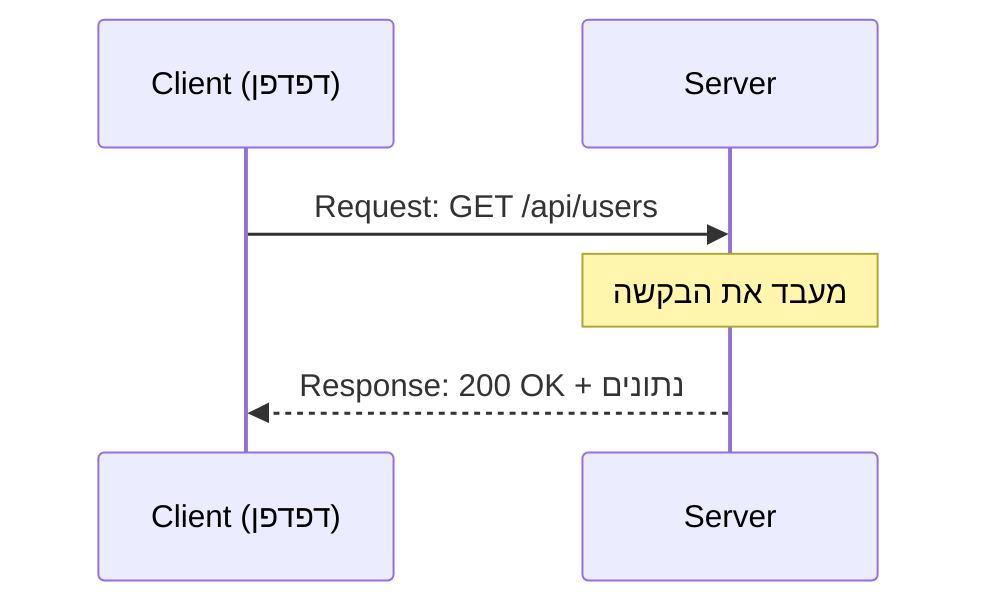

## מה זה?

בשיעור על Fetch API למדנו ש-`fetch(url)` שולחת בקשה ל**שרת** — מחשב אחר שמחזיק נתונים ועונה על בקשות. אבל איך בדיוק "מדברים" client (למשל, הדפדפן שלכם) ו-server זה עם זה? הם צריכים שפה משותפת מוסכמת — **HTTP** (HyperText Transfer Protocol). בלי פרוטוקול משותף, כל דפדפן וכל שרת היו צריכים "להסכים" בנפרד איך לתקשר. HTTP נותן מבנה קבוע ואחיד לכל בקשה ולכל תגובה, שכל כלי web מבין.

## מילות מפתח שחשוב לזכור

• Client — הצד ש**מתחיל** את השיחה ושולח בקשה (למשל, דפדפן, או קוד עם `fetch`)

• Server — הצד שמקבל בקשות ומגיב להן; מחכה "פסיבית" לבקשות נכנסות

• Request (בקשה) — מה שה-client שולח: Method + URL + Headers + (לפעמים) Body

• Response (תגובה) — מה שה-server מחזיר: Status Code + Headers + Body

• HTTP Method — המילה שמגדירה **איזו פעולה** מבוקשת: `GET` (קרא), `POST` (צור), `PUT`/`PATCH` (עדכן), `DELETE` (מחק)

• Status Code — מספר בן 3 ספרות שמתאר את תוצאת הבקשה: `200` (הצליח), `201` (נוצר), `404` (לא נמצא), `500` (שגיאת שרת)

• Header — "מדבקת מידע" על הבקשה/תגובה — לא התוכן עצמו, אלא מטא-מידע עליו, כמו `Content-Type` (איזה סוג תוכן זה)

• Stateless (חסר-מצב) — כל Request עצמאי לגמרי; השרת **לא זוכר** requests קודמים מאותו client

```
GET /api/users HTTP/1.1
Host: example.com
Accept: application/json

---

HTTP/1.1 200 OK
Content-Type: application/json

{"users": [{"id": 1, "name": "Dana"}]}
```



## הסבר עיקרי

Method כ"פועל" — כל בקשה מתחילה במילה שמתארת מה רוצים לעשות: `GET /api/users` פירושו "תן לי את רשימת המשתמשים"; `POST /api/users` פירושו "צור משתמש חדש עם הנתונים שאני שולח". אותו URL (`/api/users`) יכול להתנהג אחרת לגמרי, תלוי ב-Method.

Status Code כתשובה מהירה — קבוצות המספרים מקודדות משמעות: `2xx` הצלחה, `4xx` שגיאה **מהצד של הלקוח** (למשל, ביקש URL שלא קיים — 404), `5xx` שגיאה **מהצד של השרת** (משהו נשבר בקוד השרת עצמו — 500). בשיעור Fetch API כבר ראינו למה חשוב לבדוק את זה: `fetch` לא נכשלת (במובן של Promise שנדחה) בגלל סטטוס 404 — צריך לבדוק את זה ידנית.

Stateless — כל בקשה "מתחילה מאפס" — לדוגמה: זה שהיה `GET /api/users` רגע לפני, לא "עוזר" לשרת לזכור מי אתם ב-`POST /api/orders` הבא. אם צריך "לזכור" מי המשתמש בין בקשות (כמו login), צריך מנגנון נוסף מפורש — נלמד אותו בהמשך היחידה (Auth & JWT).

## יתרונות

פרוטוקול אחיד ומוסכם שכל שפה/כלי מבינים; Status Codes נותנים מידע מיידי ותקני על תוצאת הבקשה בלי לפרסר תוכן; Stateless מפשט מאוד את בניית שרתים שיכולים לשרת הרבה clients בו-זמנית.

## חסרונות

Stateless דורש מנגנון נוסף (כמו טוקנים) כשבאמת צריך "לזכור" מידע בין בקשות; טעות נפוצה היא לבחור Method לא-מתאים (למשל `GET` שמוחק נתונים) שסותר את הציפייה התקנית.

## נקודות חשובות למבחן / ראיון עבודה

• Request מכיל Method + URL + Headers + (אופציונלי) Body; Response מכיל Status + Headers + Body

• `GET`=קריאה, `POST`=יצירה, `PUT`/`PATCH`=עדכון, `DELETE`=מחיקה

• `2xx` הצלחה, `4xx` שגיאת לקוח, `5xx` שגיאת שרת

• HTTP הוא Stateless — כל בקשה עצמאית, השרת לא זוכר בקשות קודמות

## טעויות נפוצות

• שימוש ב-`GET` לפעולה שמשנה נתונים (כמו מחיקה) — מפר את הציפייה התקנית מ-`GET`

• בלבול בין 404 (המשאב לא קיים) ל-401/403 (אין הרשאה) — קודים שונים לגמרי

• הנחה שהשרת "זוכר" בקשה קודמת בלי מנגנון מפורש לכך (Stateless!)

## סיכום

HTTP הוא הפרוטוקול המשותף שדרכו client ו-server מתקשרים: Request (Method+URL+Headers+Body) יוצא, Response (Status+Headers+Body) חוזר. Method מתאר את הפעולה המבוקשת; Status Code מתאר את התוצאה. HTTP הוא Stateless — כל בקשה עצמאית לגמרי.

## דוקומנטציה רשמית

[MDN — HTTP Overview](https://developer.mozilla.org/en-US/docs/Web/HTTP/Overview)

---

## תרגילים

### תרגיל 1 — זיהוי Method

**המשימה:** לכל פעולה, קבעו את ה-HTTP Method המתאים: "קבל רשימת מוצרים", "מחק הזמנה", "עדכן פרטי משתמש", "צור חשבון חדש".

**בדיקה:** התשובות: `GET`, `DELETE`, `PUT`/`PATCH`, `POST` (בהתאמה).

### תרגיל 2 — Status Codes

**המשימה:** התאימו סטטוס לתרחיש: משתמש חדש נוצר בהצלחה; המשתמש ביקש `/api/users/999` שלא קיים; קרתה שגיאה לא-צפויה בקוד השרת; הבקשה הצליחה ומחזירה נתונים.

**בדיקה:** התשובות: `201`, `404`, `500`, `200` (בהתאמה).

### תרגיל 3 — כתבו Request

**המשימה:** כתבו (בטקסט חופשי, לא קוד) איך תיראה בקשת `POST` ליצירת משתמש חדש עם `name` ו-`email` — כולל Method, URL, ו-Headers רלוונטיים.

**בדיקה:** הבקשה שלכם כוללת `POST /api/users`, כותרת `Content-Type: application/json`, וגוף JSON עם `name` ו-`email`.

---

## פרויקט מסכם

**המשימה:** תעדו "מפרט API" קטן לפני שכותבים קוד בכלל, לניהול "משימות" (Tasks).

**דרישות:**
1. רשמו 4 Endpoints: קבלת רשימה, יצירה, עדכון, מחיקה
2. לכל אחד: ה-Method הנכון, ה-URL, ו-Status Code צפוי בהצלחה
3. ציינו לכל אחד גם Status Code אפשרי לכישלון (404? 400?)

**בדיקה:** המפרט כולל 4 שורות, כל אחת עם Method+URL+Status הצלחה+Status כישלון — למשל: `GET /api/tasks → 200`, כישלון לא רלוונטי כאן; `DELETE /api/tasks/:id → 200, כישלון: 404`.

---

## מה בפרק הבא

בפרק הבא נלמד על **Node.js Basics** — עד עכשיו כל קוד ה-JavaScript שכתבתם היה מיועד לרוץ **בתוך דפדפן**. אבל JavaScript בדפדפן לא יכולה לקרוא קבצים מהדיסק, לפתוח פורט רשת כדי לקבל בקשות, או להתחבר ישירות ל-DB — מסיבות אבטחה, הדפדפן פשוט ל
