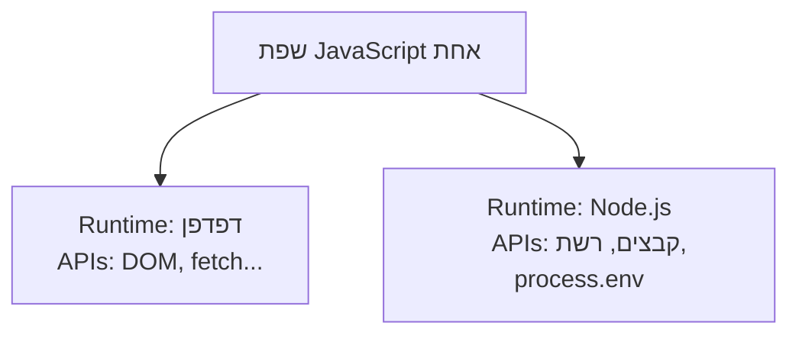

## מה זה?

עד עכשיו כל קוד ה-JavaScript שכתבתם היה מיועד לרוץ **בתוך דפדפן**. אבל JavaScript בדפדפן לא יכולה לקרוא קבצים מהדיסק, לפתוח פורט רשת כדי לקבל בקשות, או להתחבר ישירות ל-DB — מסיבות אבטחה, הדפדפן פשוט לא נותן לה. **Node.js** הוא Runtime — סביבת הרצה — שמריצה את **אותה** שפת JavaScript, אבל **מחוץ** לדפדפן, על שרת, עם APIs חדשים שמתאימים לעולם השרת: קבצים, רשת, תהליכים.

## מילות מפתח שחשוב לזכור

• Runtime (סביבת הרצה) — התוכנה שמריצה קוד JavaScript ומספקת לו APIs; לדפדפן יש runtime, ל-Node.js יש runtime אחר

• `npm` (Node Package Manager) — הכלי שמגיע עם Node.js להתקנה וניהול ספריות חיצוניות (dependencies)

• `package.json` — קובץ שמתאר את הפרויקט: שם, גרסה, `scripts` (פקודות מוגדרות), ורשימת `dependencies`

• `node_modules` — תיקייה שנוצרת אוטומטית ע"י `npm install`, ומכילה את כל הספריות שהותקנו; **לעולם לא** נכנסת ל-Git (זוכרים `.gitignore`?)

• ESM (ES Modules) — מערכת ה-`import`/`export` שכבר מכירים; ב-Node.js דורשת `"type": "module"` בתוך `package.json`

• `process.env` — אובייקט גלובלי שדרכו קוראים משתני סביבה (הרחבה בשיעור dotenv בהמשך)

```json
{
  "name": "my-server",
  "type": "module",
  "scripts": { "start": "node index.js" },
  "dependencies": {}
}
```
```javascript
// index.js
console.log("שלום מ-Node.js!");
console.log(process.env.NODE_ENV); // קורא משתנה סביבה
```



## הסבר עיקרי

אותה שפה, "כוחות" חדשים — כל מה שלמדתם (משתנים, פונקציות, מערכים, Promises, async/await) עובד **בדיוק אותו דבר** ב-Node.js. ההבדל הוא ב-APIs הנוספים: קריאת/כתיבת קבצים, פתיחת שרת HTTP (בשיעור הבא!), וגישה למשתני סביבה — יכולות שאין לדפדפן.

`npm` ו-`package.json` — כשפרויקט צריך ספרייה חיצונית (למשל, בשיעורים הבאים: `express`), `npm install express` מוריד אותה לתוך `node_modules` ורושם אותה אוטומטית ב-`package.json` תחת `dependencies`. כל מי ששולף (`git clone`) את הפרויקט יכול להריץ `npm install` ולקבל בדיוק אותן ספריות.

`"type": "module"` — כברירת מחדל, Node.js מצפה לתחביר `require`/`module.exports` הישן (CommonJS). כדי להשתמש ב-`import`/`export` המוכר לכם, **חובה** להוסיף `"type": "module"` ל-`package.json` — זה בדיוק מה שנדרש בכל תרגיל וקוד בקורס הזה.

## יתרונות

אותה שפה בדיוק בצד השרת ובצד הלקוח — לא צריך ללמוד שפה נוספת; אקוסיסטם ענק של ספריות דרך npm; `package.json` נותן דרך מוסכמת לתעד ולשתף תלויות פרויקט.

## חסרונות

בלבול נפוץ בין CommonJS (`require`) ל-ESM (`import`) בפרויקטים ישנים יותר; `node_modules` יכולה לתפוס הרבה מקום ותמיד צריך להתקין מחדש אחרי `clone`.

## נקודות חשובות למבחן / ראיון עבודה

• Node.js הוא Runtime שמריץ JavaScript מחוץ לדפדפן, עם APIs נוספים (קבצים, רשת)

• `package.json` מתעד dependencies; `npm install` מתקין אותן לתוך `node_modules`

• `node_modules` **לעולם לא** נכנס ל-Git — נמצא ב-`.gitignore`

• `"type": "module"` ב-`package.json` נדרש כדי להשתמש ב-`import`/`export`

## טעויות נפוצות

• שכחת `"type": "module"` וקבלת שגיאת syntax על `import`

• הוספת `node_modules` בטעות ל-Git (קובץ ענק, מיותר — כל אחד מתקין בעצמו)

• בלבול בין `dependencies` (נדרש בפרודקשן) ל-`devDependencies` (רק לפיתוח)

## סיכום

Node.js הוא Runtime שמריץ JavaScript מחוץ לדפדפן, עם APIs לשרת: קבצים, רשת, תהליכים. `npm` ו-`package.json` מנהלים ספריות חיצוניות; `node_modules` מכיל אותן בפועל אך לא נכנס ל-Git. `"type": "module"` מפעיל את תחביר `import`/`export` שכבר מוכר לכם.

## דוקומנטציה רשמית

[Node.js — Official Docs](https://nodejs.org/en/docs)

---

## תרגילים

### תרגיל 1 — package.json ראשון

**המשימה:** צרו `package.json` ידנית עם `name`, `"type": "module"`, ו-`scripts.start` שמריץ `node index.js`.

**בדיקה:** הקובץ תקין כ-JSON (למשל `node -e "console.log(require('./package.json'))"` לא זורק שגיאה, או פתיחה בעורך בלי אזהרת syntax).

### תרגיל 2 — הרצה ראשונה

**המשימה:** צרו `index.js` עם `console.log` ו-`import` של מודול מובנה (למשל `node:fs`). הריצו עם `node index.js`.

**בדיקה:** ההרצה מדפיסה את ההודעה שלכם בלי שגיאת `SyntaxError` על `import` (סימן שה-`"type": "module"` עובד).

### תרגיל 3 — process.env

**המשימה:** גרמו ל-`index.js` להדפיס את `process.env.NODE_ENV`, והריצו אותו עם משתנה סביבה מוגדר: `NODE_ENV=development node index.js`.

**בדיקה:** ההרצה עם המשתנה מדפיסה `development`; הרצה רגילה (`node index.js`, בלי המשתנה) מדפיסה `undefined`.

---

## פרויקט מסכם

**המשימה:** הקימו שלד (skeleton) פרויקט Node.js נקי.

**דרישות:**
1. `package.json` עם `"type": "module"` ו-scripts רלוונטיים
2. `index.js` שמדפיס הודעת פתיחה
3. `.gitignore` עם `node_modules`
4. `README.md` קצר שמסביר איך להריץ את הפרויקט

**בדיקה:** `npm start` (או `node index.js`) מריץ את הפרויקט בלי שגיאות; `git status` (אם יוזמה ריפו) לא מציג את `node_modules` כקובץ למעקב.

---

## מה בפרק הבא

בפרק הבא נלמד על **Vanilla Node Server** — עכשיו, לאחר שהכרנו את HTTP (Request/Response, Methods, Status Codes) ואת Node.js (Runtime, ESM), אפשר לבנות שרת אמיתי. Node.js מגיע עם מודול מובנה בשם `http` שיודע "להאזין" לבקשות רשת נכנסות ולהחזיר ת
