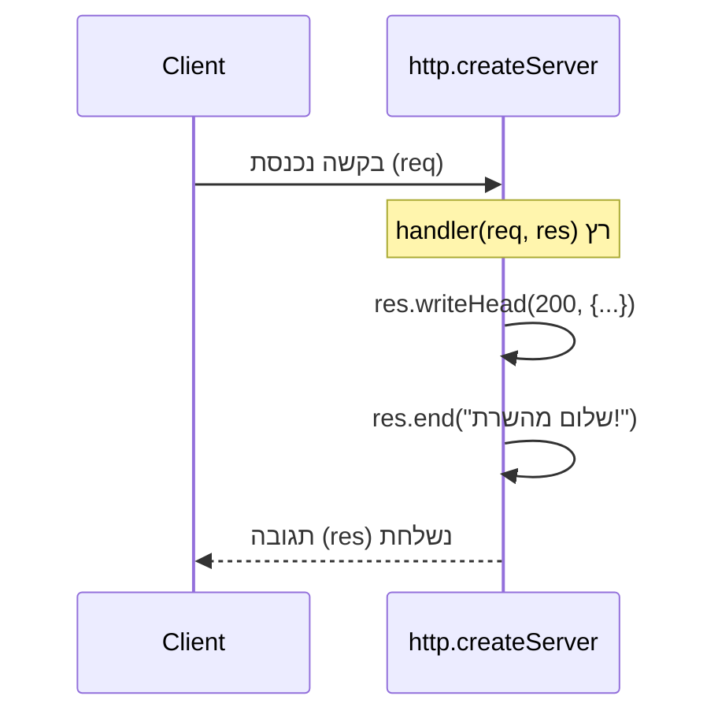

## מה זה?

עכשיו, לאחר שהכרנו את HTTP (Request/Response, Methods, Status Codes) ואת Node.js (Runtime, ESM), אפשר לבנות שרת אמיתי. Node.js מגיע עם מודול מובנה בשם `http` שיודע "להאזין" לבקשות רשת נכנסות ולהחזיר תגובות — בלי להתקין שום ספרייה חיצונית. זה בדיוק ה"צד השני" של `fetch`: כש-`fetch` שולחת בקשה, **מישהו** צריך להיות ער ומאזין כדי לקבל ולענות עליה — זה מה ששרת עושה.

## מילות מפתח שחשוב לזכור

• `node:http` — המודול המובנה ב-Node.js לבניית שרתים; `import http from "node:http"`

• `http.createServer(handler)` — יוצר שרת; `handler` היא פונקציה שרצה **בכל בקשה נכנסת**

• `server.listen(port)` — מתחיל "להאזין" לבקשות על פורט (מספר) מסוים במחשב

• Port (פורט) — "דלת" מספרית במחשב שדרכה תקשורת רשת נכנסת; לדוגמה, `3000`

• `req`/`res` — האובייקטים שהפונקציה מקבלת בכל בקשה: `req` (הבקשה הנכנסת) ו-`res` (התגובה שבונים)

• `res.writeHead(status, headers)` — קובע את ה-Status Code וה-Headers של התגובה

• `res.end(body)` — שולח את התגובה בחזרה ל-client ומסיים אותה

```javascript
import http from "node:http";

const server = http.createServer((req, res) => {
  res.writeHead(200, { "Content-Type": "text/plain" });
  res.end("שלום מהשרת!");
});

server.listen(3000, () => console.log("השרת רץ על פורט 3000"));
```



## הסבר עיקרי

מה קורה בכל בקשה — הפונקציה שמעבירים ל-`createServer` היא **בעצם callback** (זוכרים משיעור Callbacks?) — Node.js מפעילה אותה מחדש, אוטומטית, בכל פעם שבקשה חדשה מגיעה. `req` מכיל את פרטי הבקשה שהגיעה (Method, URL, Headers); `res` הוא האובייקט שבעזרתו בונים את התגובה.

למה חייבים `res.end()` — בלי לקרוא ל-`res.end()`, ה-client (למשל, `fetch` שממתין) פשוט **ימשיך לחכות** — התגובה אף פעם לא "נשלחת" סופית. זו טעות נפוצה במיוחד: לשכוח לסיים תגובה בנתיב מסוים בקוד.

Port כ"דלת" — כשקוראים ל-`server.listen(3000)`, השרת "תופס" את הפורט 3000 על המחשב ומקשיב לכל תעבורת רשת שמגיעה אליו. `fetch("http://localhost:3000/...")` היה שולח בקשה בדיוק לפורט הזה, על אותו מחשב.

## יתרונות

אין תלות בספריות חיצוניות — הבנה מלאה של מה שקורה "מתחת למכסה המנוע"; שולט מלא בכל בית (byte) שנשלח בתגובה; שימושי להבין לפני שעוברים ל-Express (השיעורים הבאים), שעוטף בדיוק את זה.

## חסרונות

כתיבת routing (התאמת URL ל-handler שונה) דורשת קוד ידני מסורבל; אין פרסור אוטומטי ל-body או ל-params — כל זה ידני (נלמד בשני השיעורים הבאים); קוד חוזר על עצמו בכל route חדש.

## נקודות חשובות למבחן / ראיון עבודה

• `http.createServer(handler)` יוצר שרת; ה-`handler` רץ בכל בקשה נכנסת

• `server.listen(port)` מתחיל להאזין לבקשות על פורט מסוים

• בלי `res.end()`, התגובה לעולם לא נשלחת סופית ל-client

• `req` מכיל את פרטי הבקשה; `res` הוא האובייקט לבניית התגובה

## טעויות נפוצות

• שכחת `res.end()` — הבקשה "נתקעת" בהמתנה אצל ה-client

• שכחת `res.writeHead` עם `Content-Type` נכון — ה-client לא יודע איך לפרש את התגובה

• ניסיון להפעיל שני שרתים על אותו פורט בו-זמנית — שגיאת "port already in use"

## סיכום

מודול `node:http` המובנה בונה שרת HTTP אמיתי: `http.createServer` מגדיר מה קורה בכל בקשה, `server.listen(port)` מתחיל להאזין. `req` מכיל את הבקשה הנכנסת, `res` בונה את התגובה — `res.end()` חובה כדי לשלוח אותה בפועל. זה הבסיס שעליו Express (השיעורים הבאים) בנוי.

## דוקומנטציה רשמית

[Node.js — HTTP module](https://nodejs.org/api/http.html)

---

## תרגילים

### תרגיל 1 — שרת "Hello World"

**המשימה:** בנו שרת עם `http.createServer` שמחזיר `"Hello, World!"` לכל בקשה, על פורט 3000.

**בדיקה:** פתיחת `http://localhost:3000` בדפדפן (או `curl`) מציגה `Hello, World!`.

### תרגיל 2 — status code שונה

**המשימה:** שנו את השרת כך שיחזיר Status Code `201` במקום `200`.

**בדיקה:** `curl -i http://localhost:3000` מציג `HTTP/1.1 201` בשורת הסטטוס.

### תרגיל 3 — routing פשוט

**המשימה:** בדקו את `req.url` בתוך ה-handler: אם הוא `"/"` החזירו הודעת ברוכים הבאים; אחרת החזירו `404` עם הודעת "לא נמצא".

**בדיקה:** `GET /` מחזיר את הודעת הברוכים הבאים בסטטוס 200; `GET /anything-else` מחזיר סטטוס 404 עם הודעה.

---

## פרויקט מסכם

**המשימה:** בנו שרת "בריאות" (health check) בסיסי.

**דרישות:**
1. שרת `http.createServer` שמאזין על פורט 3000
2. route `GET /health` שמחזיר `{"status": "ok"}` עם `Content-Type: application/json` ו-status 200
3. כל route אחר מחזיר 404 עם הודעה ברורה
4. הודעת console בעת עליית השרת עם מספר הפורט

**בדיקה:** `curl http://localhost:3000/health` מחזיר `{"status":"ok"}`; `curl -i http://localhost:3000/other` מחזיר סטטוס 404.

---

## מה בפרק הבא

בפרק הבא נלמד על **URL Params (Vanilla)** — בשיעור הקודם ראינו ש-`req.url` הוא **מחרוזת גולמית**, למשל `"/users/42?role=admin"`. אבל כדי לדעת "איזה משתמש?" (`42`) או "איזה תפקיד?" (`admin`), צריך לפרסר את המחרוזת הזו לחלקיה — Node.js לא עושה זא
