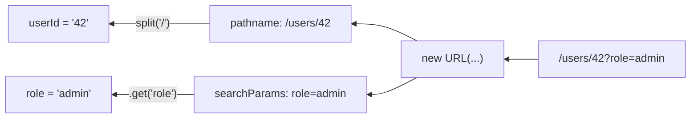

## מה זה?

בשיעור הקודם ראינו ש-`req.url` הוא **מחרוזת גולמית**, למשל `"/users/42?role=admin"`. אבל כדי לדעת "איזה משתמש?" (`42`) או "איזה תפקיד?" (`admin`), צריך לפרסר את המחרוזת הזו לחלקיה — Node.js לא עושה זאת אוטומטית. `URL`, כלי מובנה ב-Node.js, פותר את זה: הוא הופך מחרוזת URL גולמית לאובייקט מסודר עם החלקים השונים שלה.

## מילות מפתח שחשוב לזכור

• `pathname` — חלק ה"נתיב" ב-URL, למשל `/users/42` (בלי ה-query string)

• Query String — החלק אחרי `?`, למשל `role=admin&page=2`

• `new URL(url, base)` — מפרסר מחרוזת URL; דורש `base` כי `req.url` הוא נתיב יחסי בלבד (אין בו `http://...`)

• `URLSearchParams` — האובייקט שמייצג את ה-Query String; `.get("key")` שולף ערך, מחזיר `null` אם לא קיים

• URL Param (חלק דינמי בנתיב) — למשל, ה-`42` ב-`/users/42` — כדי לחלץ אותו ב-Vanilla, צריך לפצל את ה-`pathname` ידנית (`split("/")`)

• Type Coercion מ-URL — כל ערך שמגיע מ-URL הוא **תמיד מחרוזת (string)**, גם אם "נראה" כמו מספר

```javascript
import http from "node:http";

const server = http.createServer((req, res) => {
  const url = new URL(req.url, `http://${req.headers.host}`);
  const parts = url.pathname.split("/").filter(Boolean); // ["users", "42"]
  const userId = parts[1];               // "42" — always a string!
  const role = url.searchParams.get("role"); // "admin" or null

  res.writeHead(200, { "Content-Type": "application/json" });
  res.end(JSON.stringify({ userId, role }));
});
```



## הסבר עיקרי

למה צריך `base`? — `req.url` הוא רק הנתיב (`"/users/42"`), בלי שם הדומיין. `new URL()` דורשת URL מלא, ולכן מעבירים `base` (בדרך כלל `req.headers.host`) כדי להשלים אותו למשהו תקין שאפשר לפרסר.

מ-pathname לפרמטר בודד — `url.pathname` נותן מחרוזת (`"/users/42"`), לא אובייקט מסודר. פיצול ידני (`split("/")`) הוא הדרך ב-Vanilla לחלץ ממנה חלקים ספציפיים — לעומת Express, שנלמד בהמשך, שנותן תחביר נוח בהרבה (`/users/:id`) לאותו רעיון בדיוק.

מחרוזת, תמיד מחרוזת — גם אם ה-URL הוא `/users/42`, `userId` יהיה המחרוזת `"42"`, לא המספר `42`. אם רוצים להשתמש בו כמספר (למשל, להשוות ל-ID ב-DB), צריך המרה מפורשת: `Number(userId)`.

## יתרונות

`URL`/`URLSearchParams` הם כלים מובנים — אין צורך בספרייה חיצונית לפרסור בסיסי; ברגע שמבינים את הפרסור הידני כאן, קל הרבה יותר להעריך את הנוחות ש-Express נותן בהמשך.

## חסרונות

פיצול `pathname` ידני לחילוץ params הוא מסורבל ורגיש לטעויות (למשל, נתיבים עם אורך משתנה); חובה לזכור להמיר Type בעצמכם בכל מקום.

## נקודות חשובות

• `new URL(req.url, base)` הופך מחרוזת גולמית לאובייקט מסודר עם `pathname` ו-`searchParams`

• `URLSearchParams.get("key")` מחזיר `string` או `null` — לעולם לא זורק שגיאה על מפתח חסר

• כל פרמטר שמגיע מ-URL הוא string — גם אם "נראה" כמו מספר או בוליאני

• `pathname` הוא הנתיב בלבד; Query String הוא החלק אחרי `?`

## טעויות נפוצות

• ניסיון להשוות `userId === 42` (מספר) כש-`userId` הוא בעצם המחרוזת `"42"` — ההשוואה תמיד `false`

• שכחת `base` בקריאה ל-`new URL(req.url)` — זורק שגיאה כי `req.url` לבדו הוא לא URL תקין

• הנחה ש-`.get()` על `URLSearchParams` יזרוק שגיאה אם המפתח לא קיים — הוא פשוט מחזיר `null`

## סיכום

`req.url` הוא מחרוזת גולמית; `new URL(req.url, base)` הופכת אותה לאובייקט מסודר עם `pathname` (הנתיב) ו-`searchParams` (ה-Query String). חילוץ פרמטר דינמי מהנתיב עצמו (כמו `42` ב-`/users/42`) דורש פיצול ידני. כל ערך שמגיע מ-URL הוא תמיד string.

## דוקומנטציה רשמית

[MDN — URL](https://developer.mozilla.org/en-US/docs/Web/API/URL)

---

## תרגילים

### תרגיל 1 — פרסור pathname

**המשימה:** בהינתן `req.url = "/products/7"`, השתמשו ב-`new URL` וב-`split` כדי לחלץ את מזהה המוצר.

**בדיקה:** הערך המחולץ שווה למחרוזת `"7"` (לא למספר 7).

### תרגיל 2 — Query String

**המשימה:** בהינתן `req.url = "/search?term=laptop&page=2"`, שלפו את `term` ואת `page` עם `URLSearchParams`.

**בדיקה:** `term` שווה למחרוזת `"laptop"`, `page` שווה למחרוזת `"2"`; שליפת פרמטר שלא קיים (למשל `"sort"`) מחזירה `null`.

### תרגיל 3 — Type Coercion

**המשימה:** הסבירו (בכתיבה) למה `url.searchParams.get("page") === 2` יהיה תמיד `false`, וכתבו את הביטוי הנכון להשוואה.

**בדיקה:** ההסבר מזכיר שה-`.get()` מחזיר תמיד string; הביטוי התקין הוא `Number(url.searchParams.get("page")) === 2`.

---

## פרויקט מסכם

**המשימה:** בנו route שמדמה `GET /products/:id?currency=USD` ב-Vanilla Node.

**דרישות:**
1. פרסרו את ה-`pathname` לחילוץ מזהה המוצר
2. שלפו את פרמטר ה-`currency` מה-Query String, עם ברירת מחדל `"ILS"` אם לא סופק
3. החזירו JSON עם `{ productId, currency }` — ודאו ש-`productId` הומר למספר

**בדיקה:** `curl http://localhost:3000/products/7` מחזיר `{"productId":7,"currency":"ILS"}`; `curl "http://localhost:3000/products/7?currency=USD"` מחזיר `{"productId":7,"currency":"USD"}`.

---

## מה בפרק הבא

בפרק הבא נלמד על **Request Body (Vanilla)** — עד עכשיו טיפלנו ב-URL ובפרמטרים שלו — אבל מה עם בקשות `POST` ששולחות **תוכן** (body), כמו נתוני משתמש חדש? ב-Vanilla Node.js, `req.body` **פשוט לא קיים**. הסיבה: HTTP לא מבטיח שכל תוכן הבקשה יגיע בבת 
