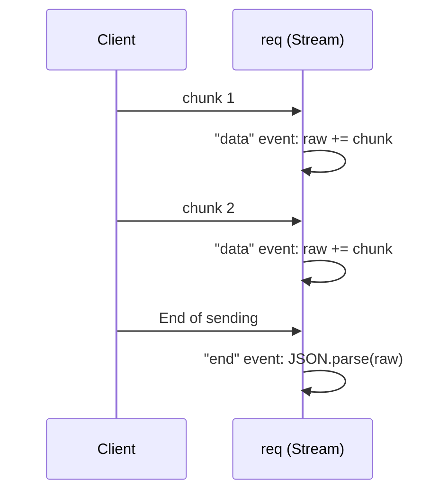

## מה זה?

עד עכשיו טיפלנו ב-URL ובפרמטרים שלו — אבל מה עם בקשות `POST` ששולחות **תוכן** (body), כמו נתוני משתמש חדש? ב-Vanilla Node.js, `req.body` **פשוט לא קיים**. הסיבה: HTTP לא מבטיח שכל תוכן הבקשה יגיע בבת אחת — הוא מגיע כ-**Stream**: נתונים שמגיעים בחלקים (chunks) לאורך זמן. חייבים "להקשיב" לחלקים האלה ולהרכיב אותם בעצמנו לפני שאפשר להשתמש בתוכן.

## מילות מפתח שחשוב לזכור

• Stream (זרם) — נתונים שמגיעים בחלקים (chunks) במקום בבת אחת; `req` עצמו הוא Stream

• `data` event — מתרחש בכל פעם שחלק (chunk) חדש מגיע: `req.on("data", chunk => ...)`

• `end` event — מתרחש כשה-Stream הסתיים; **רק אז** התוכן שלם ומוכן

• `JSON.parse(text)` — הופך מחרוזת JSON לאובייקט JavaScript; זורק `SyntaxError` אם המחרוזת לא תקינה

• `readBody` (wrapper) — פונקציה שכותבים בעצמכם, שעוטפת את אירועי ה-Stream ב-`Promise` — כדי שיהיה נוח להשתמש איתה עם `await`

```javascript
function readBody(req) {
  return new Promise((resolve, reject) => {
    let raw = "";
    req.on("data", chunk => { raw += chunk; });
    req.on("end", () => {
      try {
        resolve(JSON.parse(raw));
      } catch (err) {
        reject(err);
      }
    });
  });
}

// Usage inside the handler:
const server = http.createServer(async (req, res) => {
  if (req.method === "POST") {
    const body = await readBody(req); // waits for the stream to finish
    res.writeHead(201, { "Content-Type": "application/json" });
    res.end(JSON.stringify({ received: body }));
  }
});
```



## הסבר עיקרי

למה בכלל Stream? — תארו בקשה עם קובץ ענק מצורף — אם Node.js הייתה ממתינה "לכל הבקשה" לפני שהיא נותנת לכם גישה לכלום, זה היה לא-יעיל וגם מבזבז זיכרון. Stream נותן גישה לחלקים ברגע שהם מגיעים — יעיל יותר, אבל דורש מכם "להרכיב" את זה בעצמכם כשבאמת צריך את הכל יחד (כמו כאן).

מ-Promise עוטף ל-await — `readBody` בעצמה נבנית בדיוק כמו `getUserById` שכתבנו בשיעור Promises: `new Promise((resolve, reject) => {...})`, עם `resolve` בהצלחה ו-`reject` בכישלון. העטיפה הזו מאפשרת להשתמש ב-`await readBody(req)` בתוך ה-handler — קריאה נוחה, בדיוק כמו `await fetch(...)`.

מדוע handler צריך להיות `async` — כדי להשתמש ב-`await` בתוך ה-handler של `createServer`, ההגדרה שלו חייבת להיות `async (req, res) => {...}` — בדיוק כמו כל פונקציה אחרת שרוצים להשתמש בה עם `await`.

## יתרונות

הבנת המנגנון האמיתי שמאחורי `req.body` — כשנעבור ל-Express בשיעור הבא ונראה ש-`express.json()` עושה את כל זה אוטומטית, תבינו בדיוק *מה* הוא חוסך לכם.

## חסרונות

הרבה קוד "boilerplate" (חוזר, לא ייחודי) לכל route שצריך body; שכחת טיפול ב-`JSON.parse` שנכשל (JSON לא תקין) עלולה להפיל את השרת אם לא נתפס נכון.

## נקודות חשובות

• `req` הוא Stream — התוכן מגיע בחלקים (`data` events), לא בבת אחת

• `end` event מסמן שה-Stream הסתיים — רק אז אפשר לפרסר את התוכן שנאסף

• `readBody` הוא דפוס נפוץ: עטיפת אירועי Stream ב-Promise לשימוש נוח עם `await`

• `JSON.parse` זורק `SyntaxError` על JSON לא תקין — צריך `try`/`catch` (או `reject`)

## טעויות נפוצות

• ניסיון לגשת ל-`req.body` ישירות ב-Vanilla Node.js — הוא פשוט לא קיים שם

• שכחת `await` על `readBody(req)` וניסיון להשתמש בתוצאה כאילו היא כבר מוכנה

• אי-טיפול בשגיאת `JSON.parse` כש-body לא-תקין נשלח מה-client

## סיכום

ב-Vanilla Node.js, גוף הבקשה מגיע כ-Stream — חלקים (`data` events) שצריך לאסוף עד ל-`end`. `readBody` הוא wrapper נפוץ שעוטף את זה ב-Promise, לשימוש נוח עם `await` בתוך handler `async`. השיעור הבא (Express) יראה איך `express.json()` עושה בדיוק את זה, אוטומטית.

## דוקומנטציה רשמית

[Node.js — Streams](https://nodejs.org/api/stream.html)

---

## תרגילים

### תרגיל 1 — readBody בסיסי

**המשימה:** כתבו פונקציית `readBody` (עוטפת Stream ב-Promise) ובנו handler שמדפיס ל-console את ה-body שהתקבל בבקשת `POST`.

**בדיקה:** `curl -X POST http://localhost:3000 -H "Content-Type: application/json" -d '{"name":"דנה"}'` גורם ל-console להדפיס אובייקט עם `name: "דנה"`.

### תרגיל 2 — טיפול בשגיאה

**המשימה:** שלחו ל-handler שלכם JSON לא-תקין (למשל `{name: דנה}` בלי מרכאות) וודאו שהשגיאה נתפסת.

**בדיקה:** השרת ממשיך לרוץ אחרי הבקשה השגויה (לא קורס), וה-handler מחזיר status `400` במקום לזרוק שגיאה לא-מטופלת.

### תרגיל 3 — הבינו את ה-Stream

**המשימה:** הוסיפו `console.log` בתוך `req.on("data", ...)` שמדפיס את אורך כל chunk שמגיע, ושלחו body ארוך (למשל מחרוזת של כמה אלפי תווים).

**בדיקה:** ה-console מציג יותר משורת `data` אחת עבור body ארוך מספיק — הוכחה שהתוכן מגיע בחלקים, לא בבת אחת.

---

## פרויקט מסכם

**המשימה:** בנו route `POST /echo` שמחזיר בדיוק את מה שנשלח אליו.

**דרישות:**
1. השתמשו ב-`readBody` לקריאת ה-body הנכנס
2. אם ה-JSON תקין — החזירו אותו בחזרה עם status `200`
3. אם ה-JSON לא תקין — תפסו את השגיאה והחזירו status `400` עם הודעה ברורה
4. ודאו שה-handler מוגדר כ-`async` כדי לתמוך ב-`await`

**בדיקה:** `curl -X POST http://localhost:3000/echo -H "Content-Type: application/json" -d '{"x":1}'` מחזיר status `200` וגוף `{"x":1}`; שליחת גוף לא-תקין (`-d '{x:1}'`) מחזירה status `400`.

---

## מה בפרק הבא

בפרק הבא נלמד על **Express.js** — בשלושת השיעורים האחרונים בנינו שרת ב-Vanilla Node.js, וראינו כמה קוד ידני נדרש לכל דבר: routing (התאמת URL ל-handler), פרסור URL, קריאת body — כל route חוזר על אותו boilerplate. **Express** הוא Framew
