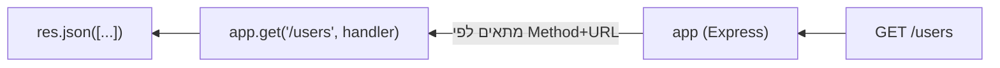

## מה זה?

בשלושת השיעורים האחרונים בנינו שרת ב-Vanilla Node.js, וראינו כמה קוד ידני נדרש לכל דבר: routing (התאמת URL ל-handler), פרסור URL, קריאת body — כל route חוזר על אותו boilerplate. **Express** הוא Framework מינימלי ל-Node.js שעוטף את מודול ה-`http` ונותן routing נוח, Middleware Pipeline (נלמד בשיעור נפרד בהמשך), ועזרים (helpers) שחוסכים בדיוק את הקוד החוזר הזה.

## מילות מפתח שחשוב לזכור

• `app` — ה-instance המרכזי של Express: `const app = express()`

• Route — צירוף של Method + URL + Handler: `app.get("/users", handler)`

• Route Handler — הפונקציה שמטפלת בבקשה שהתאימה ל-route: `(req, res) => {...}`

• `req`/`res` — כמו ב-Vanilla, אבל **עשירים בהרבה**: `req.params`, `req.query`, `req.body` (בשיעור הבא); `res.json()`, `res.status()`

• `res.json(data)` — שולח תגובה עם `Content-Type: application/json` אוטומטית, וממיר את `data` ל-JSON בעצמו

• `app.listen(port)` — כמו `server.listen` ב-Vanilla — מתחיל להאזין לבקשות

```javascript
import express from "express";

const app = express();

app.get("/users", (req, res) => {
  res.json([{ id: 1, name: "Dana" }]);
});

app.listen(3000, () => console.log("השרת רץ על פורט 3000"));
```



## הסבר עיקרי

מה בדיוק Express חוסך — בשיעור Vanilla Server, בדיקת `req.url`/`req.method` ידנית והחלטה מה להחזיר הייתה קוד `if`/`else` שמתנפח עם כל route נוסף. `app.get("/users", handler)`, `app.post("/users", handler)` וכו' מבטאים ישירות "מה קורה כשמגיעה בקשת GET/POST ל-URL הזה" — קריא ותמציתי הרבה יותר.

`res.json()` מול `res.end()` — זוכרים שב-Vanilla היינו צריכים `res.writeHead` **וגם** `JSON.stringify` **וגם** `res.end`? `res.json(data)` עושה את כל שלושת אלה בקריאה אחת: קובע `Content-Type`, ממיר ל-JSON, ושולח.

כל method, קריאה נפרדת — `app.get`, `app.post`, `app.put`, `app.delete` — כל אחד מטפל ב-HTTP Method המתאים (זוכרים מ-HTTP Basics?) בנפרד. אותו URL יכול להיות מוגדר עם `handler` שונה לגמרי לכל method.

## יתרונות

routing תמציתי וקריא במקום `if`/`else` ידני; `res.json()`/`req.params`/`req.query` (בשיעורים הבאים) חוסכים המון קוד חוזר; אקוסיסטם ענק של middleware מוכן (נלמד בהמשך).

## חסרונות

עוד ספרייה חיצונית להתקין ולנהל גרסה שלה; "קסם" מסוים (מה בדיוק `res.json` עושה מתחת למכסה?) שקל להבין הרבה יותר טוב אחרי שכבר ראיתם את הגרסה הידנית ב-Vanilla.

## נקודות חשובות למבחן / ראיון עבודה

• Express עוטף את מודול `http` המובנה עם routing ועזרים נוחים

• `app.get`/`app.post`/`app.put`/`app.delete` — אחד לכל HTTP Method

• `res.json(data)` קובע Content-Type, ממיר ל-JSON, ושולח — הכל בקריאה אחת

• `app.listen(port)` שקול ל-`server.listen(port)` ב-Vanilla

## טעויות נפוצות

• שכחת `app.listen()` בסוף — השרת מוגדר אבל לעולם לא מתחיל להאזין

• שימוש ב-`app.get` לפעולה שמשנה נתונים — לא תואם למוסכמות HTTP (זוכרים משיעור HTTP Basics?)

• בלבול בין `res.json()` (שולח JSON) ל-`res.send()` (שולח כל סוג תוכן)

## סיכום

Express עוטף את מודול `http` המובנה ונותן routing תמציתי (`app.get`/`app.post`...) ועזרים נוחים כמו `res.json()`. אותו רעיון בדיוק כמו ב-Vanilla Server, אבל עם הרבה פחות קוד חוזר. השיעורים הבאים ביחידה מרחיבים עם body, params, ו-middleware.

## דוקומנטציה רשמית

[Express — Official Docs](https://expressjs.com/)

---

## תרגילים

### תרגיל 1 — שרת Express ראשון

**המשימה:** התקינו `express` (`npm install express`) והקימו שרת עם route `GET /` שמחזיר `res.json({ message: "Hello Express" })`.

**בדיקה:** `curl http://localhost:3000/` מחזיר `{"message":"Hello Express"}` עם `Content-Type: application/json`.

### תרגיל 2 — כמה routes

**המשימה:** הוסיפו `GET /about` ו-`GET /contact`, כל אחד עם תוכן JSON שונה.

**בדיקה:** `curl http://localhost:3000/about` ו-`curl http://localhost:3000/contact` מחזירים שני גופי תגובה שונים, שניהם status `200`.

### תרגיל 3 — Methods שונים לאותו URL

**המשימה:** הגדירו `app.get("/items", ...)` ו-`app.post("/items", ...)` על אותו URL בדיוק, עם תגובות שונות זו מזו.

**בדיקה:** `curl http://localhost:3000/items` מחזיר תגובה אחת; `curl -X POST http://localhost:3000/items` מחזיר תגובה שונה — הוכחה ש-Method קובע איזה handler רץ.

---

## פרויקט מסכם

**המשימה:** בנו שרת Express בסיסי ל"ניהול משימות" (Tasks) עם נתונים בזיכרון.

**דרישות:**
1. מערך `tasks` בזיכרון (לא DB עדיין) עם 2-3 משימות לדוגמה
2. `GET /tasks` שמחזיר את המערך עם `res.json()`
3. `GET /` שמחזיר הודעת ברוכים הבאים
4. `app.listen` עם הודעת console ברורה

**בדיקה:** `curl http://localhost:3000/tasks` מחזיר מערך JSON עם 2-3 משימות, status `200`; `curl http://localhost:3000/` מחזיר את הודעת הברוכים הבאים.

---

## מה בפרק הבא

בפרק הבא נלמד על **Request Body (Express)** — בשיעור על Request Body ב-Vanilla ראינו שקריאת body דורשת אסיפת chunks ידנית, `JSON.parse` עם `try`/`catch`, וכל זה חוזר על עצמו בכל route. Express נותן פתרון מובנה: `express.json()` הוא **Middleware**
