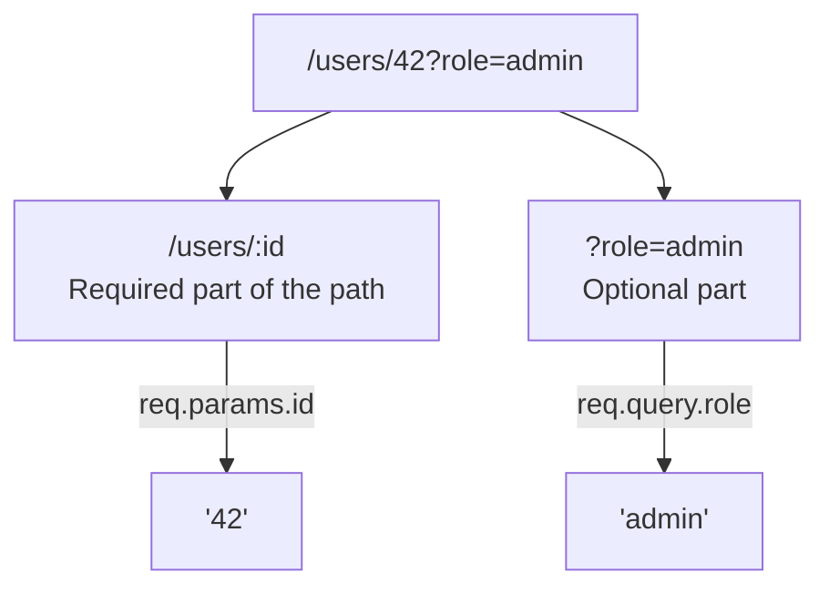

## מה זה?

בשיעור ה-Vanilla על URL Params פיצלנו `pathname` ידנית כדי לחלץ חלק דינמי כמו `42` מ-`/users/42`. Express נותן לזה תחביר נוח בהרבה: `req.params` ו-`req.query` הם שני מקורות מידע **שונים** שקל לבלבל ביניהם — `req.params` שולף פרמטרים שמוגדרים **ב-route עצמו**, בעוד `req.query` שולף פרמטרים אופציונליים מה-**Query String**.

## מילות מפתח שחשוב לזכור

• `req.params` — פרמטרים שמוגדרים בהגדרת ה-route עם `:name`, למשל `/users/:id` → `req.params.id`

• `req.query` — Query String אחרי `?` ב-URL, כמו `?role=admin` → `req.query.role`

• `:id` — placeholder בהגדרת route: `app.get("/users/:id", handler)`

• Multiple Params — route יכול להכיל כמה params בבת אחת: `/users/:userId/posts/:postId`

• Type Coercion מ-URL — גם `req.params` וגם `req.query` מחזירים **תמיד string**, גם כשהערך "נראה" כמו מספר (בדיוק כמו ב-Vanilla)

```javascript
// GET /users/42?role=admin
app.get("/users/:id", (req, res) => {
  const userId = req.params.id;   // "42" — from the route
  const role = req.query.role;    // "admin" — from the query string
  res.json({ userId, role });
});
```



## הסבר עיקרי

מתי params, מתי query — `req.params` מתאים לחלק **חובה** ומזהה ייחודית של המשאב (איזה משתמש? `42`). `req.query` מתאים לפרמטרים **אופציונליים** שמסננים/משנים את התוצאה (איזה סינון? מיון? עמוד?) — אם המשאב יכול "להתקיים" בלעדיו, זה כנראה query, לא param.

כמה params בבת אחת — `/users/:userId/posts/:postId` מגדיר **שני** placeholders — `req.params` יכיל `{ userId: "5", postId: "12" }` עבור `/users/5/posts/12`. סדר ה-`:name` בהגדרה חייב להתאים לסדר ב-URL.

עדיין strings — בדיוק כמו ב-Vanilla, `req.params.id` הוא **תמיד** string, גם אם ה-URL הוא `/users/42`. השוואה כמו `req.params.id === 42` (מספר) תמיד `false` — צריך `Number(req.params.id)`.

404 כשלא נמצא — אם `req.params.id` לא תואם שום משתמש קיים בפועל (למשל, ב-`tasks` array), חוזרים על עיקרון ה-Status Codes מ-HTTP Basics: `res.status(404).json({ error: "not found" })`, לא `200` עם גוף ריק.

## יתרונות

תחביר `:name` קריא בהרבה מפיצול ידני של `pathname`; הפרדה ברורה בין "מה חובה לזהות את המשאב" (params) ל"מה אופציונלי לסינון" (query); Express מפרסר את שניהם אוטומטית, בלי קוד נוסף.

## חסרונות

בלבול נפוץ בין השניים אצל מתחילים; שכחת `Number()` על params/query גורמת להשוואות שגויות שקטות.

## נקודות חשובות

• `req.params` מגיע מהגדרת ה-route (`:id`); `req.query` מגיע מ-Query String אחרי `?`

• שניהם תמיד מחזירים string, גם לערכים שנראים כמו מספרים

• route יכול להכיל כמה `:params` בבת אחת

• כשמשאב לא נמצא לפי param — מחזירים `404`, לא `200` ריק

## טעויות נפוצות

• שימוש ב-`req.query` כשהתכוונו ל-`req.params` (או להפך)

• השוואת `req.params.id` (string) ישירות למספר בלי `Number()`

• שכחת לטפל במקרה שה-param לא תואם שום רשומה קיימת (חוזר `200` עם `undefined` במקום `404`)

## סיכום

`req.params` שולף פרמטרים חובה שמוגדרים בהגדרת ה-route (`:id`); `req.query` שולף פרמטרים אופציונליים מה-Query String. שניהם תמיד strings. route יכול להכיל כמה params; כשמשהו לא נמצא, מחזירים `404` תקני.

## דוקומנטציה רשמית

[Express — Routing](https://expressjs.com/en/guide/routing.html)

---

## תרגילים

### תרגיל 1 — params בסיסי

**המשימה:** בנו `GET /products/:id` שמחזיר `{ productId: req.params.id }`.

**בדיקה:** `curl http://localhost:3000/products/7` מחזיר `{"productId":"7"}` — שימו לב ש-`"7"` הוא string, לא מספר.

### תרגיל 2 — query בסיסי

**המשימה:** בנו `GET /search` שקורא `req.query.term` ו-`req.query.page`, עם ברירת מחדל `"1"` ל-`page` אם לא סופק.

**בדיקה:** `curl "http://localhost:3000/search?term=laptop"` מחזיר `page: "1"`; `curl "http://localhost:3000/search?term=laptop&page=3"` מחזיר `page: "3"`.

### תרגיל 3 — כמה params

**המשימה:** בנו `GET /users/:userId/orders/:orderId` שמחזיר את שני הערכים יחד ב-JSON.

**בדיקה:** `curl http://localhost:3000/users/5/orders/12` מחזיר `{"userId":"5","orderId":"12"}`.

---

## פרויקט מסכם

**המשימה:** בנו `GET /tasks/:id` על מערך המשימות מהשיעור הקודם.

**דרישות:**
1. חפשו במערך `tasks` משימה עם `id` תואם ל-`req.params.id` (זכרו: השוואה נכונה, לא string מול number)
2. אם נמצאה — `res.json(task)`
3. אם לא — `res.status(404).json({ error: "Task not found" })`
4. הוסיפו תמיכה ב-`?verbose=true` ב-query שמחזיר שדות נוספים אם קיים

**בדיקה:** `curl http://localhost:3000/tasks/1` מחזיר את המשימה עם status `200`; `curl http://localhost:3000/tasks/999` מחזיר status `404`; `curl "http://localhost:3000/tasks/1?verbose=true"` מחזיר שדות נוספים לעומת הבקשה הרגילה.

---

## מה בפרק הבא

בפרק הבא נלמד על **Express Router** — ככל שמוסיפים routes (users, products, orders...) לאותו קובץ `app.js` יחיד, הוא הופך לבלתי-ניתן-לניווט — עשרות routes בקובץ אחד. `express.Router()` הוא פתרון: הוא יוצר "mini-app" עצמאי עם `.get`/`.post
