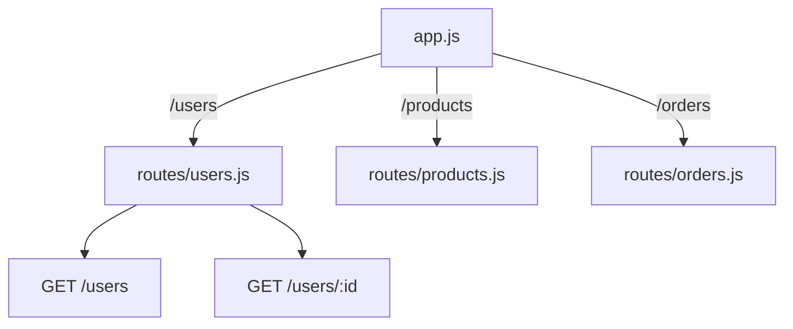

## מה זה?

ככל שמוסיפים routes (users, products, orders...) לאותו קובץ `app.js` יחיד, הוא הופך לבלתי-ניתן-לניווט — עשרות routes בקובץ אחד. `express.Router()` הוא פתרון: הוא יוצר "mini-app" עצמאי עם `.get`/`.post`/`.put`/`.delete` משלו, שמאפשר לפצל routes לקבצים נפרדים **לפי משאב**, ואז לחבר את כולם ל-`app` הראשי.

## מילות מפתח שחשוב לזכור

• `express.Router()` — יוצר router עצמאי, עם אותה API בדיוק כמו `app`

• `app.use(prefix, router)` — "מרכיב" router ל-`app` הראשי, עם קידומת (prefix) משותפת לכל ה-routes שבו

• Prefix (קידומת) — חלק ה-URL המשותף לכל routes בקובץ router, מוגדר ב-`app.use`

• Relative Paths ב-Router — בתוך קובץ router, `"/"` פירושו **שורש הprefix**, לא שורש כל האפליקציה

• `export default router` — מייצא (ESM, כבר מוכר!) את ה-router לשימוש ב-`app.js`

```javascript
// routes/users.js
import express from "express";
const router = express.Router();

router.get("/", (req, res) => res.json([{ id: 1, name: "Dana" }])); // = GET /users
router.get("/:id", (req, res) => res.json({ id: req.params.id }));  // = GET /users/:id

export default router;

// app.js
import usersRouter from "./routes/users.js";
app.use("/users", usersRouter); // כל route בקובץ מקבל את הprefix "/users"
```



## הסבר עיקרי

איך ה-prefix עובד — `app.use("/users", usersRouter)` אומר: "כל route שמוגדר בתוך `usersRouter` יקבל `/users` בתחילת ה-URL שלו אוטומטית". כך `router.get("/", ...)` הופך בפועל ל-`GET /users`, ו-`router.get("/:id", ...)` הופך ל-`GET /users/:id` — בלי לכתוב `/users` בכל שורה בקובץ.

למה זה מסייע לתחזוקה — כל קובץ router (`routes/users.js`, `routes/products.js`, `routes/orders.js`) עוסק ב**משאב אחד בלבד** — מי שמחפש לוגיקת "משתמשים" יודע בדיוק לאיזה קובץ ללכת, בלי לחפש בתוך `app.js` ענק.

`app.js` נשאר "מפת ניווט" — לאחר הפיצול, `app.js` עצמו הופך קצר וברור: הוא רק "מרכיב" את כל ה-routers השונים עם ה-prefix שלהם — כמעט בלי לוגיקה ממשית משלו.

## יתרונות

קובץ router לכל משאב — קל למצוא ולתחזק קוד; `app.js` נשאר קצר וקריא כ"מפת ניווט"; קל להוסיף משאב חדש (קובץ router חדש) בלי לגעת בקבצים קיימים.

## חסרונות

עוד רמת הפשטה שדורשת הבנה (prefix, relative paths); פיצול-יתר (router לכל route בודד) יכול ליצור יותר מדי קבצים קטנים.

## נקודות חשובות למבחן / ראיון עבודה

• `express.Router()` יוצר mini-app עצמאי עם אותה API כמו `app`

• `app.use(prefix, router)` מרכיב router עם קידומת URL משותפת

• בתוך router, `"/"` = שורש ה-prefix, לא שורש כל האפליקציה

• פיצול ל-routers מאורגן **לפי משאב** (users, products...) הוא המוסכמה הנפוצה

## טעויות נפוצות

• שכחת `export default router` בסוף קובץ ה-router

• ציפייה ש-`router.get("/")` יתאים לשורש האפליקציה (`/`) במקום לשורש ה-prefix (`/users`)

• רישום router עם prefix שגוי או כפול (`/users/users`)

## סיכום

`express.Router()` יוצר mini-app עצמאי לפיצול routes לקבצים נפרדים לפי משאב. `app.use(prefix, router)` מחבר אותו ל-`app` הראשי עם קידומת URL משותפת. זה הופך `app.js` לקצר וברור, וכל קובץ router מתמקד במשאב אחד בלבד.

## דוקומנטציה רשמית

[Express — Router](https://expressjs.com/en/guide/routing.html#express-router)

---

## תרגילים

### תרגיל 1 — router ראשון

**המשימה:** צרו `routes/products.js` עם `router.get("/", ...)` שמחזיר רשימת מוצרים, וחברו אותו ב-`app.js` עם `app.use("/products", productsRouter)`.

**בדיקה:** `curl http://localhost:3000/products` מחזיר את רשימת המוצרים, בדיוק כאילו ה-route הוגדר ישירות על `app`.

### תרגיל 2 — כמה routes ב-router אחד

**המשימה:** הוסיפו ל-`products.js` גם `router.get("/:id", ...)` וגם `router.post("/", ...)`.

**בדיקה:** `curl http://localhost:3000/products/1` מחזיר מוצר בודד; `curl -X POST http://localhost:3000/products -H "Content-Type: application/json" -d '{"name":"עכבר"}'` מחזיר status `201`.

### תרגיל 3 — שני routers

**המשימה:** צרו router נוסף (`routes/orders.js`) וחברו אותו עם prefix שונה (`/orders`).

**בדיקה:** `curl http://localhost:3000/products` ו-`curl http://localhost:3000/orders` מחזירים כל אחד את התוכן הנכון שלו, בלי חפיפה או שגיאה.

---

## פרויקט מסכם

**המשימה:** פצלו שרת "Tasks" קיים ל-router נפרד.

**דרישות:**
1. `routes/tasks.js` עם כל ה-routes של המשימות (`GET /`, `GET /:id`, `POST /`) בעזרת `express.Router()`
2. `app.js` שמחבר אותו עם `app.use("/tasks", tasksRouter)`
3. ודאו ש-`GET /tasks` ו-`GET /tasks/:id` עדיין עובדים בדיוק כמו קודם
4. `app.js` הסופי צריך להיראות קצר וברור, בלי לוגיקת tasks בתוכו

**בדיקה:** `curl http://localhost:3000/tasks` ו-`curl http://localhost:3000/tasks/1` מחזירים בדיוק את אותן תגובות כמו לפני הפיצול; `app.js` לא מכיל אף `app.get`/`app.post` עם `"tasks"` בנתיב.

---

## מה בפרק הבא

בפרק הבא נלמד על **Middleware** — ראינו כבר `express.json()` (שיעור Request Body) — הוא בעצם **Middleware**: פונקציה שרצה **בין** קבלת הבקשה לשליחת התגובה הסופית. עכשיו נכיר את המושג לעומק: Middleware יכולה לבדוק תנאי, להוסיף מידע ל-`
