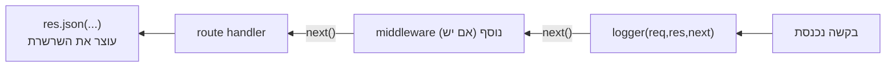

## מה זה?

ראינו כבר `express.json()` (שיעור Request Body) — הוא בעצם **Middleware**: פונקציה שרצה **בין** קבלת הבקשה לשליחת התגובה הסופית. עכשיו נכיר את המושג לעומק: Middleware יכולה לבדוק תנאי, להוסיף מידע ל-`req`, לעצור עם תגובה, או להמשיך הלאה. הבעיה שנפתרת: לוגיקה משותפת (רישום בקשות, בדיקת הרשאה) שצריכה לרוץ על **כמה** routes לא אמורה להיכתב בכל route בנפרד.

## מילות מפתח שחשוב לזכור

• `(req, res, next)` — חתימת כל middleware: הבקשה, התגובה, ופונקציית ה"המשך"

• `next()` — קריאה שמעבירה שליטה לפונקציה **הבאה** בשרשרת (עוד middleware, או ה-route handler עצמו)

• `res.json()`/`res.send()` — שולחים תגובה **ועוצרים** את השרשרת; **לא** קוראים `next()` אחרי זה

• `app.use(fn)` — רישום middleware גלובלי, שרץ על **כל** route שנרשם **אחריו** בקוד

• Middleware מקומי — middleware שמצורף ל-route ספציפי בלבד: `app.get(path, middlewareFn, handler)`

• סדר רישום — Middleware רץ **בדיוק** לפי סדר הרשמתו בקוד; middleware שנרשם אחרי route מסוים לא ירוץ עליו

```javascript
function logger(req, res, next) {
  console.log(`${req.method} ${req.url}`);
  next(); // חובה! בלי זה הבקשה "נתקעת" כאן
}

app.use(logger); // גלובלי — רץ על כל route שנרשם אחריו

app.get("/users", (req, res) => {
  res.json([{ id: 1, name: "Dana" }]);
});
```



## הסבר עיקרי

`next()` הוא ה"מעביר תפקיד" — כל middleware **חייבת** לעשות אחד משניים: לקרוא ל-`next()` (כדי להעביר שליטה הלאה), או לשלוח תגובה (`res.json`/`res.send`/`res.end`) שעוצרת את השרשרת. אם היא לא עושה אף אחד מהשניים, הבקשה נשארת "תלויה" לנצח — ה-client ימשיך לחכות.

סדר רישום קובע הכל — Express מריץ middleware **בדיוק** בסדר שבו הן נרשמו בקוד. `app.use(logger)` שנרשם **לפני** `app.get("/users", ...)` ירוץ על הבקשה; אם הוא היה נרשם **אחרי**, הוא פשוט לא היה משפיע על אותו route.

Middleware יכול "להעשיר" את `req` — למשל, middleware בדיקת הרשאה יכול לקרוא Header, לאמת אותו, ולהוסיף `req.user = {...}` — כך שה-route handler הבא בשרשרת "מקבל" מידע מוכן, בלי לחשב אותו בעצמו.

Middleware גלובלי מול מקומי — `app.use(fn)` חל על **כל** route שנרשם אחריו; לעומת זאת `app.get("/admin", checkAdmin, handler)` מצרף `checkAdmin` **רק** ל-route הספציפי הזה — שימושי כשרק חלק מה-routes צריכים בדיקה מסוימת.

## יתרונות

לוגיקה משותפת (לוג, אימות, פרסור) נכתבת **פעם אחת**, לא בכל route; אפשר לשלב כמה middlewares ברצף לבניית "צנרת" עיבוד ברורה; middleware מקומי נותן שליטה עדינה — רק ל-routes שבאמת צריכים.

## חסרונות

שכחת `next()` תוקעת בקשות בלי הודעת שגיאה ברורה; סדר רישום לא-נכון (middleware אחרי ה-route שצריך אותה) הוא באג שקט וקשה לאיתור למתחילים.

## נקודות חשובות למבחן / ראיון עבודה

• כל middleware מקבלת `(req, res, next)`; חייבת לקרוא `next()` או לשלוח תגובה

• `app.use(fn)` — גלובלי, חל על routes שנרשמו **אחריו**; סדר קובע הכל

• Middleware מקומי מצורף ל-route ספציפי: `app.get(path, middlewareFn, handler)`

• Middleware יכולה להעשיר `req` (למשל `req.user`) לפני שה-handler רץ

## טעויות נפוצות

• שכחת `next()` — הבקשה נתקעת בלי תגובה ובלי שגיאה גלויה

• קריאה ל-`next()` **אחרי** ששלחו כבר תגובה עם `res.json()` — שגיאת "headers already sent"

• רישום middleware גלובלי **אחרי** ה-routes שאמורים להשתמש בו

## סיכום

Middleware היא פונקציה `(req, res, next)` שרצה בין הבקשה לתגובה — יכולה לבדוק, להעשיר את `req`, או לעצור. `app.use(fn)` רושם middleware גלובלי; `app.get(path, fn, handler)` רושם מקומי. סדר הרישום קובע בדיוק על אילו routes היא תרוץ. חובה לקרוא `next()` או לשלוח תגובה — אחרת הבקשה נתקעת.

## דוקומנטציה רשמית

[Express — Using middleware](https://expressjs.com/en/guide/using-middleware.html)

---

## תרגילים

### תרגיל 1 — logger middleware

**המשימה:** כתבו middleware גלובלי שמדפיס `method` ו-`url` של כל בקשה, ורשמו אותו לפני כל ה-routes.

**בדיקה:** כל בקשה (למשל `curl http://localhost:3000/`) גורמת ל-console להדפיס שורה כמו `GET /`, לפני שהתגובה חוזרת.

### תרגיל 2 — middleware מקומי

**המשימה:** כתבו `checkApiKey` שבודק Header בשם `x-api-key`; אם חסר, מחזיר `401`; אחרת קורא `next()`. צרפו אותו ל-route בודד בלבד.

**בדיקה:** `curl http://localhost:3000/protected` (בלי header) מחזיר status `401`; `curl -H "x-api-key: secret" http://localhost:3000/protected` מחזיר status `200`; route אחר, בלי ה-middleware, עדיין עובד בלי ה-header.

### תרגיל 3 — העשרת req

**המשימה:** כתבו middleware שמוסיף `req.requestTime = Date.now()`, ו-route handler שמחזיר את הערך הזה ב-JSON.

**בדיקה:** התגובה כוללת `requestTime` שהוא מספר (timestamp) קרוב לזמן הריצה בפועל.

---

## פרויקט מסכם

**המשימה:** הוסיפו שכבת middleware לשרת ה-Tasks.

**דרישות:**
1. Middleware גלובלי `logger` שרושם כל בקשה (method + url + timestamp)
2. Middleware מקומי `validateTaskBody` שבודק ש-`req.body.title` קיים לפני `POST /tasks`; אחרת `400`
3. ודאו שסדר הרישום נכון (logger גלובלי לפני הroutes; validateTaskBody רק על ה-POST)
4. תעדו (בהערה) מה קורה אם משכחים `next()` ב-logger

**בדיקה:** כל בקשה לשרת מדפיסה שורת log; `curl -X POST http://localhost:3000/tasks -H "Content-Type: application/json" -d '{}'` מחזיר status `400`; אותה בקשה עם `-d '{"title":"קניות"}'` מחזירה status `201`.

---

## מה בפרק הבא

בפרק הבא נלמד על **Express Error Handling** — מה קורה אם route handler אסינכרוני (`async`) זורק שגיאה — למשל, כי `JSON.parse` נכשל, או שקריאה ל-DB (בהמשך הקורס) נדחית? בלי טיפול מפורש, Express לא תמיד תופס שגיאות שנזרקות בתוך `async` functions, ו
