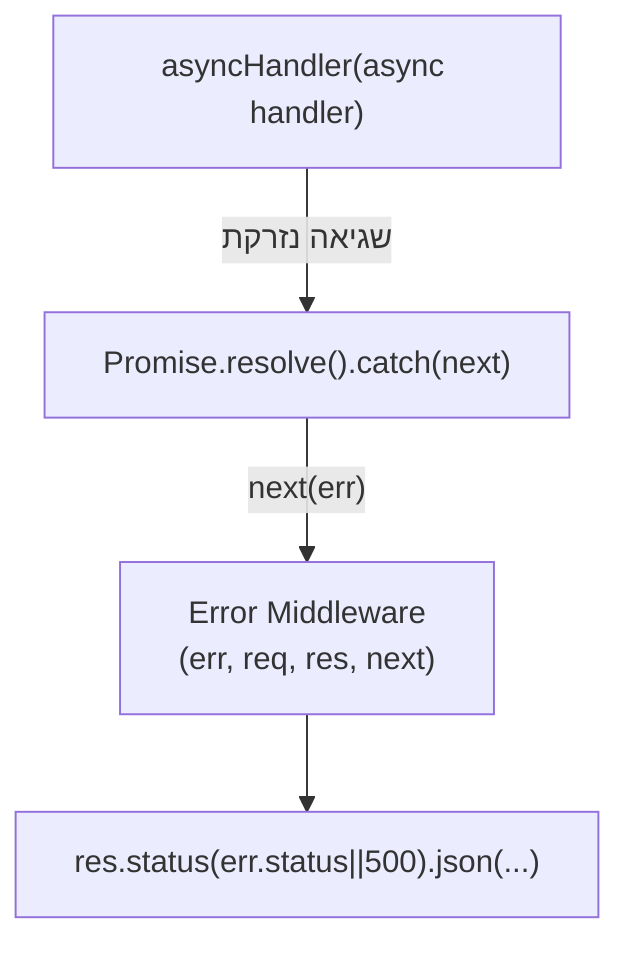

## מה זה?

מה קורה אם route handler אסינכרוני (`async`) זורק שגיאה — למשל, כי `JSON.parse` נכשל, או שקריאה ל-DB (בהמשך הקורס) נדחית? בלי טיפול מפורש, Express לא תמיד תופס שגיאות שנזרקות בתוך `async` functions, וה-client עלול פשוט **לא לקבל תגובה בכלל** — הבקשה נשארת תלויה. הבעיה שנפתרת: כתיבת `try`/`catch` זהה בכל route אסינכרוני היא קוד חוזר, קל לשכוח, ומפר את עקרון ה-DRY שכבר מכירים.

## מילות מפתח שחשוב לזכור

• `asyncHandler` — פונקציית wrapper ל-route handlers אסינכרוניים: תופסת כל שגיאה ומעבירה אותה אוטומטית ל-`next(err)`

• `next(err)` — קריאה ל-`next` **עם ארגומנט**; מדלגת על כל שאר ה-routes הרגילים וקופצת ישר ל-Error Middleware

• Error Middleware — middleware מיוחד עם **בדיוק 4** פרמטרים: `(err, req, res, next)` — לא 3 כמו middleware רגיל

• `err.status` — property שמצמידים לשגיאה כדי לקבוע את ה-Status Code בתגובה הסופית

```javascript
function asyncHandler(fn) {
  return (req, res, next) => {
    Promise.resolve(fn(req, res, next)).catch(next); // תופס שגיאה -> next(err)
  };
}

app.get("/users/:id", asyncHandler(async (req, res) => {
  const user = await findUser(req.params.id); // אם נזרקת שגיאה, asyncHandler תופס אותה
  if (!user) {
    const err = new Error("User not found");
    err.status = 404;
    throw err;
  }
  res.json(user);
}));

// Error Middleware — תמיד אחרון, עם 4 פרמטרים בדיוק
app.use((err, req, res, next) => {
  res.status(err.status || 500).json({ error: err.message });
});
```



## הסבר עיקרי

איך `asyncHandler` עובד — הוא "עוטף" את ה-route handler שלכם: `Promise.resolve(fn(...)).catch(next)` — זוכרים `.catch()` משיעור Promises? בדיוק אותו רעיון: אם ה-`async` function שבפנים דוחה (כי היא זרקה שגיאה), ה-`.catch(next)` תופס את זה ומעביר את השגיאה ישירות ל-`next`.

Error Middleware תמיד אחרון, ותמיד 4 פרמטרים — Express מזהה middleware כ"מטפל שגיאות" **רק** לפי מספר הפרמטרים: בדיוק 4 (`err, req, res, next`), לא 3. הוא חייב להירשם **אחרי** כל ה-routes הרגילים, כדי שכל `next(err)` "יגיע" אליו.

`err.status` כמנגנון תקשורת — כשקוד עסקי (route handler) "יודע" מה הבעיה (משתמש לא נמצא = 404), הוא מציין את זה על השגיאה עצמה (`err.status = 404`) לפני שהיא נזרקת. Error Middleware קורא את זה ומחליט איזה Status Code להחזיר בפועל.

## יתרונות

מבטל צורך ב-`try`/`catch` בכל route בנפרד; מקום אחד (Error Middleware) מטפל בכל השגיאות באפליקציה, עקבי; מונע מהשרת "לתקוע" בקשות בשקט בגלל שגיאה שלא נתפסה.

## חסרונות

עוד שכבת הפשטה (`asyncHandler`) שצריך להבין; שכחת לעטוף route אסינכרוני ב-`asyncHandler` מחזירה למצב המקורי הבעייתי.

## נקודות חשובות למבחן / ראיון עבודה

• `asyncHandler` תופס שגיאות מ-`async` route handlers ומעביר אותן ל-`next(err)`

• Error Middleware מזוהה ע"י Express לפי **בדיוק 4** פרמטרים: `(err, req, res, next)`

• Error Middleware נרשם **אחרון**, אחרי כל ה-routes הרגילים

• `err.status` הוא מוסכמה נפוצה לתקשר Status Code מהקוד העסקי ל-Error Middleware

## טעויות נפוצות

• שכחת לעטוף route אסינכרוני ב-`asyncHandler` — שגיאות בו לא נתפסות

• רישום Error Middleware עם 3 פרמטרים בטעות (`req, res, next`) — Express לא מזהה אותו כ-Error Middleware

• רישום Error Middleware **לפני** ה-routes הרגילים במקום אחריהם

## סיכום

`asyncHandler` עוטף route handlers אסינכרוניים ותופס שגיאות דרך `.catch(next)` — Promises שכבר מוכרים. Error Middleware (`err, req, res, next` — בדיוק 4 פרמטרים) נרשם אחרון ומטפל בכל השגיאות במקום אחד. `err.status` מתקשר איזה Status Code להחזיר.

## דוקומנטציה רשמית

[Express — Error Handling](https://expressjs.com/en/guide/error-handling.html)

---

## תרגילים

### תרגיל 1 — asyncHandler בסיסי

**המשימה:** כתבו `asyncHandler` (כמו בדוגמה) ועטפו איתו route שזורק שגיאה מלאכותית (`throw new Error("בדיקה")`).

**בדיקה:** `curl -i http://localhost:3000/<route>` מחזיר תגובת שגיאה מיידית (לא נתקע וללא קריסת שרת) עם גוף JSON שמכיל את הודעת השגיאה.

### תרגיל 2 — err.status

**המשימה:** בנו route שזורק שגיאה עם `err.status = 400` על קלט לא-תקין.

**בדיקה:** `curl -i` לאותו route עם קלט לא-תקין מחזיר `HTTP/1.1 400` בשורת הסטטוס, לא `500`.

### תרגיל 3 — בלי asyncHandler

**המשימה:** הסירו את `asyncHandler` מ-route אסינכרוני שזורק שגיאה, ושלחו אליו בקשה.

**בדיקה:** הבקשה נשארת תלויה (ה-client לא מקבל תגובה כלל) — בניגוד להתנהגות עם `asyncHandler`, שמחזירה תגובת שגיאה מיידית.

---

## פרויקט מסכם

**המשימה:** הוסיפו טיפול שגיאות מרכזי לשרת ה-Tasks.

**דרישות:**
1. כתבו `asyncHandler` ועטפו איתו את כל routes ה-Tasks האסינכרוניים
2. `GET /tasks/:id` שזורק שגיאה עם `err.status = 404` אם המשימה לא נמצאה
3. Error Middleware אחד בסוף הקובץ שמחזיר `{ error: err.message }` עם הסטטוס הנכון
4. ודאו ש-route תקין ממשיך לעבוד רגיל, לא רק ה-route השגוי

**בדיקה:** `curl -i http://localhost:3000/tasks/999` מחזיר `HTTP/1.1 404` עם `{"error":"..."}`; `curl http://localhost:3000/tasks/1` (קיים) עדיין מחזיר `200` עם המשימה כרגיל.

---

## מה בפרק הבא

בפרק הבא נלמד על **Error Handling** — בשיעור הקודם השתמשנו ב-`throw new Error(...)` וב-`.catch(next)` בלי להסביר אותם לעומק. עכשיו נעצור ונבין את מנגנון הטיפול בשגיאות של JavaScript עצמו: `try`/`catch`/`finally`, מחלקת `Error` המובנית, ו-
