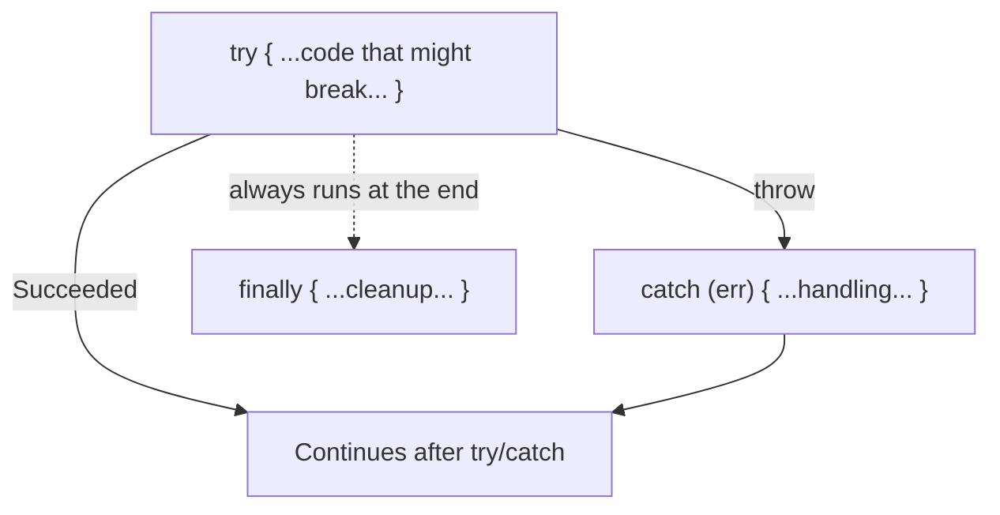

## מה זה?

בשיעור הקודם השתמשנו ב-`throw new Error(...)` וב-`.catch(next)` בלי להסביר אותם לעומק. עכשיו נעצור ונבין את מנגנון הטיפול בשגיאות של JavaScript עצמו: `try`/`catch`/`finally`, מחלקת `Error` המובנית, ו-Custom Errors שמרחיבים אותה. הבעיה שנפתרת: בלי טיפול שגיאות, כל חריגה (JSON לא תקין, קלט משתמש שגוי) עלולה להפיל את כל התוכנית — Error Handling נותן דרך לתפוס בדיוק את מה שצפוי, ולהגיב אליו בצורה מבוקרת.

## מילות מפתח שחשוב לזכור

• `try`/`catch`/`finally` — נסה קוד (`try`), תפוס שגיאה אם נזרקה (`catch`), הרץ תמיד בסוף (`finally`)

• `throw` — זריקת ערך כשגיאה, בדרך כלל `new Error("message")`

• `Error` — מחלקת שגיאה מובנית עם `message` (טקסט) ו-`stack` (traceback — היכן נזרקה)

• Custom Error — מחלקה שמרחיבה `Error`: `class ValidationError extends Error {}` — שגיאה עם משמעות ספציפית לפרויקט שלכם

• Unhandled Rejection — Promise שנדחה בלי `.catch()` בשום מקום; גורם לאזהרה, ולפעמים לקריסה

```javascript
class ValidationError extends Error {
  constructor(message) {
    super(message);   // invokes the Error class's own constructor
    this.name = "ValidationError";
    this.status = 400;
  }
}

try {
  if (!email.includes("@")) {
    throw new ValidationError("Invalid email format");
  }
} catch (err) {
  console.error(err.name, err.message); // "ValidationError" "Invalid email format"
}
```



## הסבר עיקרי

`try`/`catch` כרשת ביטחון — קוד שעלול "להישבר" (`JSON.parse` על טקסט לא-תקין, למשל) עוטפים ב-`try`; אם הוא נשבר בפועל, הביצוע "קופץ" ישר ל-`catch`, בלי להמשיך את שאר ה-`try`. `finally` רץ **תמיד**, הצליח או נכשל — שימושי לניקוי משאבים.

Custom Error כתקשורת ברורה — `class ValidationError extends Error` יוצר סוג שגיאה משלכם, עם משמעות ספציפית ("קלט לא תקין"). `super(message)` **חובה** בשורה הראשונה של ה-constructor — הוא מפעיל את הלוגיקה הפנימית של `Error` (בעיקר בניית `stack`). זה בדיוק המנגנון ש-`err.status` מהשיעור הקודם נשען עליו.

Promise.catch() כמקבילה אסינכרונית — `try`/`catch` תופס שגיאות **סינכרוניות**. לשגיאה בתוך Promise (זוכרים את השיעור על Promises?), `.catch()` הוא המקביל — וזו בדיוק הסיבה ש-`asyncHandler` מהשיעור הקודם השתמש ב-`.catch(next)` ולא ב-`try`/`catch` רגיל.

## יתרונות

מונע קריסה מוחלטת של האפליקציה משגיאה בודדת; Custom Errors נותנים משמעות עסקית ברורה לשגיאות (לא רק "Error" גנרי); `finally` מבטיח ניקוי משאבים גם כשמשהו נכשל.

## חסרונות

`try`/`catch` תופס רק שגיאות סינכרוניות — קל לשכוח שקוד async דורש `.catch()` נפרד; Custom Errors רבים מדי בלי מבנה ברור יכולים להסתבך.

## נקודות חשובות

• `try`/`catch` תופס שגיאות סינכרוניות; `.catch()` על Promise תופס שגיאות אסינכרוניות

• `finally` רץ תמיד, הצליח או נכשל ה-`try`

• Custom Error מרחיב `Error` עם `extends`; `super(message)` חובה בשורה הראשונה

• Unhandled Rejection = Promise שנדחה בלי `.catch()` בשום מקום בשרשרת

## טעויות נפוצות

• ציפייה ש-`try`/`catch` רגיל יתפוס שגיאה מתוך Promise שלא הופעל עם `await`

• שכחת `super(message)` ב-constructor של Custom Error

• זריקת מחרוזת רגילה (`throw "error"`) במקום `throw new Error(...)` — מאבדים `stack` שימושי לדיבוג

## סיכום

`try`/`catch`/`finally` תופס שגיאות סינכרוניות; `.catch()` על Promise תופס אסינכרוניות — זה בדיוק מה ש-`asyncHandler` מהשיעור הקודם השתמש בו. Custom Errors (`class X extends Error`) נותנים משמעות עסקית ברורה לשגיאות שלכם, עם `super(message)` חובה בבנאי.

## דוקומנטציה רשמית

[MDN — try...catch](https://developer.mozilla.org/en-US/docs/Web/JavaScript/Reference/Statements/try...catch)

---

## תרגילים

### תרגיל 1 — try/catch בסיסי

**המשימה:** כתבו `try`/`catch` סביב `JSON.parse` על מחרוזת לא-תקינה (למשל `"{bad json"`), והדפיסו הודעת שגיאה ברורה במקום לתת לתוכנית לקרוס.

**בדיקה:** הרצת הסקריפט מדפיסה את הודעת השגיאה שלכם ומסתיימת בלי `Uncaught Exception` — הריצה ממשיכה אחרי ה-`catch`.

### תרגיל 2 — Custom Error

**המשימה:** כתבו `class NotFoundError extends Error` עם `status = 404`. זרקו אותה ותפסו אותה עם `catch`, והדפיסו `err.name`, `err.message`, `err.status`.

**בדיקה:** ה-console מדפיס `NotFoundError`, את הודעת השגיאה שנתתם, ו-`404` — שלושתם, לא רק `"Error"` גנרי.

### תרגיל 3 — finally

**המשימה:** כתבו `try`/`catch`/`finally` שמדפיס "מנקה משאבים" ב-`finally`. בדקו פעם עם `try` שמצליח ופעם עם `try` שנכשל.

**בדיקה:** בשני הריצות (הצלחה וכישלון) ההודעה "מנקה משאבים" מודפסת — `finally` רץ בכל מקרה.

---

## פרויקט מסכם

**המשימה:** בנו מערכת שגיאות מותאמת קטנה לפרויקט.

**דרישות:**
1. `class AppError extends Error` עם `status` ו-`isOperational` (בוליאני)
2. שתי מחלקות שמרחיבות אותה: `NotFoundError` (status 404) ו-`ValidationError` (status 400)
3. פונקציה שמדמה חיפוש משתמש וזורקת `NotFoundError` אם לא נמצא
4. `try`/`catch` שקורא לפונקציה ומדפיס הודעה שונה לפי סוג השגיאה שנתפסה

**בדיקה:** קריאה לפונקציה עם משתמש קיים מדפיסה תוצאה תקינה בלי שגיאה; קריאה עם משתמש לא-קיים מדפיסה הודעה שמזכירה `NotFoundError` ו-`404`, לא הודעת שגיאה גנרית.

---

## מה בפרק הבא

בפרק הבא נלמד על **dotenv & Environment Variables** — עד עכשיו, כל ערך בקוד שלנו היה כתוב ישירות בתוכו (`const PORT = 3000`). אבל מה עם ערכים **רגישים** — סיסמת DB, מפתח API סודי? כתיבתם ישירות בקוד אומרת שכל מי שרואה את הקוד (כולל כל מי שרואה את ה-Repos
