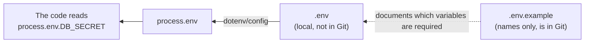

## מה זה?

עד עכשיו, כל ערך בקוד שלנו היה כתוב ישירות בתוכו (`const PORT = 3000`). אבל מה עם ערכים **רגישים** — סיסמת DB, מפתח API סודי? כתיבתם ישירות בקוד אומרת שכל מי שרואה את הקוד (כולל כל מי שרואה את ה-Repository ב-GitHub!) רואה גם אותם. **Environment Variables** (משתני סביבה) הם ערכים שמוגדרים **מחוץ** לקוד עצמו, ונקראים ב-Node.js דרך `process.env` (שכבר ראינו בקצרה בשיעור Node.js Basics). חבילת `dotenv` טוענת אותם מקובץ `.env` מקומי.

## מילות מפתח שחשוב לזכור

• Environment Variable (משתנה סביבה) — ערך שמוגדר בסביבת ההרצה, לא בקוד; יכול להשתנות בין המחשב שלכם לשרת בפרודקשן

• `.env` — קובץ configuration מקומי עם המשתנים בפועל; **לעולם לא** מועלה ל-Git (זוכרים `.gitignore`?)

• `.env.example` — תבנית **ריקה** (רק שמות, בלי ערכים אמיתיים) שכן מועלית ל-Git — מראה לצוות אילו משתנים נדרשים

• `process.env` — האובייקט הגלובלי דרכו קוראים משתני סביבה: `process.env.PORT`

• `dotenv` — הספרייה שטוענת את `.env` לתוך `process.env`: `import "dotenv/config"`

• Fail Fast — עצירת האפליקציה **מיד** בהפעלה אם חסר משתנה סביבה קריטי, במקום לקרוס מאוחר יותר בצורה מבלבלת

```javascript
// index.js
import "dotenv/config"; // loads .env into process.env

const PORT = process.env.PORT || 3000;
const DB_SECRET = process.env.DB_SECRET;

if (!DB_SECRET) {
  throw new Error("Missing DB_SECRET in .env"); // Fail Fast
}
```
```
# .env (never committed to Git!)
PORT=4000
DB_SECRET=super-secret-key-123
```



## הסבר עיקרי

`.env` מול `.env.example` — `.env` מכיל **ערכים אמיתיים** ונשאר רק על המחשב שלכם (ב-`.gitignore`). `.env.example` מכיל **רק שמות** בלי ערכים אמיתיים (`DB_SECRET=`), ו**כן** נכנס ל-Git — כדי שכל מפתח שמצטרף לפרויקט ידע בדיוק אילו משתני סביבה עליו להגדיר בעצמו.

Fail Fast למה זה חשוב — אם קוד "ממשיך לרוץ" בלי `DB_SECRET` (למשל, פשוט משתמש ב-`undefined`), השגיאה האמיתית תתגלה הרבה יותר מאוחר, במקום לא-קשור, ותהיה הרבה יותר קשה לאבחן. בדיקה מפורשת ב-`if (!DB_SECRET) throw ...` בתחילת האפליקציה עוצרת הכל **מיד**, עם הודעה ברורה.

למה זה שונה בין סביבות — אותו קוד בדיוק רץ בפיתוח (`PORT=3000`) ובפרודקשן (`PORT=8080`, ערכים אמיתיים של DB) — רק `.env` שונה בין הסביבות. זו הסיבה שמשתני סביבה, לא קוד, הם המקום הנכון להגדיר קונפיגורציה.

## יתרונות

מונע סודות (סיסמאות, מפתחות) מלהיכנס ל-Git בטעות; אותו קוד רץ בכל סביבה, רק הקונפיגורציה משתנה; `.env.example` מתעד לצוות בדיוק מה נדרש בלי לחשוף ערכים אמיתיים.

## חסרונות

שכחת להוסיף `.env` ל-`.gitignore` **לפני** ה-commit הראשון היא טעות בלתי-הפיכה (הסוד כבר בהיסטוריית Git); שכחת לעדכן `.env.example` כשמוסיפים משתנה חדש מבלבלת את שאר הצוות.

## נקודות חשובות

• `.env` מכיל ערכים אמיתיים ולעולם לא נכנס ל-Git; `.env.example` הוא תבנית ריקה שכן נכנסת

• `process.env` הוא האובייקט הגלובלי לקריאת משתני סביבה ב-Node.js

• `dotenv` טוען `.env` לתוך `process.env` בזמן הפעלה

• Fail Fast: לעצור מיד אם חסר משתנה קריטי, לא להמשיך עם `undefined`

## טעויות נפוצות

• commit ראשון של `.env` לפני שהוא ב-`.gitignore` — הסוד נשאר בהיסטוריית Git גם אחרי מחיקה

• שימוש בערך ברירת מחדל מסוכן (`|| "admin123"`) על סוד קריטי, במקום Fail Fast

• שכחת לעדכן `.env.example` כשמוסיפים משתנה סביבה חדש לפרויקט

## סיכום

Environment Variables מפרידים קונפיגורציה וסודות מהקוד עצמו. `.env` מחזיק ערכים אמיתיים ולא נכנס ל-Git; `.env.example` מתעד אילו משתנים נדרשים, בלי ערכים. `dotenv` טוען הכל ל-`process.env`. עקרון ה-Fail Fast עוצר את האפליקציה מיד אם חסר משהו קריטי.

## דוקומנטציה רשמית

[dotenv — npm](https://www.npmjs.com/package/dotenv)

---

## תרגילים

### תרגיל 1 — .env ראשון

**המשימה:** צרו `.env` עם `PORT=4000`, התקינו `dotenv`, וקראו את הערך ב-`process.env.PORT` בקוד.

**בדיקה:** `console.log(process.env.PORT)` (אחרי `import "dotenv/config"`) מדפיס `"4000"`.

### תרגיל 2 — .env.example

**המשימה:** צרו `.env.example` תואם ל-`.env` שלכם — אותם שמות משתנים, בלי ערכים אמיתיים.

**בדיקה:** `.env.example` מכיל שורות כמו `PORT=` (בלי ערך); `.gitignore` מכיל `.env` אבל **לא** `.env.example`.

### תרגיל 3 — Fail Fast

**המשימה:** כתבו בדיקה בתחילת הקוד שעוצרת את האפליקציה עם הודעה ברורה אם `process.env.API_KEY` חסר.

**בדיקה:** הרצה בלי `API_KEY` מוגדר זורקת שגיאה ברורה ועוצרת מיד; הרצה עם `API_KEY=xyz node index.js` ממשיכה כרגיל בלי השגיאה.

---

## פרויקט מסכם

**המשימה:** הוסיפו קונפיגורציה מבוססת `.env` לשרת ה-Tasks.

**דרישות:**
1. `PORT` ו-`NODE_ENV` נקראים מ-`process.env`, עם ברירת מחדל הגיונית ל-`PORT`
2. משתנה סביבה "קריטי" מדומה (למשל `ADMIN_TOKEN`) שבלעדיו האפליקציה עוצרת מיד עם שגיאה ברורה
3. `.env.example` מעודכן עם כל המשתנים (בלי ערכים אמיתיים)
4. ודאו ש-`.env` נמצא ב-`.gitignore`

**בדיקה:** הרצה בלי `.env` (או בלי `ADMIN_TOKEN`) עוצרת מיד עם הודעת שגיאה ברורה; הרצה עם `.env` תקין מדפיסה את מספר הפורט שנקרא בפועל מ-`process.env.PORT`.

---

## מה בפרק הבא

בפרק הבא נלמד על **REST API** — עד עכשיו בנינו routes באופן אינטואיטיבי. אבל בלי קונבנציה משותפת, כל צוות היה מעצב API בסגנון שונה לגמרי — `/getUsers`, `/user-create`, `/deleteUserById` — ומי שמצטרף לפרויקט חדש היה צריך ללמוד מוסכמה
