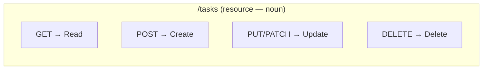

## מה זה?

עד עכשיו בנינו routes באופן אינטואיטיבי. אבל בלי קונבנציה משותפת, כל צוות היה מעצב API בסגנון שונה לגמרי — `/getUsers`, `/user-create`, `/deleteUserById` — ומי שמצטרף לפרויקט חדש היה צריך ללמוד מוסכמה שרירותית מחדש בכל פעם. **REST** (Representational State Transfer) הוא סגנון ארכיטקטורה מוסכם לעיצוב APIs מעל HTTP: **URLs מייצגים משאבים** (שמות עצם), ו-**HTTP Methods מייצגים פעולות** (פעלים) — בדיוק העקרונות שכבר יישמנו באינטואיציה לאורך היחידה הזו.

## מילות מפתח שחשוב לזכור

• Resource (משאב) — ישות שה-API מנהל (משתמש, משימה, מוצר) — מיוצגת ב-URL כשם עצם ברבים: `/tasks`, `/users`

• Endpoint — URL ספציפי למשאב: `/api/tasks`, `/api/tasks/42`

• CRUD — ארבע הפעולות הבסיסיות: Create (`POST`), Read (`GET`), Update (`PUT`/`PATCH`), Delete (`DELETE`)

• Idempotent (אידמפוטנטי) — קריאה חוזרת שמניבה **אותה תוצאה בדיוק**: `GET`/`PUT`/`DELETE` הן כאלה; `POST` **לא** (כל קריאה יוצרת רשומה חדשה)

• Pagination — חלוקת תוצאות גדולות לעמודים: `?page=2&limit=20`

• Versioning — `/api/v1/...`, `/api/v2/...` — שמירת תאימות לאחור כשה-API משתנה עם הזמן

```javascript
router.get("/tasks", getAllTasks);       // Read (list)
router.get("/tasks/:id", getTaskById);   // Read (single)
router.post("/tasks", createTask);       // Create
router.put("/tasks/:id", updateTask);    // Update
router.delete("/tasks/:id", deleteTask); // Delete
```



## הסבר עיקרי

שם עצם, לא פועל — ה-URL עצמו **לא** אמור לתאר פעולה (`/getTasks`, `/deleteTask`) — הפעולה כבר מיוצגת ע"י ה-Method. `GET /tasks` ו-`DELETE /tasks/42` — אותו URL בסיסי, Method שונה קובע את הפעולה. זה בדיוק העיקרון שכבר יישמנו בשיעורי Express הקודמים בלי לתת לו שם.

Idempotent כלמה זה חשוב — `PUT /tasks/42` עם אותו body, פעם אחת או חמש פעמים, מסתיים **באותה תוצאה בדיוק** (המשימה מעודכנת לאותם ערכים). `POST /tasks` עם אותו body, חמש פעמים, יוצר **חמש** משימות שונות. ההבחנה הזו חשובה כשחושבים על מה קורה אם בקשה "נשלחת פעמיים בטעות" (למשל, בגלל ניתוק רשת וניסיון חוזר).

Pagination כשיש הרבה תוצאות — `GET /tasks` שמחזיר 10,000 רשומות בבת אחת הוא כבד ולא-שימושי. `GET /tasks?page=2&limit=20` מבקש "עמוד" ספציפי — 20 תוצאות, מהתוצאה ה-21 והלאה.

Versioning כשה-API משתנה — כשמוסיפים שדה חדש או משנים מבנה תגובה, `/api/v2/tasks` מאפשר לשמר את `/api/v1/tasks` הישן פעיל, בלי לשבור אפליקציות קיימות שעדיין תלויות בו.

## יתרונות

מוסכמה משותפת שכל מפתח REST מבין מיד; חיזוי קל של URLs ("איך אמחק משימה? כנראה `DELETE /tasks/:id`"); Idempotency נותנת ביטחון לגבי מה קורה בניסיונות חוזרים.

## חסרונות

לא כל פעולה עסקית מתאימה בקלות ל-CRUD (למשל, "שלח התראה" הוא לא באמת Create/Read/Update/Delete); Versioning מוסיף תחזוקה — צריך לתמוך בכמה גרסאות במקביל לפעמים.

## נקודות חשובות

• URLs הם שמות עצם (משאבים); HTTP Methods הם הפעלים (פעולות)

• CRUD: Create=`POST`, Read=`GET`, Update=`PUT`/`PATCH`, Delete=`DELETE`

• Idempotent: `GET`/`PUT`/`DELETE` כן; `POST` לא

• Pagination (`?page=&limit=`) ו-Versioning (`/v1/`) הם מוסכמות נפוצות ב-REST APIs בוגרים

## טעויות נפוצות

• תכנון URLs עם פעלים (`/getTasks`, `/createTask`) במקום שמות עצם עם Method מתאים

• שימוש ב-`GET` לפעולה שמשנה נתונים — סותר את ה-Idempotency הצפוי ממנו

• החזרת כל התוצאות בבת אחת בלי Pagination כשיש הרבה רשומות

## סיכום

REST הוא סגנון ארכיטקטורה: URLs מייצגים משאבים (שמות עצם), HTTP Methods מייצגים פעולות (CRUD). Idempotency קובעת אם קריאה חוזרת בטוחה; Pagination מחלקת תוצאות גדולות; Versioning שומר תאימות לאחור. זה בדיוק העיקרון שכבר יישמנו לאורך כל שיעורי Express.

## דוקומנטציה רשמית

[MDN — REST APIs](https://developer.mozilla.org/en-US/docs/Glossary/REST)

---

## תרגילים

### תרגיל 1 — תכנון Endpoints

**המשימה:** תכננו (בכתיבה) 5 endpoints RESTful למשאב "הזמנות" (orders): רשימה, פרט בודד, יצירה, עדכון, מחיקה.

**בדיקה:** התשובות: `GET /orders`, `GET /orders/:id`, `POST /orders`, `PUT /orders/:id` (או `PATCH`), `DELETE /orders/:id`.

### תרגיל 2 — Idempotent או לא?

**המשימה:** קבעו לכל אחד: `GET /tasks`, `POST /tasks`, `DELETE /tasks/5`, `PUT /tasks/5` — Idempotent או לא, ולמה.

**בדיקה:** התשובות: `GET` — כן (לא משנה מצב); `POST` — לא (כל קריאה יוצרת רשומה נוספת); `DELETE /tasks/5` — כן (מחיקה חוזרת מסתיימת באותו מצב "לא קיים"); `PUT /tasks/5` — כן (אותו body מייצר תמיד אותה תוצאה).

### תרגיל 3 — Pagination

**המשימה:** בנו `GET /tasks?page=&limit=` שמחזיר רק חלק ממערך משימות בזיכרון לפי הפרמטרים, עם ברירות מחדל `page=1`, `limit=10`.

**בדיקה:** `curl "http://localhost:3000/tasks?page=1&limit=2"` מחזיר בדיוק 2 משימות; `curl http://localhost:3000/tasks` (בלי פרמטרים) מחזיר תוצאה לפי ברירות המחדל.

---

## פרויקט מסכם

**המשימה:** תכננו ובנו API RESTful מלא למשאב "מוצרים" (products).

**דרישות:**
1. חמשת ה-endpoints הבסיסיים (CRUD מלא) עם Router נפרד
2. `GET /products` תומך ב-Pagination (`page`, `limit`)
3. כל endpoint מחזיר Status Code נכון (200/201/404/400 לפי המקרה)
4. תיעדו (בהערה) איזה מה-endpoints Idempotent ואיזה לא

**בדיקה:** `curl -X POST http://localhost:3000/products -H "Content-Type: application/json" -d '{"name":"עט"}'` מחזיר `201`; `curl http://localhost:3000/products/999` (לא קיים) מחזיר `404`; `curl "http://localhost:3000/products?page=1&limit=2"` מחזיר עד 2 תוצאות; שתי קריאות רצופות ל-`curl -X DELETE http://localhost:3000/products/1` מסתיימות באותו מצב סופי (המוצר לא קיים).

---

## מה בפרק הבא

בפרק הבא — **פרויקט מסכם ליחידת Server**: בונים API RESTful מלא ומאורגן, שמחבר יחד HTTP, Express, Router, Middleware, וטיפול שגיאות לכדי שרת אחד עובד מקצה לקצה.
