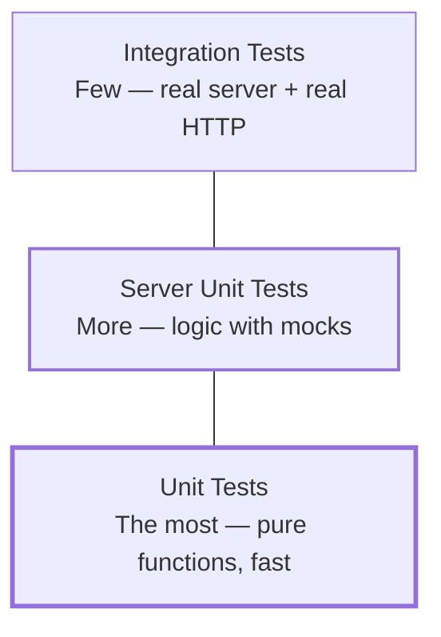

## מה זה?

זהו הפרויקט המסכם של יחידת Testing: כותבים **שלוש שכבות בדיקה** על אותו קוד בדיוק — Unit Tests על פונקציות טהורות, Server Unit Testing עם Mocks על לוגיקה עסקית מבודדת מה-DB, ו-Integration Testing שמריץ שרת אמיתי ושולח בקשת HTTP אמיתית. המטרה: להרגיש **בפועל** למה כל שכבה קיימת, ולמה אף אחת מהן לא "מספיקה" לבד.

## מילות מפתח שחשוב לזכור

• פירמידת הבדיקות — הרבה Unit Tests (מהירים, ממוקדים), פחות Integration Tests (איטיים יותר, בודקים יותר ביחד) — לא הפוך

• Unit Test — בודק פונקציה טהורה אחת, בלי תלויות חיצוניות בכלל

• Server Unit Test — בודק לוגיקת שרת עם Mocks במקום DB אמיתי — מהיר, אבל לא מוכיח שהחיבור האמיתי ל-DB עובד

• Integration Test — מריץ שרת אמיתי ושולח בקשת HTTP אמיתית — איטי יותר, אבל מוכיח שהשרשרת **כולה** עובדת יחד

```javascript
// validation.js — a pure function, tested with a regular unit test, no mocks at all
export function isValidTask(task) {
  return typeof task.title === "string" && task.title.trim().length > 0;
}
```

```javascript
// taskService.test.js — server unit test with a mock instead of a real repository
import { test } from "node:test";
import assert from "node:assert/strict";
import { createTaskService } from "./taskService.js";

test("createTask rejects a task without a title without calling the Repository", () => {
  const fakeRepo = { create: mock.fn() };
  const service = createTaskService(fakeRepo);

  assert.throws(() => service.createTask({ title: "" }));
  assert.strictEqual(fakeRepo.create.mock.calls.length, 0);
});
```



## הסבר עיקרי

שלוש שכבות, שלוש שאלות שונות — Unit Test על `isValidTask` שואל: "האם הלוגיקה הטהורה נכונה?" — בלי DB, בלי שרת, בלי שום דבר חיצוני. Server Unit Test על `taskService` שואל: "האם הלוגיקה העסקית משתמשת נכון בתלויות שלה?" — עם `fakeRepo` מזויף, בלי DB אמיתי. Integration Test שואל: "האם כל השרשרת — Router, Middleware, Service, DB אמיתי — באמת עובדת יחד?" — עם שרת אמיתי מורם ובקשת HTTP אמיתית.

אף שכבה לא מייתרת את השאר — Unit Tests רצים תוך מילישניות, ותופסים המון באגים בזול — אבל הם לא מוכיחים שה-Router מחובר נכון, או שה-DB באמת מקבל את השאילתה כמו שציפיתם. Integration Tests מוכיחים את זה — אבל הם איטיים יותר, ובגלל זה כותבים **הרבה פחות** מהם. זו בדיוק פירמידת הבדיקות: בסיס רחב של Unit Tests מהירים, וקומץ Integration Tests שמכסים את הנתיבים הקריטיים ביותר.

## יתרונות

שלוש השכבות ביחד נותנות ביטחון גם בלוגיקה הטהורה, גם בהתנהגות עם תלויות מבודדות, וגם בחיבור האמיתי בין כל החלקים; ריצה מהירה של רוב הבדיקות (Unit + Server Unit) מאפשרת להריץ אותן בכל שמירת קובץ.

## חסרונות

תחזוקת שלוש שכבות בדיקה דורשת יותר קוד בדיקה מאשר שכבה אחת בלבד; כפילות מסוימת בין השכבות (אותה לוגיקה עסקית נבדקת גם ב-Server Unit וגם, בעקיפין, ב-Integration) היא מחיר מקובל של הביטחון הנוסף.

## נקודות חשובות

• פירמידת הבדיקות: הרבה Unit, פחות Integration — לא להפוך את היחס

• Unit Test בודק פונקציה טהורה בלי תלויות; Server Unit בודק לוגיקה עם Mocks; Integration בודק שרת אמיתי מקצה לקצה

• אף שכבה לא "מייתרת" את האחרות — כל אחת מוכיחה דבר אחר

• מהירות ריצה היא הסיבה המרכזית שיש **הרבה** Unit Tests אך **מעטים** Integration Tests

## טעויות נפוצות

• לכתוב רק Integration Tests, "כי הם בודקים הכי הרבה" — סוויטה איטית מדי להריץ בכל שמירה

• לכתוב רק Unit Tests, ולא לגלות עד production שה-Router לא מחובר נכון לגמרי

• לבדוק את אותו דבר בדיוק בשלוש השכבות (כפילות מיותרת) במקום לתת לכל שכבה לכסות היבט שונה

• לשכוח לנקות (teardown) DB בדיקות בין Integration Tests — בדיקה אחת "מזהמת" את הנתונים של הבאה

## סיכום

הפרויקט המסכם כותב שלוש שכבות בדיקה על אותו קוד: Unit Tests מהירים על לוגיקה טהורה, Server Unit Tests עם Mocks על לוגיקה עסקית מבודדת, ו-Integration Tests שמוכיחים שהשרשרת כולה — Router, Middleware, DB — באמת עובדת יחד. זו בדיוק פירמידת הבדיקות שמשמשת פרויקטים אמיתיים: בסיס רחב ומהיר, קומץ בדיקות עומק בראש.

## דוקומנטציה רשמית

[Node.js — Test Runner](https://nodejs.org/api/test.html)

[Martin Fowler — Test Pyramid](https://martinfowler.com/articles/practical-test-pyramid.html)

---

## תרגילים

### תרגיל 1 — Unit Test על פונקציה טהורה

**המשימה:** כתבו Unit Test ל-`isValidTask` עם שני מקרים: כותרת תקינה, וכותרת ריקה.

**בדיקה:** שני המקרים עוברים ומחזירים את התוצאה הבוליאנית הצפויה — `true`/`false` בהתאמה.

### תרגיל 2 — זיהוי שכבת הבדיקה הנכונה

**המשימה:** לכל אחת מהטענות הבאות, כתבו איזו שכבת בדיקה (Unit / Server Unit / Integration) הכי מתאימה לבדוק אותה, ולמה: (א) "נוסחת חישוב מס מחזירה תוצאה נכונה", (ב) "אם ה-DB זורק שגיאה, ה-Service מחזיר הודעה ברורה", (ג) "בקשת POST אמיתית יוצרת שורה חדשה ב-DB האמיתי".

**בדיקה:** התשובות תואמות: (א) Unit, (ב) Server Unit עם Mock שזורק שגיאה, (ג) Integration.

---

## פרויקט מסכם

**המשימה:** כתבו סוויטת בדיקות תלת-שכבתית מלאה ל-Task Manager API מיחידת Server.

**דרישות:**
1. **Unit Tests** — לפחות 3 בדיקות על פונקציית ולידציה טהורה (`isValidTask` או דומה), בלי שום תלות חיצונית
2. **Server Unit Tests** — לפחות 3 בדיקות על `taskService`, עם `fakeRepo` מבוסס `mock.fn()`, כולל בדיקה שמוודאת שה-Repository **לא** נקרא כשהוולידציה נכשלת
3. **Integration Tests** — לפחות 2 בדיקות שמריצות את שרת ה-Express האמיתי ושולחות בקשת HTTP אמיתית (`POST /tasks` ואז `GET /tasks/:id`), עם ניקוי (teardown) הנתונים בסוף כל בדיקה
4. כל שלוש הסוויטות רצות בהצלחה עם `node --test`

**בדיקה:** `node --test` מריץ את כל שלוש השכבות ומדווח "0 failing"; זמן הריצה הכולל של ה-Unit וה-Server Unit Tests יחד הוא שברירי שנייה; ה-Integration Tests באמת יוצרים ומוחקים נתונים אמיתיים (ניתן לוודא בלוגים או ב-DB עצמו) ולא רק "מדמים" זאת.

## מה בפרק הבא

בפרק הבא נתחיל יחידה חדשה — **HTML**. עד עכשיו כל מה שכתבנו רץ בטרמינל או דרך בדיקות אוטומטיות, בלי שום דבר חזותי. ביחידת HTML נלמד לבנות את **מבנה** כל עמוד אינטרנט — הבסיס שעליו CSS יעצב ו-JavaScript יפעיל בהמשך הקורס.
