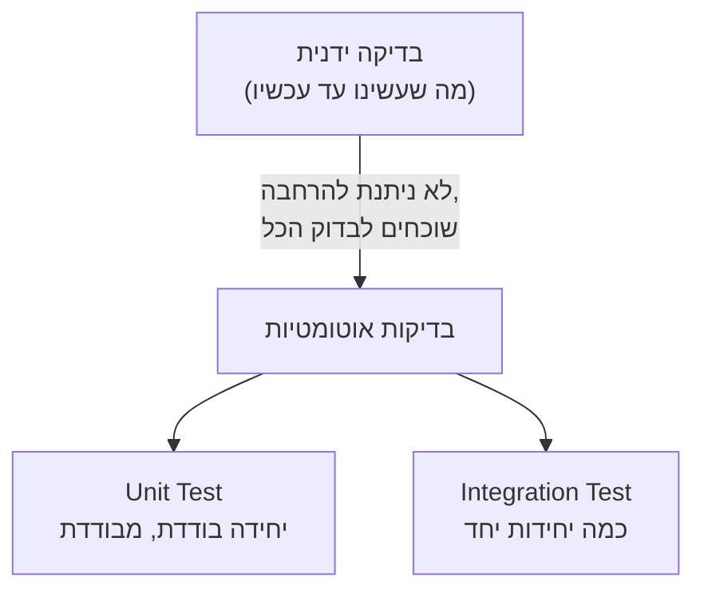

## מה זה?

לאורך כל הקורס, כדי לבדוק אם קוד עובד, הרצתם אותו ידנית — פתחתם דפדפן, שלחתם `curl`, הסתכלתם בקונסול. זה עבד, אבל תארו לעצמכם פרויקט עם 50 פונקציות ו-20 endpoints: אחרי כל שינוי קטן, איך תדעו שלא "שברתם" בטעות משהו שכבר עבד? בדיקה ידנית של הכל, בכל פעם מחדש, היא בלתי-אפשרית בפועל. **Testing** (בדיקות אוטומטיות) פותר את זה: כותבים קוד שבודק את הקוד שלכם — ומריצים אותו תוך שניות, שוב ושוב, בכל פעם שמשהו משתנה.

## מילות מפתח שחשוב לזכור

• Test (בדיקה) — קטע קוד קטן שמריץ פונקציה/רכיב מסוים ומוודא שהתוצאה תואמת את הציפייה

• Assertion (הצהרה) — הפקודה שבודקת "האם הערך הזה שווה לערך הצפוי?" — אם לא, הבדיקה נכשלת

• Test Runner — כלי שמריץ את כל הבדיקות בפרויקט ומדווח אילו עברו ואילו נכשלו

• Unit Test (בדיקת יחידה) — בודקת **יחידה בודדת** (פונקציה אחת) מבודדת מכל השאר

• Integration Test (בדיקת אינטגרציה) — בודקת שכמה יחידות **עובדות נכון ביחד**

• Regression (רגרסיה) — כשקוד שעבד בעבר "נשבר" בטעות בעקבות שינוי מאוחר יותר; בדיקות תופסות רגרסיות מיד

## הסבר עיקרי

Assertion כ"שאלה עם תשובה נכונה ידועה" — בדיקה טובה תמיד יודעת **מראש** מה התוצאה הצפויה. למשל, אם יש לכם פונקציה `add(a, b)`, אתם יודעים בוודאות ש-`add(2, 3)` **חייב** להחזיר `5` — ה-Assertion בודקת בדיוק את זה: "התוצאה בפועל שווה לתוצאה הצפויה?".

Test Runner כ"מריץ את הכל בשנייה" — במקום לפתוח דפדפן ולבדוק ידנית עשרות פעמים, Test Runner מריץ את **כל** הבדיקות בפרויקט בפקודה אחת, תוך שניות, ומדווח בדיוק אילו עברו (✓) ואילו נכשלו (✗) — כולל איפה בדיוק ומה הציפייה מול המציאות.

למה בדיקות תופסות רגרסיות — דמיינו ששיניתם פונקציה קיימת כדי לתקן באג, אבל בטעות "שברתם" משהו אחר שהיה תלוי בהתנהגות הישנה. בלי בדיקות, תגלו את זה רק כשמשתמש אמיתי נתקל בבעיה. עם בדיקות, הרצת ה-Test Runner **מיד אחרי השינוי** תראה בדיוק אילו בדיקות נכשלו — לפני שהקוד בכלל מגיע לאף אחד אחר.

## יתרונות

בדיקות רצות תוך שניות ומכסות הרבה יותר תרחישים מבדיקה ידנית; תופסות רגרסיות מיד, לפני שהן מגיעות ל-production; משמשות כתיעוד חי — קריאה בבדיקות מראה בדיוק איך פונקציה **אמורה** להתנהג.

## חסרונות

כתיבת בדיקות טובות דורשת זמן והשקעה מראש; בדיקות גרועות (שבודקות דברים לא-נכונים) נותנות תחושת ביטחון שווא; תחזוקת בדיקות היא עבודה נוספת כשהקוד משתנה.

## נקודות חשובות למבחן / ראיון עבודה

• Assertion בודקת שערך בפועל שווה לערך צפוי; בדיקה נכשלת אם הם לא תואמים

• Unit Test בודק יחידה בודדת מבודדת; Integration Test בודק כמה יחידות יחד

• Test Runner מריץ את כל הבדיקות ומדווח תוצאות

• רגרסיה = קוד שעבד ונשבר בעקבות שינוי מאוחר יותר — בדיקות תופסות זאת מיד

## טעויות נפוצות

• לחשוב שבדיקה ידנית "מספיקה" בפרויקט גדול — לא ניתנת להרחבה עם גדילת הקוד

• לכתוב בדיקה בלי Assertion אמיתית (רק מריצים קוד בלי לבדוק תוצאה) — לא באמת מוודאת כלום

• להזניח בדיקות אחרי שינוי קוד, ולגלות רגרסיות רק מאוחר יותר בפרודקשן

## סיכום

בדיקות אוטומטיות (Testing) פותרות את הבעיה של בדיקה ידנית שלא ניתנת להרחבה. Assertion בודקת שתוצאה בפועל תואמת לצפויה; Test Runner מריץ את כל הבדיקות תוך שניות. Unit Tests בודקים יחידות מבודדות; Integration Tests בודקים כמה יחידות יחד. בדיקות תופסות רגרסיות מיד, לפני שהן פוגעות במשתמשים אמיתיים.

## דוקומנטציה רשמית

[Node.js — Test Runner](https://nodejs.org/api/test.html)

---

## תרגילים

### תרגיל 1 — זיהוי Unit מול Integration

**המשימה:** קבעו אם כל תרחיש הוא Unit Test או Integration Test: (א) בדיקת `add(2,3) === 5`; (ב) בדיקה ששליחת בקשת `POST /tasks` באמת יוצרת רשומה שנגישה אחר כך דרך `GET /tasks`.

**בדיקה:** תשובות: (א) Unit Test, (ב) Integration Test.

### תרגיל 2 — כתיבת Assertion בעצמכם

**המשימה:** בלי ספריית בדיקות, כתבו קטע קוד JS פשוט שמשווה תוצאה בפועל לתוצאה צפויה, וזורק שגיאה אם הן לא שוות.

**בדיקה:** הרצת הקוד עם ערכים תואמים לא זורקת שגיאה; הרצתו עם ערכים לא-תואמים כן זורקת שגיאה ברורה.

### תרגיל 3 — זיהוי רגרסיה

**המשימה:** תארו (בכתיבה) תרחיש קונקרטי שבו שינוי בפונקציה אחת "שבר" פונקציה אחרת שהייתה תלויה בהתנהגות הישנה שלה — ואיך בדיקה הייתה תופסת את זה.

**בדיקה:** התיאור כולל שינוי ספציפי, את ההשפעה הבלתי-צפויה, ואיזו בדיקה (עם איזה Assertion) הייתה מתריעה מיד.

---

## פרויקט מסכם

**המשימה:** תכננו (בכתיבה, לא קוד) תוכנית בדיקות לפונקציה `divide(a, b)` שכבר כתבתם ביחידת JavaScript.

**דרישות:**
1. רשמו לפחות 4 מקרי בדיקה שונים (כולל מקרה קצה כמו חלוקה באפס)
2. לכל מקרה, ציינו את הקלט והתוצאה הצפויה
3. סווגו: האם זו בדיקת Unit או Integration, ולמה

**בדיקה:** יש לכם טבלה/רשימה עם 4+ שורות (קלט → תוצאה צפויה → סוג הבדיקה), כולל לפחות מקרה קצה אחד.

---

## מה בפרק הבא

בפרק הבא נלמד על **JS Unit Testing** — בשיעור הקודם דיברנו על בדיקות באופן כללי. עכשיו כותבים בפועל: Node.js מגיע עם test runner **מובנה** (`node:test`) וספריית assertions מובנית (`node:assert/strict`) — לא צריך להתקין שום ספרייה חיצונית כ
