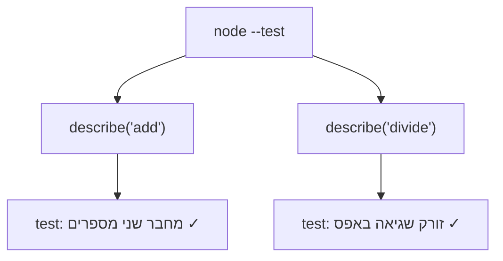

## מה זה?

בשיעור הקודם דיברנו על בדיקות באופן כללי. עכשיו כותבים בפועל: Node.js מגיע עם test runner **מובנה** (`node:test`) וספריית assertions מובנית (`node:assert/strict`) — לא צריך להתקין שום ספרייה חיצונית כדי להתחיל. `node --test` מריץ את כל הבדיקות בפרויקט ומדפיס דוח ✓/✗ מפורט.

## מילות מפתח שחשוב לזכור

• `test(name, fn)` — מגדיר בדיקה בודדת עם שם תיאורי ופונקציה שמריצה אותה

• `describe(name, fn)` — מקבץ כמה בדיקות קשורות תחת קבוצה אחת, לארגון ברור

• `assert.equal(actual, expected)` — בודק ששני ערכים שווים (עם המרת טיפוסים, `==`)

• `assert.strictEqual` / `assert.deepStrictEqual` — בודקים שוויון מדויק (`===`), כולל השוואה עמוקה למערכים/אובייקטים

• `assert.throws(fn)` — בודק שפונקציה **זורקת** שגיאה כשמריצים אותה

• `node --test` — הפקודה שמריצה את כל קבצי הבדיקות בפרויקט (`*.test.js`)

```javascript
import { test, describe } from "node:test";
import assert from "node:assert/strict";
import { add, divide } from "./math.js";

describe("add", () => {
  test("מחבר שני מספרים חיוביים", () => {
    assert.strictEqual(add(2, 3), 5);
  });
});

describe("divide", () => {
  test("זורק שגיאה בחלוקה באפס", () => {
    assert.throws(() => divide(10, 0));
  });
});
```



## הסבר עיקרי

describe כארגון, לא כבדיקה — `describe` עצמו לא בודק שום דבר — הוא רק "קבוצה" שמאגדת כמה `test`-ים קשורים (למשל, כל הבדיקות של פונקציית `add`) תחת שם משותף, כדי שדוח התוצאות יהיה קריא ומאורגן.

assert.strictEqual מול assert.equal — למה להעדיף `strictEqual` על `equal`? `equal` משתמש בהשוואה עם המרת טיפוסים (`==`) — `assert.equal(5, "5")` **עובר**, למרות שאלה טיפוסים שונים! `strictEqual` (`===`) תופס את זה כטעות — עדיף כברירת מחדל, כי הוא מדויק יותר ותופס יותר באגים.

assert.throws לבדיקת שגיאות — פונקציה שאמורה **לזרוק** שגיאה (כמו `divide(10, 0)`) לא נבדקת עם `assert.strictEqual` — קריאה לה תעצור את הבדיקה עם שגיאה לא-מטופלת! `assert.throws(() => divide(10, 0))` **עוטף** את הקריאה בפונקציה, ובודק שהיא אכן זרקה שגיאה כמצופה — בלי שהבדיקה עצמה "תיפול".

## יתרונות

מובנה ב-Node.js — אין צורך להתקין ספרייה חיצונית כדי להתחיל; `describe`/`test` נותנים מבנה ברור וקריא; `assert.throws` מטפל בבדיקת שגיאות בלי "לשבור" את ריצת שאר הבדיקות.

## חסרונות

פחות "תכונות נוחות" מספריות בדיקה חיצוניות פופולריות (כמו mocking מתקדם); דוח התוצאות של `node --test` פחות ויזואלי מכלים חיצוניים.

## נקודות חשובות למבחן / ראיון עבודה

• `test(name, fn)` מגדיר בדיקה בודדת; `describe` מקבץ בדיקות קשורות

• `assert.strictEqual` (===) עדיף על `assert.equal` (==) — מדויק יותר, תופס יותר טעויות

• `assert.throws(fn)` בודק שפונקציה זורקת שגיאה, בלי לעצור את הבדיקה

• `node --test` מריץ את כל קבצי הבדיקות בפרויקט בפקודה אחת

## טעויות נפוצות

• שימוש ב-`assert.equal` (עם המרת טיפוסים) כברירת מחדל במקום `assert.strictEqual` — עלול "לפספס" טעויות טיפוס

• קריאה ישירה לפונקציה שזורקת שגיאה בתוך `test` (בלי `assert.throws`) — הבדיקה "נופלת" עם שגיאה לא-ברורה במקום להיכשל בצורה מדווחת

• כתיבת בדיקה אחת ענקית שבודקת יותר מדי דברים בבת אחת — קשה לדעת מה בדיוק נכשל

## סיכום

`node:test` ו-`node:assert/strict` נותנים test runner ו-assertions מובנים ב-Node.js, בלי ספריות חיצוניות. `test`/`describe` מארגנים בדיקות; `assert.strictEqual`/`assert.deepStrictEqual` בודקים שוויון מדויק; `assert.throws` בודק שפונקציה זורקת שגיאה. `node --test` מריץ הכל ומדווח תוצאות.

## דוקומנטציה רשמית

[Node.js — Test Runner](https://nodejs.org/api/test.html)

---

## תרגילים

### תרגיל 1 — בדיקה ראשונה

**המשימה:** כתבו קובץ `math.test.js` עם בדיקה יחידה שבודקת `add(2, 3) === 5` בעזרת `assert.strictEqual`.

**בדיקה:** `node --test` מציג ✓ ליד הבדיקה, ומדווח "1 passed" (או דומה) בסיכום.

### תרגיל 2 — בדיקת שגיאה

**המשימה:** כתבו בדיקה שמוודאת ש-`divide(10, 0)` זורקת שגיאה, בעזרת `assert.throws`.

**בדיקה:** `node --test` מציג ✓ — אם תסירו את בדיקת החלוקה באפס מהפונקציה עצמה, הבדיקה תיכשל (✗) — נסו את זה כדי לוודא שהבדיקה באמת בודקת משהו.

### תרגיל 3 — קיבוץ עם describe

**המשימה:** ארגנו לפחות 4 בדיקות (2 ל-`add`, 2 ל-`divide`) תחת שני בלוקי `describe` נפרדים.

**בדיקה:** פלט `node --test` מציג את שני שמות ה-`describe` כקבוצות נפרדות, כל אחת עם הבדיקות שלה מקוננות תחתיה.

---

## פרויקט מסכם

**המשימה:** כתבו סוויטת בדיקות מלאה לקובץ מתמטיקה קטן (`math.js`) עם `add`, `subtract`, `divide`.

**דרישות:**
1. `describe` נפרד לכל פונקציה
2. לפחות 2 בדיקות לכל פונקציה, כולל מקרה קצה אחד (למשל: `divide` עם חלוקה באפס, `subtract` עם מספרים שליליים)
3. שימוש נכון ב-`assert.strictEqual` לערכים רגילים ו-`assert.throws` לשגיאות צפויות
4. כל הבדיקות עוברות בהרצת `node --test`

**בדיקה:** `node --test` מדווח "0 failing" בסיכום; הסרה מכוונת של תיקון קוד (למשל הסרת בדיקת חלוקה-באפס מ-`divide`) גורמת לבדיקה המתאימה להיכשל — הוכחה שהבדיקות אכן בודקות את מה שהן אמורות.

---

## מה בפרק הבא

בפרק הבא נלמד על **Integration Testing** — בשיעור הקודם בדקנו פונקציות בודדות ומבודדות (`add`, `divide`) — Unit Tests. אבל שרת Express אמיתי (מיחידת השרתים) מורכב מהרבה חלקים ביחד: Router, Middleware, לוגיקה עסקית, ותשובת HTTP — ה-Unit Test של
