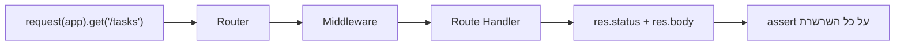

## מה זה?

בשיעור הקודם בדקנו פונקציות בודדות ומבודדות (`add`, `divide`) — Unit Tests. אבל שרת Express אמיתי (מיחידת השרתים) מורכב מהרבה חלקים ביחד: Router, Middleware, לוגיקה עסקית, ותשובת HTTP — ה-Unit Test של פונקציה בודדת לא בודק אם **הם עובדים נכון ביחד**. **Integration Testing** בודק את זה: שולח בקשת HTTP אמיתית (בדיוק כמו `fetch` שכבר מכירים) לאפליקציית Express, ומוודא שהתגובה הסופית נכונה — מקצה לקצה.

## מילות מפתח שחשוב לזכור

• Integration Test — בודק שכמה חלקים (Router+Middleware+Controller...) עובדים נכון ביחד, לא כל אחד בבידוד

• End-to-End (E2E) flow — תרחיש שמדמה בדיוק מה שמשתמש אמיתי היה עושה: שולח בקשה, מקבל תשובה

• `supertest` — ספרייה פופולרית ששולחת בקשות HTTP אמיתיות לאפליקציית Express, בלי צורך להריץ שרת נפרד ידנית

• Test Isolation (בידוד בדיקות) — כל בדיקה צריכה להתחיל ממצב נקי, בלי להיות תלויה בתוצאה של בדיקה קודמת

• `beforeEach` — פונקציה שרצה **לפני כל בדיקה** בקבוצה, לרוב כדי "לאפס" את המצב (למשל, לרוקן את מערך המשימות)

```javascript
import { test, describe, beforeEach } from "node:test";
import assert from "node:assert/strict";
import request from "supertest";
import app from "./app.js";

describe("GET /tasks", () => {
  beforeEach(() => {
    resetTasks(); // מתחילים כל בדיקה ממצב נקי
  });

  test("מחזיר רשימה ריקה כשאין משימות", async () => {
    const res = await request(app).get("/tasks");
    assert.strictEqual(res.status, 200);
    assert.deepStrictEqual(res.body, []);
  });
});
```



## הסבר עיקרי

supertest כ-fetch לבדיקות — `request(app).get("/tasks")` דומה מאוד ל-`fetch("/tasks")` שכבר מכירים — אבל `supertest` שולח את הבקשה ישירות ל-`app` (אובייקט ה-Express) בקוד, בלי צורך שהשרת יהיה מאזין בפועל על פורט — מהיר יותר ונוח יותר לבדיקות.

Test Isolation ולמה beforeEach קריטי — דמיינו שבדיקה 1 יוצרת משימה, ובדיקה 2 מצפה למערך ריק. אם בדיקה 2 רצה **אחרי** בדיקה 1 בלי איפוס, היא תיכשל — לא בגלל שהקוד שגוי, אלא בגלל שהבדיקות "מזהמות" זו את זו. `beforeEach` פותר את זה: מריץ קוד איפוס **לפני כל בדיקה בודדת**, כך שכל בדיקה מתחילה תמיד מאותו מצב נקי וידוע, בלי תלות בסדר ריצה.

Integration Test בודק את השרשרת השלמה — בניגוד ל-Unit Test של `add(2,3)` שבודק רק את הפונקציה עצמה, בדיקה כמו `request(app).get("/tasks")` עוברת דרך ה-Router, ה-Middleware, הלוגיקה, ובניית התגובה — כל השרשרת שלמדנו ביחידת השרתים, בבת אחת. אם משהו **בכל שלב** שבור, הבדיקה נכשלת.

## יתרונות

בודק תרחישים אמיתיים מקצה לקצה, לא רק פונקציות מבודדות; תופס באגים באינטגרציה בין חלקים (Router+Middleware+לוגיקה) שUnit Tests לא יתפסו; `beforeEach` מבטיח בדיקות עקביות ובלתי-תלויות זו בזו.

## חסרונות

איטי יותר מ-Unit Tests (עובר דרך יותר קוד); באג שנתפס נותן פחות מידע על **איפה בדיוק** הבעיה, לעומת Unit Test ממוקד; דורש הגדרת מצב התחלתי (כמו `beforeEach`) בקפידה.

## נקודות חשובות למבחן / ראיון עבודה

• Integration Test בודק כמה חלקים יחד; Unit Test בודק יחידה בודדת מבודדת

• `supertest` שולח בקשות HTTP אמיתיות ישירות ל-Express `app`, בלי שרת מאזין בפועל

• `beforeEach` מריץ קוד איפוס לפני כל בדיקה — מבטיח Test Isolation

• בדיקות שתלויות זו בזו (בלי איפוס) הן סימן לבעיית Test Isolation

## טעויות נפוצות

• לסמוך על סדר ריצת הבדיקות (בדיקה ב' "צריכה" שבדיקה א' רצה קודם) — שובר בלי `beforeEach`

• לבדוק רק את ה-status code (200) בלי לבדוק את תוכן התגובה (`res.body`) — מפספס באגים בנתונים עצמם

• לכתוב רק Integration Tests בלי Unit Tests — קשה לאתר בדיוק היכן הבעיה כשמשהו נכשל

## סיכום

Integration Testing בודק שכמה חלקים (Router, Middleware, לוגיקה) עובדים נכון **ביחד**, בדיוק כמו משתמש אמיתי — לא רק פונקציה בודדת. `supertest` שולח בקשות HTTP אמיתיות ישירות ל-Express `app`. `beforeEach` מבטיח שכל בדיקה מתחילה ממצב נקי, בלי תלות בבדיקות אחרות.

## דוקומנטציה רשמית

[SuperTest — GitHub](https://github.com/ladjs/supertest)

---

## תרגילים

### תרגיל 1 — בדיקת GET ראשונה

**המשימה:** כתבו Integration Test ל-`GET /tasks` על שרת ה-Tasks שלכם, שבודק שה-status הוא 200 ושה-`res.body` הוא מערך.

**בדיקה:** `node --test` מציג ✓ לבדיקה, בלי שגיאה.

### תרגיל 2 — beforeEach לאיפוס מצב

**המשימה:** הוסיפו `beforeEach` שמאפס את מערך המשימות, וכתבו שתי בדיקות: אחת שיוצרת משימה ומוודאת שהיא מופיעה, ואחת שמוודאת שהרשימה ריקה — בלי קשר לסדר הרצתן.

**בדיקה:** הרצת שתי הבדיקות (בכל סדר) מצליחה — אין תלות בין התוצאה של אחת לשנייה.

### תרגיל 3 — בדיקת POST מלאה

**המשימה:** כתבו Integration Test ל-`POST /tasks` שבודק גם את ה-status (201) וגם שה-`res.body` מכיל את הכותרת ששלחתם.

**בדיקה:** הבדיקה נכשלת אם משנים בכוונה את ה-status code בקוד השרת ל-200 — הוכחה שהיא באמת בודקת את הערך הנכון.

---

## פרויקט מסכם

**המשימה:** כתבו סוויטת Integration Tests מלאה לשרת ה-Tasks (מיחידת השרתים).

**דרישות:**
1. `beforeEach` שמאפס את מצב הנתונים לפני כל בדיקה
2. בדיקה ל-`GET /tasks` (רשימה ריקה בהתחלה, ואחרי יצירה)
3. בדיקה ל-`POST /tasks` (status 201, תוכן תקין ב-body)
4. בדיקה למקרה כישלון (למשל `POST` בלי `title` — status 400)

**בדיקה:** `node --test` מדווח "0 failing"; הרצה חוזרת של כל הסוויטה (כמה פעמים ברצף) נותנת תמיד את אותה תוצאה — הוכחה ל-Test Isolation אמיתי.

---

## מה בפרק הבא

בפרק הבא נלמד על **Server Unit Testing** — בשיעור הקודם, Integration Tests שלחו בקשות HTTP אמיתיות ובדקו את **כל** השרשרת ביחד. אבל מה אם רוצים לבדוק **רק** את הלוגיקה העסקית (Service, מיחידת MVC & DDD) — בלי לגעת ב-DB אמיתי, ובלי להרים שרת HT
