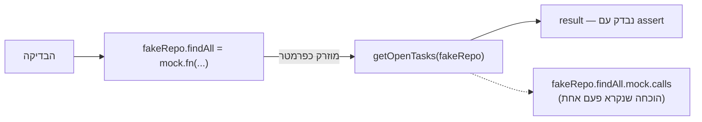

## מה זה?

בשיעור הקודם, Integration Tests שלחו בקשות HTTP אמיתיות ובדקו את **כל** השרשרת ביחד. אבל מה אם רוצים לבדוק **רק** את הלוגיקה העסקית (Service, מיחידת MVC & DDD) — בלי לגעת ב-DB אמיתי, ובלי להרים שרת HTTP בכלל? בדיקת DB אמיתי בכל בדיקה איטית, ותלויה בזמינות רשת. **Server Unit Testing** פותר את זה: מבודד את הלוגיקה מהתלויות האמיתיות שלה (כמו DB) בעזרת **Mocks** — פונקציות מזויפות שמתנהגות כמו התלות האמיתית, אבל בלי לגעת בה בפועל.

## מילות מפתח שחשוב לזכור

• Mock — פונקציה מזויפת שמחליפה תלות אמיתית (כמו קריאה ל-DB) בבדיקה, ומחזירה ערך קבוע במקום לגשת לנתונים אמיתיים

• `mock.fn()` — יוצר פונקציית Mock חדשה (מ-`node:test`), שאפשר להגדיר לה ערך החזרה, ושהיא "זוכרת" איך נקראה

• `mock.method(obj, methodName)` — מחליף מתודה **קיימת** על אובייקט (למשל `taskRepository.findAll`) בגרסת Mock, זמנית

• Dependency Injection (הזרקת תלויות) — העברת תלות (כמו Repository) לפונקציה כפרמטר, כדי שאפשר "להחליף" אותה בקלות ב-Mock בבדיקה

• `.mock.calls` — מערך שמתעד כל קריאה ל-Mock: כמה פעמים נקרא, ועם אילו פרמטרים

```javascript
import { test, mock } from "node:test";
import assert from "node:assert/strict";
import { getOpenTasks } from "./taskService.js";

test("getOpenTasks מחזיר רק משימות פתוחות", () => {
  const fakeRepo = {
    findAll: mock.fn(() => [
      { title: "קניות", done: false },
      { title: "דוח", done: true },
    ]),
  };

  const result = getOpenTasks(fakeRepo);

  assert.strictEqual(result.length, 1);
  assert.strictEqual(fakeRepo.findAll.mock.calls.length, 1);
});
```



## הסבר עיקרי

למה לא להשתמש ב-DB אמיתי כאן — בשיעור MVC & DDD למדנו להפריד Service מ-Repository. `getOpenTasks` (ה-Service) לא **צריך** לדעת אם הנתונים מגיעים מ-PostgreSQL, MongoDB, או מערך בזיכרון — הוא רק צריך אובייקט עם מתודת `findAll()`. זה בדיוק מה ש-`fakeRepo` בדוגמה עושה: מתחזה ל-Repository אמיתי, אבל מחזיר נתונים קבועים מיידית, בלי שאילתת DB אמיתית איטית.

mock.fn כ"פונקציה עם יומן" — `mock.fn(() => [...])` יוצר פונקציה שמתנהגת כמו הפונקציה שהעברתם לה (מחזירה את המערך), אבל **גם** שומרת יומן פנימי: כמה פעמים היא נקראה, עם אילו פרמטרים. `fakeRepo.findAll.mock.calls.length === 1` מוכיח ש-`getOpenTasks` באמת **השתמש** ב-Repository בדיוק פעם אחת — לא רק שהתוצאה נכונה, אלא שהדרך לשם הייתה נכונה.

Dependency Injection כמאפשר את כל זה — שימו לב ש-`getOpenTasks(fakeRepo)` מקבל את ה-Repository **כפרמטר**, לא "יוצר" אותו בעצמו בפנים. זה בדיוק מה שמאפשר להחליף אותו ב-Mock בבדיקה — בלי Dependency Injection, `getOpenTasks` היה "קשור" ל-Repository אמיתי בקוד, ולא ניתן להחלפה בבדיקה בלי לגעת ב-DB אמיתי.

## יתרונות

בדיקות רצות מהר מאוד — בלי חיבור DB אמיתי, בלי המתנה לרשת; מבודדות לגמרי מבעיות זמינות (DB לא זמין, נתונים השתנו); `.mock.calls` מוכיח לא רק **מה** קרה, אלא **איך** הקוד השתמש בתלות שלו.

## חסרונות

Mock לא בודק שהאינטגרציה עם ה-DB **האמיתי** עובדת בפועל (זו בדיוק העבודה של Integration Testing מהשיעור הקודם); דורש קוד שכתוב עם Dependency Injection מלכתחילה כדי להיות ניתן ל-mock בקלות; Mock לא-מדויק (שלא מייצג נכון את ההתנהגות האמיתית) עלול "להסתיר" באג אמיתי.

## נקודות חשובות למבחן / ראיון עבודה

• Mock מחליף תלות אמיתית (כמו DB) בפונקציה מזויפת, לבדיקה מהירה ומבודדת

• `mock.fn()` יוצר Mock חדש; `mock.method()` מחליף מתודה קיימת על אובייקט קיים

• `.mock.calls` מתעד כל קריאה ל-Mock — כמה פעמים, עם אילו פרמטרים

• Dependency Injection (העברת תלות כפרמטר) הוא מה שמאפשר להחליף אותה ב-Mock בקלות

## טעויות נפוצות

• לבדוק רק את ערך ההחזרה בלי לבדוק `.mock.calls` — מפספסים לוודא שהקוד באמת **השתמש** בתלות כמו שציפינו

• לכתוב קוד ללא Dependency Injection (תלות "קשיחה" בפנים) ואז להתקשות ל-mock אותה בבדיקה

• להשתמש ב-Server Unit Testing כתחליף מלא ל-Integration Testing — Mock לא מוכיח שה-DB האמיתי באמת עובד

## סיכום

Server Unit Testing מבודד לוגיקת שרת מתלויות אמיתיות (כמו DB) בעזרת Mocks — פונקציות מזויפות עם יומן קריאות. `mock.fn()`/`mock.method()` יוצרים אותן; `.mock.calls` מוכיח **איך** הקוד השתמש בתלות, לא רק מה התוצאה. Dependency Injection הוא מה שמאפשר את כל הטכניקה — לכן קוד שכתוב היטב (כמו ביחידת MVC & DDD) קל בהרבה לבדוק.

## דוקומנטציה רשמית

[Node.js — Mocking](https://nodejs.org/api/test.html#mocking)

---

## תרגילים

### תרגיל 1 — Mock ראשון

**המשימה:** כתבו `mock.fn(() => 42)` וקראו לו. בדקו גם את ערך ההחזרה וגם את `.mock.calls.length`.

**בדיקה:** ערך ההחזרה הוא `42`; `.mock.calls.length` הוא `1` אחרי קריאה בודדת.

### תרגיל 2 — הזרקת Mock לפונקציה

**המשימה:** קחו פונקציית Service (למשל `getOpenTasks(repo)`) וכתבו לה בדיקה עם `fakeRepo` שה-`findAll` שלו הוא `mock.fn`.

**בדיקה:** הבדיקה עוברת בלי לגעת ב-DB אמיתי כלל — לא נדרש חיבור רשת.

### תרגיל 3 — בדיקת פרמטרים שהועברו

**המשימה:** הרחיבו את הבדיקה כך שתוודא לא רק שה-Mock נקרא, אלא **עם אילו פרמטרים** (`.mock.calls[0].arguments`).

**בדיקה:** הבדיקה מאמתת שהפרמטרים שהועברו ל-Mock תואמים בדיוק למה שציפיתם (למשל, ה-`id` הנכון).

---

## פרויקט מסכם

**המשימה:** כתבו סוויטת Server Unit Tests ל-Service מיחידת MVC & DDD (`taskService.js`), מבודדים לגמרי מה-Repository האמיתי.

**דרישות:**
1. `fakeRepo` עם `mock.fn()` לכל מתודה שה-Service משתמש בה (`findAll`, `create` וכו')
2. בדיקה שמוודאת שהלוגיקה העסקית (למשל: "אין ליצור משימה בלי כותרת") עובדת נכון, בלי DB אמיתי
3. שימוש ב-`.mock.calls` כדי לוודא שה-Repository נקרא בדיוק כצפוי (כמה פעמים, עם אילו פרמטרים)
4. לפחות בדיקה אחת שמוודאת שכאשר ה-validation נכשל, ה-Repository **לא** נקרא בכלל

**בדיקה:** `node --test` מדווח "0 failing"; הרצת כל הסוויטה לוקחת פחות משנייה (הוכחה שאין קריאות DB אמיתיות); הבדיקה על "validation נכשל → Repository לא נקרא" בודקת `.mock.calls.length === 0`.
