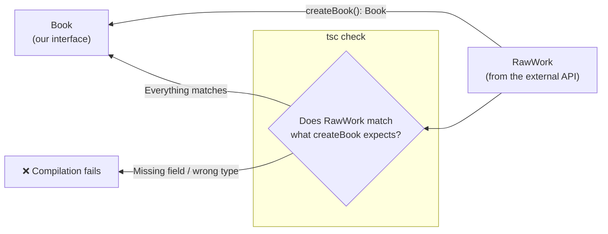

## מה זה?

זהו הפרויקט המסכם של יחידת TypeScript: לוקחים את פרויקט "מנהל קטלוג הספרים" מהפרויקט המסכם של יחידת JavaScript — שלושה מודולים, Factory Function, Closure, `async`/`await` — וממירים אותו **במלואו** ל-TypeScript. לא קוד חדש, אלא הוספת שכבת טיפוסים על קוד שכבר עובד, כדי לראות איפה TypeScript **באמת** תופס בעיות ש-JavaScript רגיל היה מפספס.

## מילות מפתח שחשוב לזכור

• `interface` לצורת נתונים חוזרת — במקום לתאר "אובייקט ספר" באופן חופשי, מגדירים `interface Book { ... }` פעם אחת ומשתמשים בו בכל מקום

• טיפוס החזרה של פונקציית `async` — `Promise<Book[]>`, לא רק `Book[]` — כי `async` **תמיד** מחזירה Promise

• Type Annotation על Factory Function — הפרמטר והחזרה של `createBook` מסומנים במפורש, כדי שקריאה שגויה תיתפס בקומפילציה

```typescript
// library.ts — with full interfaces and types
interface RawWork {
  title: string;
  authors?: { name: string }[];
  first_publish_year?: number;
}

interface Book {
  title: string;
  author: string;
  year: number | null;
  view(): string;
}

export function createBook(rawWork: RawWork): Book {
  let timesViewed = 0;

  return {
    title: rawWork.title,
    author: rawWork.authors?.[0]?.name ?? "Unknown",
    year: rawWork.first_publish_year ?? null,
    view() {
      timesViewed++;
      return `${this.title} (viewed ${timesViewed} times)`;
    },
  };
}
```

```typescript
// api.ts — an async return type is always wrapped in Promise
export async function fetchBooksBySubject(subject: string): Promise<RawWork[]> {
  const res = await fetch(`https://openlibrary.org/subjects/${subject}.json?limit=10`);
  if (!res.ok) throw new Error(`Network error: ${res.status}`);
  const data = await res.json();
  return data.works;
}
```



## הסבר עיקרי

`interface` מחליף "תיאור חופשי" בחוזה קבוע — בגרסת JavaScript, שום דבר לא מכריח ש-`createBook` תמיד מחזירה אובייקט עם בדיוק `title`/`author`/`year`/`view` — טעות (שדה חסר, שם שדה שגוי) הייתה מתגלה רק כשמנסים להשתמש בשדה החסר, בזמן ריצה. עם `interface Book`, כל מקום בקוד שמצפה ל-`Book` בודק את זה **בקומפילציה** — לפני שהקוד רץ בכלל.

`Promise<Book[]>` הוא לא פרט טכני קטן — פונקציית `async` **תמיד** מחזירה `Promise`, גם אם בגוף הפונקציה `return`ים ערך "רגיל" — TypeScript דורש לסמן את זה במפורש כדי שקוד שקורא לפונקציה ידע שהוא מקבל `Promise<Book[]>` ולא `Book[]` ישירות, וחייב `await` (או `.then()`) כדי להגיע לערך עצמו.

הקומפילציה תופסת בדיוק את סוג הבאגים שקרו בזמן אמת ב-JS — נסו בכוונה להעביר ל-`createBook` אובייקט בלי `title` — בגרסת JavaScript, זה היה עובר בשקט ורק מאוחר יותר, כשמישהו מנסה להציג `book.title`, היינו מקבלים `undefined`. בגרסת TypeScript, `tsc` פשוט **מסרב לקמפל** — השגיאה מוצגת מיד, על השורה המדויקת שבה קרתה.

## יתרונות

טיפוסים תופסים בדיוק את סוג הבאגים ש"עברו בשקט" בגרסת ה-JavaScript המקורית; `interface` אחד מרכזי (`Book`) מבטיח שכל מקום בקוד שמשתמש בספר "מסכים" על אותה צורה בדיוק; אוטוקומפליט ב-IDE משתפר משמעותית ברגע שיש טיפוסים אמיתיים.

## חסרונות

המרה מלאה של פרויקט קיים ל-TypeScript דורשת זמן ותשומת לב לכל פונקציה, לא רק "להוסיף `:type` בקצה"; טיפוסים ל-API חיצוני (כמו Open Library) לפעמים לא מדויקים ב-100% אם המבנה האמיתי משתנה בלי אזהרה.

## נקודות חשובות

• פונקציית `async` תמיד מחזירה `Promise<T>` — גם אם ה-`return` בגוף הפונקציה הוא ערך "רגיל"

• `interface` מגדיר חוזה קבוע לצורת אובייקט, ונאכף בקומפילציה בכל מקום שמשתמש בו

• המרת פרויקט JS קיים ל-TS לא משנה את ההתנהגות בזמן ריצה — רק מוסיפה בדיקה בזמן כתיבה

• השוואת "לפני ואחרי" (JS מול TS על אותו קוד) היא הדרך הכי ברורה להראות בפועל למה טיפוסים שווים משהו

## טעויות נפוצות

• לסמן את החזרת פונקציית `async` בלי `Promise<...>` — למשל `Book[]` במקום `Promise<Book[]>`

• להגדיר `interface` אבל להמשיך להשתמש באובייקטים "חופשיים" בלי לסמן שהם מאותו טיפוס

• לצפות שהמרה ל-TypeScript "תתקן" באגים לוגיים — היא תופסת רק אי-התאמות **טיפוס**, לא כל באג אפשרי

## סיכום

הפרויקט המסכם ממיר פרויקט JavaScript עובד ל-TypeScript מלא — `interface`ים לצורת הנתונים, טיפוסי פרמטרים והחזרה על כל פונקציה, ו-`Promise<T>` על כל פונקציית `async`. ההמרה לא משנה איך הקוד מתנהג — היא מוסיפה שכבת בדיקה שתופסת בדיוק את סוג הטעויות שהיו "עוברות בשקט" בגרסה המקורית.

## דוקומנטציה רשמית

[TypeScript — Interfaces](https://www.typescriptlang.org/docs/handbook/2/objects.html)

[TypeScript — Async/Await](https://www.typescriptlang.org/docs/handbook/release-notes/typescript-1-7.html)

---

## תרגילים

### תרגיל 1 — הוספת interface לאובייקט קיים

**המשימה:** קחו פונקציה מ-JavaScript רגיל שמחזירה אובייקט עם 3 שדות, והוסיפו לה `interface` וטיפוס החזרה תואם.

**בדיקה:** קריאה לפונקציה עם החזרת אובייקט חסר-שדה גורמת לשגיאת קומפילציה.

### תרגיל 2 — טיפוס async נכון

**המשימה:** כתבו פונקציית `async` שמחזירה מערך מספרים, וסמנו את טיפוס ההחזרה שלה נכון.

**בדיקה:** הטיפוס שסימנתם הוא `Promise<number[]>`, לא `number[]` — נסו לסמן `number[]` בכוונה ובדקו שהקומפילציה נכשלת.

---

## פרויקט מסכם

**המשימה:** המירו את פרויקט "מנהל קטלוג הספרים" (מהפרויקט המסכם של יחידת JavaScript) ל-TypeScript מלא, בשלושת הקבצים.

**דרישות:**
1. `interface RawWork` לתיאור הנתונים הגולמיים מה-API, ו-`interface Book` לתיאור אובייקט הספר המעובד
2. `createBook` מקבל `RawWork` ומחזיר `Book`, עם טיפוסים מפורשים על הפרמטר וההחזרה
3. `fetchBooksBySubject` מסומנת עם טיפוס החזרה `Promise<RawWork[]>`
4. הריצו `tsc` על כל שלושת הקבצים וודאו שאין שגיאות קומפילציה
5. נסו בכוונה לשבור טיפוס אחד (למשל להעביר `RawWork` בלי `title`) ותעדו את הודעת השגיאה המדויקת שמתקבלת

**בדיקה:** `tsc` מקמפל את כל הפרויקט בלי שגיאות בגרסה התקינה; השגיאה המכוונת שיצרתם מצביעה בדיוק על השדה החסר ועל השורה הרלוונטית; הקוד המקומפל (`.js`) רץ ומתנהג זהה לגרסת ה-JavaScript המקורית מהפרויקט הקודם.

## מה בפרק הבא

בפרק הבא נתחיל יחידה חדשה — **React**. עד עכשיו כל עדכון DOM שכתבנו היה ידני — `createElement`, `appendChild`, מחיקה ובנייה מחדש. ביחידת React נלמד ספרייה שמנהלת את כל זה **בשבילנו** — מתארים איך ה-UI אמור להיראות, וה-React דואגת לעדכן רק את מה שבאמת השתנה.
