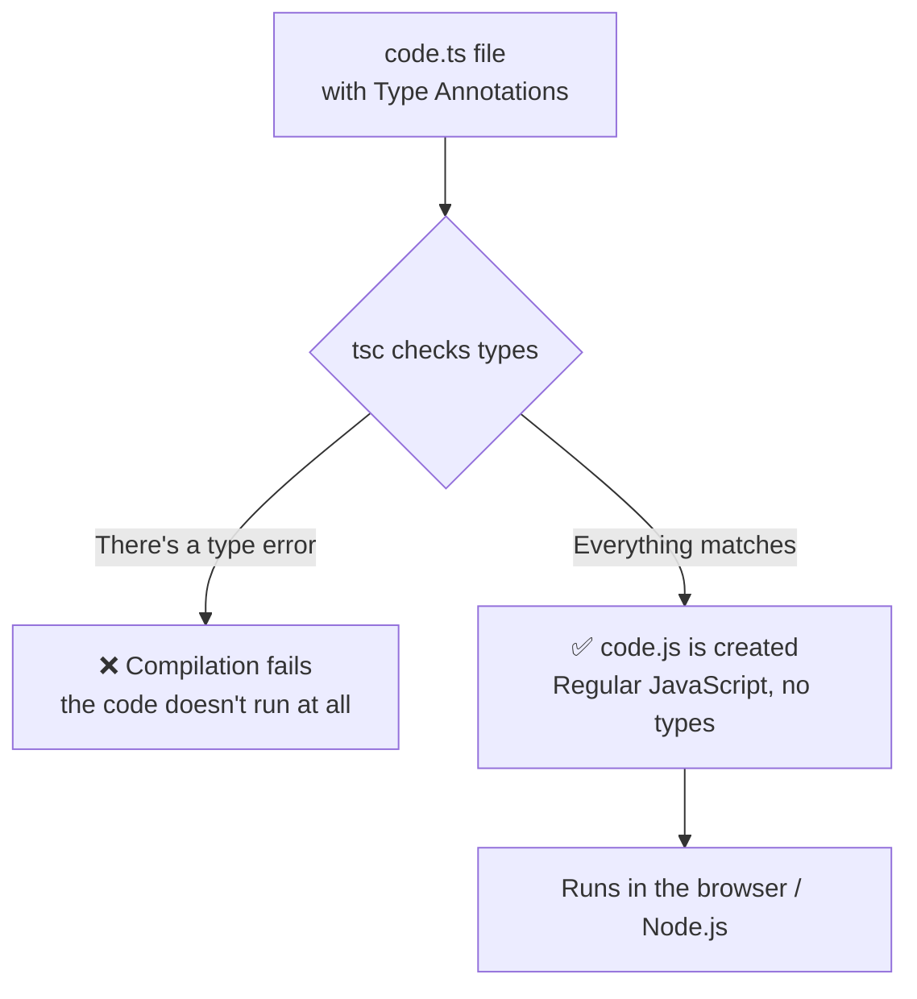

## מה זה?

לאורך כל הקורס, JavaScript לא "ידע" לעולם באיזה טיפוס משתנה יהיה — `let x = 5;` יכול להפוך ל-`x = "טקסט"` בלי אזהרה, וטעות כמו קריאה לפונקציה עם פרמטרים לא-נכונים מתגלה רק **בזמן ריצה**, לפעמים אצל משתמש אמיתי. **TypeScript** הוא "על-גבי" JavaScript (Superset) — אותה שפה בדיוק, בתוספת **מערכת טיפוסים** (Type System) שבודקת טעויות כאלה **בזמן כתיבת הקוד**, לפני שהוא בכלל רץ.

## מילות מפתח שחשוב לזכור

• Superset (על-קבוצה) — כל קוד JavaScript תקין הוא **גם** קוד TypeScript תקין; TS רק **מוסיף** יכולות, לא מחליף את השפה

• Static Typing (טיפוסים סטטיים) — טיפוס המשתנה נבדק **בזמן כתיבה/קומפילציה**, לא רק בזמן ריצה כמו ב-JavaScript רגיל (Dynamic Typing)

• Type Annotation (סימון טיפוס) — תחביר מפורש שמצהיר על טיפוס משתנה/פרמטר: `let age: number = 25;`

• Type Inference (הסקת טיפוס) — TypeScript "מנחש" את הטיפוס גם בלי לסמן אותו במפורש, לפי הערך שהוקצה

• Compilation (קומפילציה) — קוד TypeScript (`.ts`) **מתורגם** לקוד JavaScript רגיל (`.js`) לפני הרצה — הדפדפן/Node.js לעולם לא מריצים TS ישירות

• Interface — מגדיר את "צורת" אובייקט צפויה: אילו שדות יש לו, ומה הטיפוס של כל אחד

```typescript
let age: number = 25;
let name: string = "Dana";

function greet(user: { name: string; age: number }): string {
  return `Hello, ${user.name}!`;
}

greet({ name: "Yossi", age: 30 }); // valid
greet({ name: "Yossi" });          // compilation error — age is missing!
```



## הסבר עיקרי

תופס שגיאות לפני שהקוד רץ בכלל — זה בדיוק ההבדל המהותי: ב-JavaScript רגיל, קריאה עם אובייקט חסר-שדה הייתה עוברת בלי שום אזהרה, ורק אם קוד בהמשך ניסה להשתמש בשדה החסר היינו מקבלים `undefined` בזמן ריצה — לפעמים רק אצל משתמש אמיתי. ב-TypeScript, זו **שגיאת קומפילציה** — הקוד פשוט לא "יתקמפל" עד שמתקנים את הבעיה, הרבה לפני שהוא מגיע לייצור.

Type Inference חוסך הרבה סימונים ידניים — לא צריך לסמן טיפוס על **כל** משתנה במפורש: `let age = 25;` (בלי `: number`) — TypeScript **מסיק** אוטומטית ש-`age` הוא `number`, לפי הערך שהוקצה. סימון טיפוס מפורש הכי שימושי כשמצהירים על **פרמטרים של פונקציה** או משתנים שעדיין לא קיבלו ערך.

Compilation — TS לעולם לא "רץ" ישירות — קובץ `.ts` **חייב** לעבור קומפילציה (בעזרת `tsc`, ה-TypeScript Compiler) לקובץ `.js` רגיל, **לפני** שהוא רץ בדפדפן או ב-Node.js. כל בדיקות הטיפוסים קורות **בשלב הזה בלבד** — ברגע שהקומפילציה מצליחה, ה-`.js` שנוצר הוא JavaScript רגיל לגמרי, בלי שום "שאריות" של טיפוסים (הם קיימים רק בזמן פיתוח, לא בזמן ריצה).

## יתרונות

תופס טעויות טיפוס בזמן כתיבה, הרבה לפני שהן מגיעות לייצור; Type Inference נותן בדיקה חזקה בלי לסמן כל דבר ידנית; אוטוקומפליט וניווט קוד חכם משמעותית ב-IDE, כי הכלי "יודע" בדיוק אילו שדות/מתודות קיימות.

## חסרונות

דורש שלב קומפילציה נוסף לפני הרצה — לא ניתן להריץ `.ts` ישירות; עקומת למידה נוספת (תחביר טיפוסים, interfaces); בפרויקטים עם הרבה קוד JavaScript קיים, מעבר מלא ל-TypeScript יכול לקחת זמן.

## נקודות חשובות

• TypeScript הוא Superset של JavaScript — כל JS תקין הוא גם TS תקין

• Static Typing (TS) בודק טיפוסים בזמן קומפילציה; Dynamic Typing (JS רגיל) בודק רק בזמן ריצה

• Type Inference מסיק טיפוס אוטומטית מהערך, בלי סימון מפורש

• קובץ `.ts` תמיד מתקמפל ל-`.js` לפני הרצה — TS לא רץ ישירות בשום מקום

## טעויות נפוצות

• לחשוב ש-TypeScript הוא שפה **נפרדת** לגמרי מ-JavaScript — היא סופרסט, לא שפה חדשה

• לסמן טיפוס מפורש בכל מקום, גם כשמספיק Type Inference — מוסיף רעש בלי תועלת

• לצפות שקוד TS ירוץ ישירות בדפדפן/Node — תמיד צריך שלב קומפילציה קודם

## סיכום

TypeScript הוא Superset של JavaScript שמוסיף Static Typing — בדיקת טיפוסים בזמן כתיבת קוד, לא רק בזמן ריצה. Type Annotations מצהירות טיפוס במפורש; Type Inference מסיק אותו אוטומטית מהערך. קוד TS תמיד מתקמפל ל-JS רגיל לפני הרצה — כל בדיקות הטיפוסים קורות בשלב הזה, ותופסות טעויות הרבה לפני שהן מגיעות למשתמש אמיתי.

## דוקומנטציה רשמית

[TypeScript — Official Handbook](https://www.typescriptlang.org/docs/handbook/intro.html)

---

## תרגילים

### תרגיל 1 — Type Annotations בסיסיים

**המשימה:** כתבו משתנים עם טיפוסים מפורשים: `name` (string), `age` (number), `isStudent` (boolean).

**בדיקה:** הקומפילציה (`tsc`) עוברת בלי שגיאה; ניסיון להקצות ערך מהטיפוס הלא-נכון (למשל מחרוזת לתוך `age`) גורם לשגיאת קומפילציה.

### תרגיל 2 — טיפוס פרמטרים ופלט של פונקציה

**המשימה:** כתבו פונקציה `add(a: number, b: number): number` שמחזירה את הסכום.

**בדיקה:** קריאה עם שני מספרים עוברת; קריאה עם מחרוזת במקום מספר גורמת לשגיאת קומפילציה.

### תרגיל 3 — Interface לאובייקט

**המשימה:** הגדירו `interface User { name: string; age: number; }`, וכתבו פונקציה שמקבלת פרמטר מטיפוס `User`.

**בדיקה:** קריאה עם אובייקט שחסר לו שדה (`age`) נכשלת בקומפילציה; קריאה עם אובייקט מלא עוברת.

---

## פרויקט מסכם

**המשימה:** המירו קובץ JavaScript קטן (כמו `math.js` משיעורי הבדיקות) ל-TypeScript.

**דרישות:**
1. סמנו טיפוסים מפורשים על כל פרמטרי הפונקציות וערכי ההחזרה
2. הגדירו `interface` אחד לפחות, אם יש אובייקט עם מבנה קבוע בקוד
3. הריצו `tsc` על הקובץ ווודאו שאין שגיאות קומפילציה
4. נסו בכוונה לשבור טיפוס אחד (למשל להעביר מחרוזת איפה שמצופה מספר) ותעדו את הודעת השגיאה שמתקבלת

**בדיקה:** הקובץ המומר מתקמפל בלי שגיאות; השגיאה המכוונת שיצרתם מוצגת בבירור עם הסבר על אי-ההתאמה בטיפוס.

---

## מה בפרק הבא

בפרק הבא — **פרויקט מסכם ליחידת TypeScript**: ממירים את כל פרויקט קטלוג הספרים מיחידת JavaScript ל-TypeScript מלא, עם interfaces וטיפוסים על כל פונקציה.
